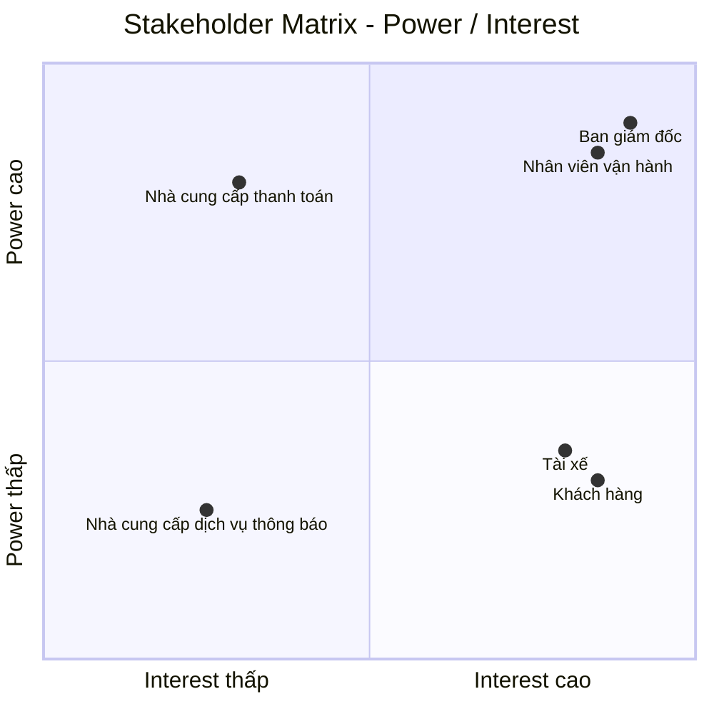
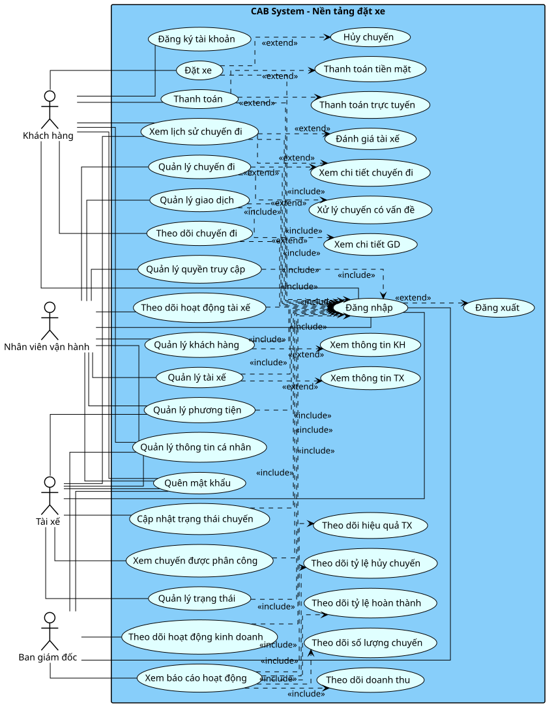

# CAB System – Phân tích yêu cầu
# Bước 1: Hiểu rõ hệ thống

## 1. Bối cảnh nghiệp vụ và lý do hệ thống cũ không đáp ứng được

Công ty ABC là một doanh nghiệp cung cấp dịch vụ đặt xe trực tuyến. Hiện tại khách hàng có thể liên hệ với tổng đài hoặc sử dụng một ứng dụng đơn giản để yêu cầu xe.

Hệ thống hiện tại còn một số hạn chế:

- Việc phân công tài xế chủ yếu được thực hiện thủ công.
- Khách hàng khó theo dõi trạng thái chuyến đi.
- Thông tin thanh toán chưa được quản lý tập trung.
- Bộ phận vận hành gặp khó khăn khi muốn mở rộng hệ thống.
- Hệ thống hiện tại khó đáp ứng khi số lượng khách hàng và tài xế tăng.

Những hạn chế này ảnh hưởng đến quá trình vận hành dịch vụ, trải nghiệm của khách hàng và khả năng mở rộng của doanh nghiệp.

## 2. Giải pháp mới và hệ thống mới

Công ty ABC mong muốn xây dựng **CAB System – Nền tảng đặt xe** nhằm hỗ trợ quy trình đặt xe từ khi khách hàng tạo yêu cầu cho đến khi chuyến đi hoàn thành.

Hệ thống mới hỗ trợ các hoạt động chính:

- Khách hàng đăng ký tài khoản, đăng nhập và cập nhật thông tin cá nhân.
- Khách hàng nhập điểm đón, điểm đến và lựa chọn loại xe.
- Khách hàng gửi yêu cầu đặt xe.
- Hệ thống xác định các tài xế phù hợp dựa trên vị trí, trạng thái sẵn sàng và một số tiêu chí vận hành khác.
- Hệ thống ưu tiên tài xế phù hợp và gần khách hàng.
- Tài xế nhận được thông báo và có thể chấp nhận hoặc từ chối chuyến.
- Nếu tài xế được đề xuất không phản hồi hoặc từ chối, hệ thống tiếp tục tìm tài xế khác mà không yêu cầu khách hàng tạo lại yêu cầu.
- Nếu không tìm được tài xế, khách hàng được thông báo rõ ràng.
- Khách hàng biết tài xế nào đã nhận chuyến và thời gian dự kiến tài xế đến.
- Tài xế cập nhật trạng thái chuyến gồm đã đến điểm đón, đã đón khách, đang di chuyển và hoàn thành chuyến.
- Khách hàng theo dõi được trạng thái hiện tại của chuyến đi.
- Sau khi chuyến đi hoàn thành, hệ thống xác định số tiền khách hàng phải trả dựa trên loại dịch vụ và thông tin chuyến đi.
- Khách hàng có thể thanh toán bằng tiền mặt hoặc phương thức thanh toán điện tử.
- Thanh toán điện tử được thực hiện thông qua nhà cung cấp thanh toán bên ngoài.
- Hệ thống CAB không lưu trực tiếp thông tin nhạy cảm của thẻ hoặc tài khoản thanh toán.
- Khách hàng nhận được thông báo khi yêu cầu đặt xe được tiếp nhận, khi có tài xế nhận chuyến, khi tài xế đến điểm đón, khi chuyến hoàn thành và khi thanh toán có kết quả.
- Tài xế nhận được thông báo về các chuyến mới hoặc những thay đổi liên quan đến chuyến đang thực hiện.
- Khách hàng có thể xem lịch sử chuyến đi, số tiền phải trả và đánh giá tài xế sau khi hoàn thành chuyến.
- Nhân viên vận hành có thể quản lý khách hàng, tài xế, phương tiện và chuyến đi.
- Nhân viên vận hành có thể xem các chuyến đang diễn ra, kiểm tra trạng thái tài xế, hỗ trợ xử lý các trường hợp chuyến bị lỗi và tra cứu lịch sử giao dịch.

Quy trình cốt lõi của hệ thống:

**Đặt xe → Tìm tài xế → Nhận chuyến → Thực hiện chuyến → Hoàn thành chuyến → Tính cước → Thanh toán → Đánh giá**

## 3. Các đối tượng tham gia hệ thống

| Đối tượng | Vai trò |
|---|---|
| Khách hàng | Đăng ký, đăng nhập, đặt xe, theo dõi chuyến đi, thanh toán và đánh giá tài xế |
| Tài xế | Quản lý hồ sơ, thông tin phương tiện, nhận hoặc từ chối chuyến và thực hiện chuyến |
| Nhân viên vận hành | Quản lý khách hàng, tài xế, phương tiện, chuyến đi và hỗ trợ xử lý các trường hợp chuyến bị lỗi |
| Nhà cung cấp thanh toán bên ngoài | Xử lý các giao dịch thanh toán điện tử |
| Nhà cung cấp dịch vụ thông báo | Hỗ trợ gửi thông báo đến khách hàng và tài xế |

## 4. Giá trị kinh doanh của hệ thống mới

| Đối tượng | Giá trị kinh doanh |
|---|---|
| Khách hàng | Đặt xe thuận tiện hơn, theo dõi được trạng thái chuyến đi, biết thông tin tài xế, thanh toán và đánh giá tài xế |
| Tài xế | Nhận yêu cầu chuyến, chủ động chấp nhận hoặc từ chối chuyến và cập nhật trạng thái chuyến |
| Nhân viên vận hành | Quản lý tập trung khách hàng, tài xế, phương tiện và chuyến đi; theo dõi và hỗ trợ xử lý các chuyến |
| Doanh nghiệp | Giảm sự phụ thuộc vào phân công tài xế thủ công, hỗ trợ tự động hóa việc tìm và phân công tài xế, cải thiện trải nghiệm khách hàng và hỗ trợ phục vụ số lượng lớn khách hàng và tài xế |

Giá trị cốt lõi của hệ thống là hỗ trợ Công ty ABC vận hành quy trình đặt xe từ khi khách hàng tạo yêu cầu, hệ thống tìm và phân công tài xế, tài xế thực hiện chuyến, chuyến hoàn thành, tính cước, thanh toán đến đánh giá tài xế.

# BƯỚC 2: XÁC ĐỊNH STAKEHOLDER, VAI TRÒ VÀ THIẾT LẬP STAKEHOLDER MATRIX

## 1. Xác định Stakeholder và vai trò

| Stakeholder | Vai trò trong hệ thống |
|---|---|
| Ban giám đốc | Chủ sở hữu sản phẩm, quyết định mục tiêu và định hướng của CAB System |
| Khách hàng | Người sử dụng dịch vụ đặt xe |
| Tài xế | Người cung cấp dịch vụ vận chuyển |
| Nhân viên vận hành | Người quản lý và giám sát hoạt động đặt xe |
| Nhà cung cấp thanh toán bên ngoài | Đối tác xử lý thanh toán điện tử |
| Nhà cung cấp dịch vụ thông báo | Đối tác hỗ trợ gửi thông báo |

## 2. Phân tích mức độ ảnh hưởng và quan tâm

| Stakeholder | Power | Interest | Lý do |
|---|---|---|---|
| Ban giám đốc | Cao | Cao | Có quyền quyết định và chịu trách nhiệm về sản phẩm |
| Nhân viên vận hành | Cao | Cao | Trực tiếp quản lý và giám sát hoạt động đặt xe |
| Khách hàng | Thấp | Cao | Sử dụng trực tiếp sản phẩm |
| Tài xế | Thấp | Cao | Sử dụng trực tiếp hệ thống để nhận và thực hiện chuyến |
| Nhà cung cấp thanh toán bên ngoài | Cao | Thấp | Có ảnh hưởng đến hoạt động thanh toán nhưng không tham gia trực tiếp vào quy trình đặt xe |
| Nhà cung cấp dịch vụ thông báo | Thấp | Thấp | Hỗ trợ một phần hoạt động của hệ thống |

## 3. Stakeholder Matrix



## 4. Chiến lược quản lý Stakeholder

| Nhóm | Stakeholder | Chiến lược |
|---|---|---|
| Power cao – Interest cao | Ban giám đốc, Nhân viên vận hành | Quản lý chặt chẽ, trao đổi thường xuyên và tham gia vào các quyết định quan trọng |
| Power thấp – Interest cao | Khách hàng, Tài xế | Duy trì sự tham gia, thường xuyên thu thập nhu cầu và phản hồi |
| Power cao – Interest thấp | Nhà cung cấp thanh toán bên ngoài | Duy trì sự hài lòng và phối hợp khi có vấn đề liên quan đến tích hợp |
| Power thấp – Interest thấp | Nhà cung cấp dịch vụ thông báo | Theo dõi và phối hợp khi phát sinh vấn đề |

## Bước 3. Mục đích nghiệp vụ

CAB System được xây dựng nhằm giải quyết các hạn chế của hệ thống đặt xe hiện tại và hỗ trợ Công ty ABC cải thiện hoạt động cung cấp dịch vụ đặt xe trực tuyến.

### Mục đích chính

- **Tự động hóa quá trình đặt xe và tìm tài xế**, giảm sự phụ thuộc vào việc phân công tài xế thủ công.
- **Cải thiện trải nghiệm khách hàng** bằng cách cho phép khách hàng chủ động đặt xe và theo dõi trạng thái chuyến đi.
- **Hỗ trợ tài xế tiếp nhận và thực hiện chuyến** thông qua hệ thống thay vì phụ thuộc vào quá trình điều phối thủ công.
- **Quản lý tập trung thông tin** về khách hàng, tài xế, phương tiện, chuyến đi và giao dịch.
- **Hỗ trợ thanh toán** bằng tiền mặt và phương thức thanh toán điện tử thông qua nhà cung cấp bên ngoài.
- **Cải thiện khả năng theo dõi và xử lý hoạt động vận hành** thông qua giao diện dành cho nhân viên vận hành.
- **Giảm thời gian xử lý khi tìm tài xế** bằng cách tự động tiếp tục tìm tài xế khác khi tài xế được đề xuất không phản hồi hoặc từ chối.
- **Cung cấp thông tin và dữ liệu cần thiết cho doanh nghiệp** để theo dõi hoạt động đặt xe và tình hình vận hành.

### Kết quả nghiệp vụ mong muốn

| Mục đích | Kết quả mong muốn |
|---|---|
| Tự động hóa đặt xe | Khách hàng có thể tạo yêu cầu và hệ thống tự động xử lý quá trình tìm tài xế |
| Cải thiện trải nghiệm khách hàng | Khách hàng có thể biết trạng thái yêu cầu, thông tin tài xế và trạng thái chuyến đi |
| Nâng cao hiệu quả tìm tài xế | Hệ thống có thể tiếp tục tìm tài xế khác khi tài xế được đề xuất không nhận chuyến |
| Quản lý tập trung | Thông tin khách hàng, tài xế, phương tiện, chuyến đi và giao dịch được quản lý trong hệ thống |
| Hỗ trợ thanh toán | Khách hàng có thể thanh toán bằng tiền mặt hoặc phương thức điện tử |
| Hỗ trợ vận hành | Nhân viên vận hành có thể theo dõi chuyến và hỗ trợ xử lý các trường hợp phát sinh |
| Hỗ trợ hoạt động kinh doanh | Doanh nghiệp có nền tảng để phục vụ số lượng lớn khách hàng và tài xế hơn hệ thống hiện tại |

### Mục tiêu tổng quát

**Xây dựng một nền tảng đặt xe giúp Công ty ABC tự động hóa quy trình từ khi khách hàng tạo yêu cầu, tìm và phân công tài xế, thực hiện chuyến, tính cước, thanh toán đến đánh giá sau chuyến, đồng thời hỗ trợ doanh nghiệp quản lý và theo dõi hoạt động đặt xe hiệu quả hơn.**

# BƯỚC 4: XÁC ĐỊNH PHẠM VI DỰ ÁN

## 1. Các module trong phạm vi

### Module 1: Quản lý tài khoản

- Đăng ký tài khoản khách hàng.
- Đăng nhập.
- Cập nhật thông tin cá nhân.
- Quản lý thông tin tài xế.
- Quản lý thông tin phương tiện.

### Module 2: Đặt xe

- Nhập điểm đón.
- Nhập điểm đến.
- Lựa chọn loại xe.
- Gửi yêu cầu đặt xe.
- Theo dõi trạng thái yêu cầu đặt xe.

### Module 3: Tìm và phân công tài xế

- Tìm tài xế phù hợp.
- Ưu tiên tài xế gần khách hàng.
- Gửi yêu cầu chuyến đến tài xế.
- Tài xế chấp nhận hoặc từ chối chuyến.
- Tiếp tục tìm tài xế khác khi tài xế từ chối hoặc không phản hồi.
- Thông báo khi không tìm được tài xế.

### Module 4: Quản lý chuyến đi

- Tài xế cập nhật trạng thái chuyến.
- Khách hàng theo dõi trạng thái chuyến.
- Lưu thông tin chuyến đi.
- Hoàn thành chuyến.

### Module 5: Tính cước và thanh toán

- Tính số tiền khách hàng phải trả.
- Thanh toán bằng tiền mặt.
- Thanh toán điện tử thông qua nhà cung cấp bên ngoài.
- Xử lý kết quả thanh toán.
- Thông báo kết quả thanh toán.

### Module 6: Thông báo

- Thông báo yêu cầu đặt xe được tiếp nhận.
- Thông báo khi tài xế nhận chuyến.
- Thông báo khi tài xế đến điểm đón.
- Thông báo khi chuyến hoàn thành.
- Thông báo kết quả thanh toán.
- Thông báo chuyến mới cho tài xế.

### Module 7: Lịch sử và đánh giá

- Xem lịch sử chuyến đi.
- Xem số tiền phải trả.
- Đánh giá tài xế sau chuyến.

### Module 8: Quản lý vận hành

- Quản lý khách hàng.
- Quản lý tài xế.
- Quản lý phương tiện.
- Theo dõi chuyến đang diễn ra.
- Kiểm tra trạng thái tài xế.
- Tra cứu lịch sử giao dịch.
- Hỗ trợ xử lý các trường hợp chuyến bị lỗi.
  
## Bước 5. Yêu cầu nghiệp vụ

| Yêu cầu nghiệp vụ | Yêu cầu hệ thống |
|---|---|
| Cung cấp dịch vụ đặt xe trực tuyến | Hệ thống phải cho phép khách hàng nhập điểm đón, điểm đến, lựa chọn loại xe và gửi yêu cầu đặt xe. |
| Tự động tìm và phân công tài xế | Hệ thống phải tự động xác định và lựa chọn tài xế phù hợp dựa trên vị trí, trạng thái sẵn sàng và các tiêu chí được xác định. |
| Xử lý trường hợp tài xế không nhận chuyến | Hệ thống phải tự động tìm tài xế khác khi tài xế được đề xuất từ chối hoặc không phản hồi. |
| Quản lý quá trình thực hiện chuyến | Hệ thống phải cho phép tài xế cập nhật trạng thái chuyến và cho phép khách hàng theo dõi trạng thái hiện tại của chuyến. |
| Quản lý khách hàng, tài xế và phương tiện | Hệ thống phải cho phép quản lý thông tin khách hàng, tài xế và phương tiện. |
| Tính cước chuyến đi | Hệ thống phải xác định số tiền khách hàng phải trả dựa trên thông tin chuyến đi và loại dịch vụ. |
| Hỗ trợ thanh toán | Hệ thống phải hỗ trợ thanh toán bằng tiền mặt và thanh toán điện tử thông qua nhà cung cấp thanh toán bên ngoài. |
| Quản lý kết quả thanh toán | Hệ thống phải tiếp nhận và lưu trạng thái giao dịch thanh toán, đồng thời thông báo kết quả cho khách hàng. |
| Cung cấp thông báo | Hệ thống phải gửi thông báo đến khách hàng và tài xế khi xảy ra các sự kiện quan trọng trong quá trình đặt và thực hiện chuyến. |
| Quản lý lịch sử chuyến đi | Hệ thống phải lưu trữ thông tin chuyến để khách hàng có thể tra cứu lịch sử và số tiền phải trả. |
| Đánh giá tài xế | Hệ thống phải cho phép khách hàng đánh giá tài xế sau khi chuyến đi hoàn thành. |
| Hỗ trợ nhân viên vận hành | Hệ thống phải cung cấp giao diện quản trị để nhân viên vận hành quản lý khách hàng, tài xế, phương tiện và chuyến đi. |
| Theo dõi và xử lý chuyến | Hệ thống phải cho phép nhân viên vận hành xem các chuyến đang diễn ra, kiểm tra trạng thái tài xế và hỗ trợ xử lý các trường hợp chuyến bị lỗi. |
| Phân quyền quản trị | Hệ thống phải kiểm soát quyền truy cập đối với các chức năng quản trị theo quyền của từng nhân viên. |
| Bảo vệ dữ liệu | Hệ thống phải bảo vệ thông tin cá nhân, thông tin phương tiện, dữ liệu vị trí và dữ liệu giao dịch khỏi truy cập trái phép. |
| Lưu vết hoạt động | Hệ thống phải ghi nhận các thao tác quan trọng để phục vụ kiểm tra khi có sự cố. |
| Đảm bảo tính ổn định | Hệ thống phải hạn chế việc lỗi tại một thành phần như thanh toán hoặc thông báo làm dừng toàn bộ quy trình đặt xe. |
| Hỗ trợ khả năng mở rộng | Hệ thống phải có khả năng mở rộng khi số lượng khách hàng và tài xế tăng và hỗ trợ bổ sung các chức năng mới trong tương lai. |

# Bước 6: Yêu cầu chức năng

# Bước 6. Yêu cầu chức năng

## 1. Khách hàng

- Đăng ký tài khoản
- Đăng nhập
- Đăng xuất
- Quên mật khẩu
- Quản lý thông tin cá nhân
- Đặt xe
- Theo dõi chuyến đi
- Hủy chuyến
- Thanh toán
- Xem lịch sử chuyến đi
- Xem chi tiết chuyến đi
- Đánh giá tài xế

## 2. Tài xế

- Đăng nhập
- Đăng xuất
- Quên mật khẩu
- Quản lý thông tin cá nhân
- Quản lý phương tiện
- Quản lý trạng thái hoạt động
- Xem chuyến được phân công
- Cập nhật trạng thái chuyến
- Xem lịch sử chuyến
- Xem chi tiết chuyến đi

## 3. Nhân viên vận hành

- Đăng nhập
- Đăng xuất
- Quên mật khẩu
- Quản lý thông tin cá nhân
- Quản lý khách hàng
- Xem thông tin khách hàng
- Quản lý tài xế
- Xem thông tin tài xế
- Quản lý phương tiện
- Quản lý chuyến đi
- Xem chi tiết chuyến đi
- Theo dõi hoạt động tài xế
- Quản lý giao dịch
- Xem chi tiết giao dịch
- Xử lý chuyến có vấn đề
- Quản lý quyền truy cập

## 4. Ban giám đốc

- Đăng nhập
- Đăng xuất
- Quên mật khẩu
- Quản lý thông tin cá nhân
- Theo dõi hoạt động kinh doanh
- Xem báo cáo hoạt động
- Theo dõi doanh thu
- Theo dõi số lượng chuyến
- Theo dõi tỷ lệ hoàn thành chuyến
- Theo dõi tỷ lệ hủy chuyến
- Theo dõi hiệu quả hoạt động của tài xế

## Bước 7. Use Case Diagram


# Bước 8: Đặc tả Use Case
## 1. Khách hàng

### UC01 - Đăng ký tài khoản

| Thành phần | Nội dung |
|---|---|
| **Use Case** | Đăng ký tài khoản |
| **Actor** | Khách hàng |
| **Mục đích** | Cho phép khách hàng tạo tài khoản để sử dụng các chức năng của CAB System |
| **Điều kiện trước** | Khách hàng chưa có tài khoản |
| **Điều kiện sau** | Tài khoản khách hàng được tạo thành công |
| **Luồng chính** | 1. Khách hàng chọn **Đăng ký tài khoản**.<br>2. Hệ thống hiển thị biểu mẫu đăng ký.<br>3. Khách hàng nhập các thông tin cần thiết.<br>4. Hệ thống kiểm tra tính hợp lệ của thông tin.<br>5. Hệ thống kiểm tra tài khoản đã tồn tại hay chưa.<br>6. Hệ thống tạo tài khoản khách hàng.<br>7. Hệ thống thông báo đăng ký thành công. |
| **Luồng thay thế / Ngoại lệ** | - Thông tin không hợp lệ → Hệ thống thông báo lỗi và yêu cầu nhập lại.<br>- Tài khoản đã tồn tại → Hệ thống thông báo và yêu cầu sử dụng thông tin khác. |

### UC02 - Đăng nhập

| Thành phần | Nội dung |
|---|---|
| **Use Case** | Đăng nhập |
| **Actor** | Khách hàng |
| **Mục đích** | Xác thực tài khoản để khách hàng sử dụng hệ thống |
| **Điều kiện trước** | Khách hàng đã có tài khoản và tài khoản đang hoạt động |
| **Điều kiện sau** | Khách hàng đăng nhập thành công |
| **Luồng chính** | 1. Khách hàng chọn **Đăng nhập**.<br>2. Hệ thống hiển thị biểu mẫu đăng nhập.<br>3. Khách hàng nhập thông tin đăng nhập.<br>4. Hệ thống kiểm tra thông tin.<br>5. Hệ thống xác thực tài khoản.<br>6. Hệ thống tạo phiên đăng nhập.<br>7. Hệ thống chuyển khách hàng đến giao diện chính. |
| **Luồng thay thế / Ngoại lệ** | - Thông tin đăng nhập không chính xác → Hệ thống thông báo lỗi.<br>- Tài khoản bị khóa hoặc không hoạt động → Hệ thống từ chối đăng nhập. |

### UC03 - Đăng xuất

| Thành phần | Nội dung |
|---|---|
| **Use Case** | Đăng xuất |
| **Actor** | Khách hàng |
| **Mục đích** | Kết thúc phiên sử dụng hệ thống |
| **Điều kiện trước** | Khách hàng đang đăng nhập |
| **Điều kiện sau** | Phiên đăng nhập được kết thúc |
| **Luồng chính** | 1. Khách hàng chọn **Đăng xuất**.<br>2. Hệ thống kết thúc phiên đăng nhập.<br>3. Hệ thống chuyển khách hàng về màn hình đăng nhập. |
| **Luồng thay thế / Ngoại lệ** | Không có. |

### UC04 - Quên mật khẩu

| Thành phần | Nội dung |
|---|---|
| **Use Case** | Quên mật khẩu |
| **Actor** | Khách hàng |
| **Mục đích** | Cho phép khách hàng khôi phục quyền truy cập khi quên mật khẩu |
| **Điều kiện trước** | Khách hàng đã có tài khoản |
| **Điều kiện sau** | Mật khẩu mới được cập nhật thành công |
| **Luồng chính** | 1. Khách hàng chọn **Quên mật khẩu**.<br>2. Hệ thống yêu cầu thông tin xác thực.<br>3. Khách hàng cung cấp thông tin tài khoản.<br>4. Hệ thống kiểm tra thông tin.<br>5. Hệ thống thực hiện xác thực.<br>6. Khách hàng nhập mật khẩu mới.<br>7. Hệ thống kiểm tra mật khẩu mới.<br>8. Hệ thống cập nhật mật khẩu.<br>9. Hệ thống thông báo khôi phục mật khẩu thành công. |
| **Luồng thay thế / Ngoại lệ** | - Không tìm thấy tài khoản → Hệ thống thông báo lỗi.<br>- Thông tin xác thực không hợp lệ → Hệ thống từ chối yêu cầu.<br>- Mật khẩu mới không hợp lệ → Hệ thống yêu cầu nhập lại. |

### UC05 - Quản lý thông tin cá nhân

| Thành phần | Nội dung |
|---|---|
| **Use Case** | Quản lý thông tin cá nhân |
| **Actor** | Khách hàng |
| **Mục đích** | Cho phép khách hàng xem và cập nhật thông tin cá nhân |
| **Điều kiện trước** | Khách hàng đã đăng nhập |
| **Điều kiện sau** | Thông tin cá nhân được cập nhật thành công |
| **Luồng chính** | 1. Khách hàng chọn **Thông tin cá nhân**.<br>2. Hệ thống hiển thị thông tin hiện tại.<br>3. Khách hàng chỉnh sửa thông tin cần thay đổi.<br>4. Hệ thống kiểm tra dữ liệu.<br>5. Khách hàng xác nhận cập nhật.<br>6. Hệ thống lưu thông tin mới.<br>7. Hệ thống thông báo cập nhật thành công. |
| **Luồng thay thế / Ngoại lệ** | - Thông tin không hợp lệ → Hệ thống thông báo lỗi và yêu cầu nhập lại.<br>- Khách hàng hủy cập nhật → Thông tin cũ được giữ nguyên. |

### UC06 - Đặt xe

| Thành phần | Nội dung |
|---|---|
| **Use Case** | Đặt xe |
| **Actor** | Khách hàng |
| **Mục đích** | Cho phép khách hàng tạo yêu cầu đặt xe |
| **Điều kiện trước** | Khách hàng đã đăng nhập |
| **Điều kiện sau** | Yêu cầu đặt xe được tạo và chuyển sang quá trình tìm tài xế |
| **Luồng chính** | 1. Khách hàng chọn **Đặt xe**.<br>2. Hệ thống yêu cầu nhập điểm đón và điểm đến.<br>3. Khách hàng nhập thông tin chuyến đi.<br>4. Khách hàng chọn loại phương tiện.<br>5. Hệ thống kiểm tra thông tin đặt xe.<br>6. Hệ thống tiếp nhận yêu cầu đặt xe.<br>7. Hệ thống tìm tài xế phù hợp.<br>8. Hệ thống phân công tài xế.<br>9. Hệ thống thông báo kết quả cho khách hàng. |
| **Luồng thay thế / Ngoại lệ** | - Thông tin đặt xe không hợp lệ → Hệ thống yêu cầu nhập lại.<br>- Không tìm được tài xế phù hợp → Hệ thống thông báo chưa tìm được tài xế.<br>- Khách hàng hủy thao tác → Yêu cầu đặt xe không được tạo. |

### UC07 - Theo dõi chuyến đi

| Thành phần | Nội dung |
|---|---|
| **Use Case** | Theo dõi chuyến đi |
| **Actor** | Khách hàng |
| **Mục đích** | Cho phép khách hàng theo dõi trạng thái và tiến trình của chuyến đi |
| **Điều kiện trước** | Khách hàng có chuyến đang được thực hiện |
| **Điều kiện sau** | Khách hàng xem được trạng thái hiện tại của chuyến |
| **Luồng chính** | 1. Khách hàng chọn chuyến đang thực hiện.<br>2. Hệ thống hiển thị thông tin chuyến.<br>3. Hệ thống cập nhật trạng thái chuyến.<br>4. Khách hàng theo dõi trạng thái hiện tại.<br>5. Hệ thống tiếp tục cập nhật cho đến khi chuyến kết thúc. |
| **Luồng thay thế / Ngoại lệ** | - Chuyến đã kết thúc → Hệ thống hiển thị trạng thái cuối cùng.<br>- Không thể cập nhật trạng thái → Hệ thống hiển thị trạng thái gần nhất đã ghi nhận. |

### UC08 - Hủy chuyến

| Thành phần | Nội dung |
|---|---|
| **Use Case** | Hủy chuyến |
| **Actor** | Khách hàng |
| **Mục đích** | Cho phép khách hàng hủy chuyến khi chuyến đang ở trạng thái cho phép hủy |
| **Điều kiện trước** | Khách hàng có chuyến đang được xử lý hoặc thực hiện và chuyến cho phép hủy |
| **Điều kiện sau** | Chuyến được chuyển sang trạng thái đã hủy |
| **Luồng chính** | 1. Khách hàng chọn chuyến cần hủy.<br>2. Hệ thống kiểm tra trạng thái chuyến.<br>3. Hệ thống hiển thị thông tin và điều kiện hủy chuyến.<br>4. Khách hàng xác nhận hủy chuyến.<br>5. Hệ thống cập nhật trạng thái chuyến.<br>6. Hệ thống ghi nhận thông tin hủy chuyến.<br>7. Hệ thống thông báo kết quả cho khách hàng và các bên liên quan. |
| **Luồng thay thế / Ngoại lệ** | - Chuyến không được phép hủy → Hệ thống thông báo và từ chối thao tác.<br>- Khách hàng không xác nhận → Chuyến được giữ nguyên trạng thái. |

### UC09 - Thanh toán

| Thành phần | Nội dung |
|---|---|
| **Use Case** | Thanh toán |
| **Actor** | Khách hàng |
| **Mục đích** | Cho phép khách hàng thanh toán chi phí của chuyến đi |
| **Điều kiện trước** | Chuyến đi đã phát sinh cước cần thanh toán |
| **Điều kiện sau** | Giao dịch thanh toán được ghi nhận với trạng thái tương ứng |
| **Luồng chính** | 1. Khách hàng chọn **Thanh toán**.<br>2. Hệ thống tính cước chuyến đi.<br>3. Hệ thống hiển thị số tiền cần thanh toán.<br>4. Khách hàng chọn phương thức thanh toán.<br>5. Khách hàng xác nhận thanh toán.<br>6. Hệ thống gửi yêu cầu xử lý giao dịch.<br>7. Hệ thống nhận kết quả giao dịch.<br>8. Hệ thống cập nhật trạng thái thanh toán.<br>9. Hệ thống thông báo kết quả cho khách hàng. |
| **Luồng thay thế / Ngoại lệ** | - Giao dịch thất bại → Hệ thống thông báo thanh toán không thành công.<br>- Giao dịch đang chờ xử lý → Hệ thống ghi nhận trạng thái chờ.<br>- Khách hàng hủy thanh toán → Giao dịch không được hoàn tất. |

### UC10 - Xem lịch sử chuyến đi

| Thành phần | Nội dung |
|---|---|
| **Use Case** | Xem lịch sử chuyến đi |
| **Actor** | Khách hàng |
| **Mục đích** | Cho phép khách hàng xem lại các chuyến đi đã thực hiện |
| **Điều kiện trước** | Khách hàng đã đăng nhập |
| **Điều kiện sau** | Danh sách lịch sử chuyến được hiển thị |
| **Luồng chính** | 1. Khách hàng chọn **Lịch sử chuyến đi**.<br>2. Hệ thống truy xuất lịch sử chuyến của khách hàng.<br>3. Hệ thống hiển thị danh sách chuyến.<br>4. Khách hàng lựa chọn chuyến cần xem. |
| **Luồng thay thế / Ngoại lệ** | - Không có lịch sử chuyến → Hệ thống thông báo chưa có dữ liệu. |

### UC11 - Xem chi tiết chuyến đi

| Thành phần | Nội dung |
|---|---|
| **Use Case** | Xem chi tiết chuyến đi |
| **Actor** | Khách hàng |
| **Mục đích** | Cho phép khách hàng xem đầy đủ thông tin của một chuyến đi |
| **Điều kiện trước** | Khách hàng đã đăng nhập và chuyến thuộc tài khoản khách hàng |
| **Điều kiện sau** | Thông tin chi tiết chuyến được hiển thị |
| **Luồng chính** | 1. Khách hàng chọn một chuyến.<br>2. Hệ thống kiểm tra quyền truy cập.<br>3. Hệ thống truy xuất thông tin chuyến.<br>4. Hệ thống hiển thị thông tin chi tiết chuyến, tài xế, phương tiện, cước và trạng thái. |
| **Luồng thay thế / Ngoại lệ** | - Không tìm thấy chuyến → Hệ thống thông báo lỗi.<br>- Chuyến không thuộc khách hàng → Hệ thống từ chối truy cập. |

### UC12 - Đánh giá tài xế

| Thành phần | Nội dung |
|---|---|
| **Use Case** | Đánh giá tài xế |
| **Actor** | Khách hàng |
| **Mục đích** | Cho phép khách hàng đánh giá chất lượng phục vụ của tài xế sau chuyến đi |
| **Điều kiện trước** | Chuyến đã hoàn thành và khách hàng chưa đánh giá chuyến |
| **Điều kiện sau** | Đánh giá được lưu thành công |
| **Luồng chính** | 1. Khách hàng chọn chuyến đã hoàn thành.<br>2. Khách hàng chọn **Đánh giá tài xế**.<br>3. Hệ thống hiển thị biểu mẫu đánh giá.<br>4. Khách hàng nhập mức đánh giá và nhận xét nếu có.<br>5. Khách hàng xác nhận gửi đánh giá.<br>6. Hệ thống kiểm tra thông tin đánh giá.<br>7. Hệ thống lưu đánh giá.<br>8. Hệ thống thông báo gửi đánh giá thành công. |
| **Luồng thay thế / Ngoại lệ** | - Chuyến đã được đánh giá → Hệ thống không cho phép đánh giá lại.<br>- Thông tin đánh giá không hợp lệ → Hệ thống yêu cầu nhập lại. |

## 2. Tài xế

> Các chức năng **Đăng nhập, Đăng xuất, Quên mật khẩu và Quản lý thông tin cá nhân** đã được đặc tả ở phần Khách hàng và được dùng chung, nên không đặc tả lại.

### UC13 - Quản lý phương tiện

| Thành phần | Nội dung |
|---|---|
| **Use Case** | Quản lý phương tiện |
| **Actor** | Tài xế |
| **Mục đích** | Cho phép tài xế xem và cập nhật thông tin phương tiện được sử dụng |
| **Điều kiện trước** | Tài xế đã đăng nhập |
| **Điều kiện sau** | Thông tin phương tiện được cập nhật thành công |
| **Luồng chính** | 1. Tài xế chọn **Quản lý phương tiện**.<br>2. Hệ thống hiển thị thông tin phương tiện hiện tại.<br>3. Tài xế xem hoặc chỉnh sửa thông tin phương tiện.<br>4. Hệ thống kiểm tra dữ liệu.<br>5. Tài xế xác nhận cập nhật.<br>6. Hệ thống lưu thông tin mới.<br>7. Hệ thống thông báo cập nhật thành công. |
| **Luồng thay thế / Ngoại lệ** | - Thông tin không hợp lệ → Hệ thống thông báo lỗi và yêu cầu nhập lại.<br>- Tài xế hủy thao tác → Thông tin cũ được giữ nguyên. |

### UC14 - Quản lý trạng thái hoạt động

| Thành phần | Nội dung |
|---|---|
| **Use Case** | Quản lý trạng thái hoạt động |
| **Actor** | Tài xế |
| **Mục đích** | Cho phép tài xế cập nhật trạng thái sẵn sàng nhận chuyến |
| **Điều kiện trước** | Tài xế đã đăng nhập và tài khoản đang hoạt động |
| **Điều kiện sau** | Trạng thái hoạt động của tài xế được cập nhật |
| **Luồng chính** | 1. Tài xế truy cập chức năng **Trạng thái hoạt động**.<br>2. Hệ thống hiển thị trạng thái hiện tại.<br>3. Tài xế lựa chọn trạng thái phù hợp.<br>4. Hệ thống kiểm tra điều kiện thay đổi trạng thái.<br>5. Hệ thống cập nhật trạng thái mới.<br>6. Hệ thống thông báo trạng thái đã được cập nhật. |
| **Luồng thay thế / Ngoại lệ** | - Tài xế đang thực hiện chuyến → Hệ thống không cho phép chuyển sang trạng thái không hoạt động.<br>- Trạng thái không hợp lệ → Hệ thống từ chối cập nhật. |

### UC15 - Xem chuyến được phân công

| Thành phần | Nội dung |
|---|---|
| **Use Case** | Xem chuyến được phân công |
| **Actor** | Tài xế |
| **Mục đích** | Cho phép tài xế xem các chuyến được hệ thống phân công |
| **Điều kiện trước** | Tài xế đã đăng nhập |
| **Điều kiện sau** | Danh sách chuyến được phân công được hiển thị |
| **Luồng chính** | 1. Tài xế truy cập **Chuyến được phân công**.<br>2. Hệ thống truy xuất các chuyến được phân công cho tài xế.<br>3. Hệ thống hiển thị danh sách chuyến.<br>4. Tài xế lựa chọn chuyến cần xem. |
| **Luồng thay thế / Ngoại lệ** | - Không có chuyến được phân công → Hệ thống thông báo chưa có chuyến. |

### UC16 - Cập nhật trạng thái chuyến

| Thành phần | Nội dung |
|---|---|
| **Use Case** | Cập nhật trạng thái chuyến |
| **Actor** | Tài xế |
| **Mục đích** | Cho phép tài xế cập nhật tiến trình thực hiện chuyến |
| **Điều kiện trước** | Tài xế đã đăng nhập và có chuyến được phân công |
| **Điều kiện sau** | Trạng thái chuyến được cập nhật |
| **Luồng chính** | 1. Tài xế chọn chuyến được phân công.<br>2. Hệ thống hiển thị trạng thái hiện tại.<br>3. Tài xế chọn trạng thái mới.<br>4. Hệ thống kiểm tra trạng thái có hợp lệ hay không.<br>5. Hệ thống cập nhật trạng thái chuyến.<br>6. Hệ thống thông báo cập nhật thành công.<br>7. Hệ thống cung cấp trạng thái mới cho các bên liên quan. |
| **Luồng thay thế / Ngoại lệ** | - Trạng thái không hợp lệ theo tiến trình chuyến → Hệ thống từ chối cập nhật.<br>- Chuyến đã kết thúc hoặc bị hủy → Tài xế không thể tiếp tục cập nhật trạng thái. |

### UC17 - Xem lịch sử chuyến

| Thành phần | Nội dung |
|---|---|
| **Use Case** | Xem lịch sử chuyến |
| **Actor** | Tài xế |
| **Mục đích** | Cho phép tài xế xem các chuyến đã thực hiện |
| **Điều kiện trước** | Tài xế đã đăng nhập |
| **Điều kiện sau** | Danh sách lịch sử chuyến của tài xế được hiển thị |
| **Luồng chính** | 1. Tài xế chọn **Lịch sử chuyến**.<br>2. Hệ thống truy xuất các chuyến đã thực hiện của tài xế.<br>3. Hệ thống hiển thị danh sách chuyến.<br>4. Tài xế lựa chọn chuyến cần xem. |
| **Luồng thay thế / Ngoại lệ** | - Không có lịch sử chuyến → Hệ thống thông báo chưa có dữ liệu. |

### UC18 - Xem chi tiết chuyến đi

| Thành phần | Nội dung |
|---|---|
| **Use Case** | Xem chi tiết chuyến đi |
| **Actor** | Tài xế |
| **Mục đích** | Cho phép tài xế xem đầy đủ thông tin của chuyến được phân công hoặc đã thực hiện |
| **Điều kiện trước** | Tài xế đã đăng nhập và chuyến thuộc phạm vi được phép truy cập |
| **Điều kiện sau** | Thông tin chi tiết chuyến được hiển thị |
| **Luồng chính** | 1. Tài xế chọn một chuyến.<br>2. Hệ thống kiểm tra quyền truy cập của tài xế.<br>3. Hệ thống truy xuất thông tin chuyến.<br>4. Hệ thống hiển thị thông tin khách hàng, điểm đón, điểm đến, phương tiện, trạng thái và thông tin liên quan. |
| **Luồng thay thế / Ngoại lệ** | - Không tìm thấy chuyến → Hệ thống thông báo lỗi.<br>- Tài xế không được phép truy cập chuyến → Hệ thống từ chối truy cập. |

## 3. Nhân viên vận hành

> Các chức năng **Đăng nhập, Đăng xuất, Quên mật khẩu và Quản lý thông tin cá nhân** đã được đặc tả trước đó và được dùng chung, nên không đặc tả lại.

### UC19 - Quản lý khách hàng

| Thành phần | Nội dung |
|---|---|
| **Use Case** | Quản lý khách hàng |
| **Actor** | Nhân viên vận hành |
| **Mục đích** | Cho phép nhân viên vận hành quản lý thông tin và trạng thái tài khoản khách hàng |
| **Điều kiện trước** | Nhân viên vận hành đã đăng nhập và có quyền quản lý khách hàng |
| **Điều kiện sau** | Thông tin hoặc trạng thái khách hàng được cập nhật thành công |
| **Luồng chính** | 1. Nhân viên chọn **Quản lý khách hàng**.<br>2. Hệ thống hiển thị danh sách khách hàng.<br>3. Nhân viên tìm kiếm hoặc chọn khách hàng cần quản lý.<br>4. Hệ thống hiển thị thông tin khách hàng.<br>5. Nhân viên thực hiện thao tác quản lý phù hợp.<br>6. Hệ thống kiểm tra dữ liệu và quyền thực hiện.<br>7. Hệ thống lưu thay đổi.<br>8. Hệ thống thông báo kết quả. |
| **Luồng thay thế / Ngoại lệ** | - Không tìm thấy khách hàng → Hệ thống thông báo không có dữ liệu phù hợp.<br>- Dữ liệu không hợp lệ → Hệ thống yêu cầu kiểm tra lại.<br>- Nhân viên không đủ quyền → Hệ thống từ chối thao tác. |

### UC20 - Xem thông tin khách hàng

| Thành phần | Nội dung |
|---|---|
| **Use Case** | Xem thông tin khách hàng |
| **Actor** | Nhân viên vận hành |
| **Mục đích** | Cho phép nhân viên xem thông tin chi tiết của khách hàng |
| **Điều kiện trước** | Nhân viên đã đăng nhập và có quyền truy cập |
| **Điều kiện sau** | Thông tin khách hàng được hiển thị |
| **Luồng chính** | 1. Nhân viên tìm kiếm khách hàng.<br>2. Hệ thống hiển thị danh sách kết quả.<br>3. Nhân viên chọn khách hàng.<br>4. Hệ thống kiểm tra quyền truy cập.<br>5. Hệ thống hiển thị thông tin chi tiết khách hàng. |
| **Luồng thay thế / Ngoại lệ** | - Không tìm thấy khách hàng → Hệ thống thông báo không có dữ liệu.<br>- Nhân viên không có quyền → Hệ thống từ chối truy cập. |

### UC21 - Quản lý tài xế

| Thành phần | Nội dung |
|---|---|
| **Use Case** | Quản lý tài xế |
| **Actor** | Nhân viên vận hành |
| **Mục đích** | Cho phép nhân viên quản lý thông tin và trạng thái tài xế |
| **Điều kiện trước** | Nhân viên đã đăng nhập và có quyền quản lý tài xế |
| **Điều kiện sau** | Thông tin hoặc trạng thái tài xế được cập nhật thành công |
| **Luồng chính** | 1. Nhân viên chọn **Quản lý tài xế**.<br>2. Hệ thống hiển thị danh sách tài xế.<br>3. Nhân viên tìm kiếm hoặc chọn tài xế.<br>4. Hệ thống hiển thị thông tin tài xế.<br>5. Nhân viên thực hiện thao tác quản lý.<br>6. Hệ thống kiểm tra dữ liệu và quyền.<br>7. Hệ thống lưu thay đổi.<br>8. Hệ thống thông báo kết quả. |
| **Luồng thay thế / Ngoại lệ** | - Không tìm thấy tài xế → Hệ thống thông báo không có dữ liệu.<br>- Dữ liệu không hợp lệ → Hệ thống yêu cầu nhập lại.<br>- Không đủ quyền → Hệ thống từ chối thao tác. |

### UC22 - Xem thông tin tài xế

| Thành phần | Nội dung |
|---|---|
| **Use Case** | Xem thông tin tài xế |
| **Actor** | Nhân viên vận hành |
| **Mục đích** | Cho phép nhân viên xem thông tin chi tiết của tài xế |
| **Điều kiện trước** | Nhân viên đã đăng nhập và có quyền truy cập |
| **Điều kiện sau** | Thông tin tài xế được hiển thị |
| **Luồng chính** | 1. Nhân viên tìm kiếm tài xế.<br>2. Hệ thống hiển thị danh sách kết quả.<br>3. Nhân viên chọn tài xế.<br>4. Hệ thống kiểm tra quyền truy cập.<br>5. Hệ thống hiển thị thông tin tài xế và thông tin phương tiện liên quan. |
| **Luồng thay thế / Ngoại lệ** | - Không tìm thấy tài xế → Hệ thống thông báo không có dữ liệu.<br>- Không có quyền truy cập → Hệ thống từ chối truy cập. |

### UC23 - Quản lý phương tiện

| Thành phần | Nội dung |
|---|---|
| **Use Case** | Quản lý phương tiện |
| **Actor** | Nhân viên vận hành |
| **Mục đích** | Cho phép nhân viên quản lý thông tin và trạng thái phương tiện |
| **Điều kiện trước** | Nhân viên đã đăng nhập và có quyền quản lý phương tiện |
| **Điều kiện sau** | Thông tin hoặc trạng thái phương tiện được cập nhật |
| **Luồng chính** | 1. Nhân viên chọn **Quản lý phương tiện**.<br>2. Hệ thống hiển thị danh sách phương tiện.<br>3. Nhân viên tìm kiếm hoặc chọn phương tiện.<br>4. Hệ thống hiển thị thông tin phương tiện.<br>5. Nhân viên thêm, cập nhật hoặc thay đổi trạng thái phương tiện.<br>6. Hệ thống kiểm tra dữ liệu.<br>7. Hệ thống lưu thay đổi.<br>8. Hệ thống thông báo kết quả. |
| **Luồng thay thế / Ngoại lệ** | - Thông tin phương tiện không hợp lệ → Hệ thống thông báo lỗi.<br>- Phương tiện không tồn tại → Hệ thống thông báo lỗi.<br>- Nhân viên không đủ quyền → Hệ thống từ chối thao tác. |

### UC24 - Quản lý chuyến đi

| Thành phần | Nội dung |
|---|---|
| **Use Case** | Quản lý chuyến đi |
| **Actor** | Nhân viên vận hành |
| **Mục đích** | Cho phép nhân viên theo dõi và quản lý các chuyến đi trong hệ thống |
| **Điều kiện trước** | Nhân viên đã đăng nhập và có quyền quản lý chuyến |
| **Điều kiện sau** | Thông tin hoặc trạng thái chuyến được cập nhật theo thao tác |
| **Luồng chính** | 1. Nhân viên chọn **Quản lý chuyến đi**.<br>2. Hệ thống hiển thị danh sách chuyến.<br>3. Nhân viên tìm kiếm hoặc lọc chuyến.<br>4. Nhân viên chọn chuyến cần xử lý.<br>5. Hệ thống hiển thị thông tin chuyến.<br>6. Nhân viên thực hiện thao tác quản lý phù hợp.<br>7. Hệ thống kiểm tra quyền và dữ liệu.<br>8. Hệ thống cập nhật thông tin chuyến.<br>9. Hệ thống thông báo kết quả. |
| **Luồng thay thế / Ngoại lệ** | - Không tìm thấy chuyến → Hệ thống thông báo không có dữ liệu.<br>- Thao tác không hợp lệ với trạng thái hiện tại → Hệ thống từ chối thao tác.<br>- Không đủ quyền → Hệ thống từ chối thao tác. |

### UC25 - Xem chi tiết chuyến đi

| Thành phần | Nội dung |
|---|---|
| **Use Case** | Xem chi tiết chuyến đi |
| **Actor** | Nhân viên vận hành |
| **Mục đích** | Cho phép nhân viên xem đầy đủ thông tin của một chuyến đi |
| **Điều kiện trước** | Nhân viên đã đăng nhập và có quyền truy cập |
| **Điều kiện sau** | Thông tin chi tiết chuyến được hiển thị |
| **Luồng chính** | 1. Nhân viên chọn một chuyến.<br>2. Hệ thống kiểm tra quyền truy cập.<br>3. Hệ thống truy xuất dữ liệu chuyến.<br>4. Hệ thống hiển thị thông tin khách hàng, tài xế, phương tiện, điểm đón, điểm đến, trạng thái và giao dịch liên quan. |
| **Luồng thay thế / Ngoại lệ** | - Không tìm thấy chuyến → Hệ thống thông báo lỗi.<br>- Không có quyền truy cập → Hệ thống từ chối truy cập. |

### UC26 - Theo dõi hoạt động tài xế

| Thành phần | Nội dung |
|---|---|
| **Use Case** | Theo dõi hoạt động tài xế |
| **Actor** | Nhân viên vận hành |
| **Mục đích** | Cho phép nhân viên theo dõi trạng thái và hoạt động của tài xế |
| **Điều kiện trước** | Nhân viên đã đăng nhập và có quyền theo dõi tài xế |
| **Điều kiện sau** | Thông tin hoạt động của tài xế được hiển thị |
| **Luồng chính** | 1. Nhân viên truy cập **Theo dõi hoạt động tài xế**.<br>2. Hệ thống lấy dữ liệu hoạt động của tài xế.<br>3. Hệ thống hiển thị danh sách tài xế và trạng thái hiện tại.<br>4. Nhân viên tìm kiếm hoặc lọc tài xế.<br>5. Nhân viên chọn tài xế cần theo dõi.<br>6. Hệ thống hiển thị thông tin hoạt động chi tiết. |
| **Luồng thay thế / Ngoại lệ** | - Không có dữ liệu hoạt động → Hệ thống thông báo chưa có dữ liệu.<br>- Dữ liệu chưa được cập nhật → Hệ thống hiển thị thời điểm cập nhật gần nhất. |

### UC27 - Quản lý giao dịch

| Thành phần | Nội dung |
|---|---|
| **Use Case** | Quản lý giao dịch |
| **Actor** | Nhân viên vận hành |
| **Mục đích** | Cho phép nhân viên theo dõi và quản lý các giao dịch thanh toán |
| **Điều kiện trước** | Nhân viên đã đăng nhập và có quyền quản lý giao dịch |
| **Điều kiện sau** | Thông tin giao dịch được cập nhật hoặc xử lý theo yêu cầu |
| **Luồng chính** | 1. Nhân viên chọn **Quản lý giao dịch**.<br>2. Hệ thống hiển thị danh sách giao dịch.<br>3. Nhân viên tìm kiếm hoặc lọc giao dịch.<br>4. Nhân viên chọn giao dịch cần xử lý.<br>5. Hệ thống hiển thị thông tin giao dịch.<br>6. Nhân viên thực hiện thao tác phù hợp.<br>7. Hệ thống kiểm tra quyền và dữ liệu.<br>8. Hệ thống cập nhật giao dịch.<br>9. Hệ thống thông báo kết quả. |
| **Luồng thay thế / Ngoại lệ** | - Không tìm thấy giao dịch → Hệ thống thông báo không có dữ liệu.<br>- Giao dịch không thể xử lý → Hệ thống thông báo lý do.<br>- Không đủ quyền → Hệ thống từ chối thao tác. |

### UC28 - Xem chi tiết giao dịch

| Thành phần | Nội dung |
|---|---|
| **Use Case** | Xem chi tiết giao dịch |
| **Actor** | Nhân viên vận hành |
| **Mục đích** | Cho phép nhân viên xem đầy đủ thông tin của một giao dịch |
| **Điều kiện trước** | Nhân viên đã đăng nhập và có quyền truy cập |
| **Điều kiện sau** | Thông tin chi tiết giao dịch được hiển thị |
| **Luồng chính** | 1. Nhân viên chọn một giao dịch.<br>2. Hệ thống kiểm tra quyền truy cập.<br>3. Hệ thống truy xuất thông tin giao dịch.<br>4. Hệ thống hiển thị mã giao dịch, chuyến đi liên quan, khách hàng, số tiền, phương thức và trạng thái giao dịch. |
| **Luồng thay thế / Ngoại lệ** | - Không tìm thấy giao dịch → Hệ thống thông báo lỗi.<br>- Không có quyền truy cập → Hệ thống từ chối truy cập. |

### UC29 - Xử lý chuyến có vấn đề

| Thành phần | Nội dung |
|---|---|
| **Use Case** | Xử lý chuyến có vấn đề |
| **Actor** | Nhân viên vận hành |
| **Mục đích** | Cho phép nhân viên xử lý các chuyến phát sinh sự cố hoặc bất thường |
| **Điều kiện trước** | Nhân viên đã đăng nhập và có quyền xử lý sự cố |
| **Điều kiện sau** | Vấn đề của chuyến được ghi nhận và xử lý hoặc chuyển sang trạng thái cần tiếp tục xử lý |
| **Luồng chính** | 1. Hệ thống ghi nhận hoặc nhân viên tiếp nhận chuyến có vấn đề.<br>2. Nhân viên xem thông tin chi tiết chuyến.<br>3. Nhân viên xác định vấn đề phát sinh.<br>4. Nhân viên thực hiện phương án xử lý phù hợp.<br>5. Hệ thống ghi nhận nội dung xử lý.<br>6. Hệ thống cập nhật trạng thái xử lý.<br>7. Hệ thống thông báo kết quả cho các bên liên quan nếu cần. |
| **Luồng thay thế / Ngoại lệ** | - Không đủ thông tin để xử lý → Hệ thống yêu cầu bổ sung thông tin.<br>- Vấn đề vượt quá quyền xử lý → Nhân viên chuyển vấn đề đến cấp có thẩm quyền.<br>- Không thể xử lý ngay → Hệ thống ghi nhận trạng thái đang xử lý. |

### UC30 - Quản lý quyền truy cập

| Thành phần | Nội dung |
|---|---|
| **Use Case** | Quản lý quyền truy cập |
| **Actor** | Nhân viên vận hành |
| **Mục đích** | Cho phép nhân viên có thẩm quyền quản lý quyền truy cập của người dùng trong hệ thống |
| **Điều kiện trước** | Nhân viên đã đăng nhập và được cấp quyền quản lý quyền truy cập |
| **Điều kiện sau** | Quyền truy cập của người dùng được cập nhật |
| **Luồng chính** | 1. Nhân viên truy cập **Quản lý quyền truy cập**.<br>2. Hệ thống hiển thị danh sách tài khoản và quyền hiện tại.<br>3. Nhân viên chọn tài khoản cần quản lý.<br>4. Hệ thống hiển thị các quyền hiện tại.<br>5. Nhân viên thêm, thay đổi hoặc thu hồi quyền.<br>6. Hệ thống kiểm tra quyền của nhân viên thực hiện thao tác.<br>7. Hệ thống lưu thay đổi.<br>8. Hệ thống ghi nhận lịch sử thay đổi quyền.<br>9. Hệ thống thông báo kết quả. |
| **Luồng thay thế / Ngoại lệ** | - Nhân viên không có quyền quản lý quyền truy cập → Hệ thống từ chối thao tác.<br>- Quyền được cấp không hợp lệ → Hệ thống thông báo lỗi.<br>- Tài khoản không tồn tại → Hệ thống thông báo lỗi. |

## 4. Ban giám đốc

> Các chức năng **Đăng nhập, Đăng xuất, Quên mật khẩu và Quản lý thông tin cá nhân** đã được đặc tả trước đó và được dùng chung, nên không đặc tả lại.

### UC31 - Theo dõi hoạt động kinh doanh

| Thành phần | Nội dung |
|---|---|
| **Use Case** | Theo dõi hoạt động kinh doanh |
| **Actor** | Ban giám đốc |
| **Mục đích** | Cho phép Ban giám đốc theo dõi tổng quan tình hình hoạt động kinh doanh của hệ thống |
| **Điều kiện trước** | Ban giám đốc đã đăng nhập và có quyền xem thông tin kinh doanh |
| **Điều kiện sau** | Các thông tin tổng quan về hoạt động kinh doanh được hiển thị |
| **Luồng chính** | 1. Ban giám đốc truy cập **Theo dõi hoạt động kinh doanh**.<br>2. Hệ thống tổng hợp dữ liệu hoạt động.<br>3. Hệ thống hiển thị các chỉ số kinh doanh tổng quan.<br>4. Ban giám đốc lựa chọn khoảng thời gian hoặc phạm vi cần theo dõi.<br>5. Hệ thống cập nhật dữ liệu theo điều kiện được chọn.<br>6. Ban giám đốc xem và phân tích tình hình hoạt động. |
| **Luồng thay thế / Ngoại lệ** | - Không có dữ liệu trong khoảng thời gian được chọn → Hệ thống thông báo chưa có dữ liệu.<br>- Dữ liệu chưa được cập nhật → Hệ thống hiển thị thời điểm cập nhật gần nhất. |

### UC32 - Xem báo cáo hoạt động

| Thành phần | Nội dung |
|---|---|
| **Use Case** | Xem báo cáo hoạt động |
| **Actor** | Ban giám đốc |
| **Mục đích** | Cho phép Ban giám đốc xem các báo cáo tổng hợp về hoạt động của hệ thống |
| **Điều kiện trước** | Ban giám đốc đã đăng nhập và có quyền xem báo cáo |
| **Điều kiện sau** | Báo cáo hoạt động được hiển thị |
| **Luồng chính** | 1. Ban giám đốc chọn **Xem báo cáo hoạt động**.<br>2. Hệ thống hiển thị các loại báo cáo.<br>3. Ban giám đốc lựa chọn loại báo cáo và khoảng thời gian.<br>4. Hệ thống tổng hợp dữ liệu.<br>5. Hệ thống tạo và hiển thị báo cáo.<br>6. Ban giám đốc xem thông tin báo cáo. |
| **Luồng thay thế / Ngoại lệ** | - Không có dữ liệu → Hệ thống thông báo không đủ dữ liệu để tạo báo cáo.<br>- Khoảng thời gian không hợp lệ → Hệ thống yêu cầu lựa chọn lại. |

### UC33 - Theo dõi doanh thu

| Thành phần | Nội dung |
|---|---|
| **Use Case** | Theo dõi doanh thu |
| **Actor** | Ban giám đốc |
| **Mục đích** | Cho phép Ban giám đốc theo dõi tình hình doanh thu từ hoạt động kinh doanh |
| **Điều kiện trước** | Ban giám đốc đã đăng nhập và có quyền xem dữ liệu doanh thu |
| **Điều kiện sau** | Thông tin doanh thu được hiển thị theo phạm vi lựa chọn |
| **Luồng chính** | 1. Ban giám đốc chọn **Theo dõi doanh thu**.<br>2. Hệ thống truy xuất dữ liệu giao dịch.<br>3. Hệ thống tổng hợp doanh thu.<br>4. Hệ thống hiển thị doanh thu theo khoảng thời gian được chọn.<br>5. Ban giám đốc xem và phân tích dữ liệu doanh thu. |
| **Luồng thay thế / Ngoại lệ** | - Không có dữ liệu doanh thu → Hệ thống thông báo chưa có dữ liệu.<br>- Dữ liệu giao dịch chưa hoàn tất → Hệ thống chỉ tính các giao dịch theo trạng thái được quy định. |

### UC34 - Theo dõi số lượng chuyến

| Thành phần | Nội dung |
|---|---|
| **Use Case** | Theo dõi số lượng chuyến |
| **Actor** | Ban giám đốc |
| **Mục đích** | Cho phép Ban giám đốc theo dõi số lượng chuyến phát sinh và tình trạng chuyến |
| **Điều kiện trước** | Ban giám đốc đã đăng nhập và có quyền xem dữ liệu chuyến |
| **Điều kiện sau** | Số lượng chuyến được tổng hợp và hiển thị |
| **Luồng chính** | 1. Ban giám đốc chọn **Theo dõi số lượng chuyến**.<br>2. Hệ thống truy xuất dữ liệu chuyến.<br>3. Hệ thống tổng hợp số lượng chuyến.<br>4. Hệ thống phân loại chuyến theo trạng thái.<br>5. Hệ thống hiển thị kết quả theo khoảng thời gian được chọn.<br>6. Ban giám đốc xem số liệu. |
| **Luồng thay thế / Ngoại lệ** | - Không có chuyến trong khoảng thời gian → Hệ thống thông báo chưa có dữ liệu.<br>- Dữ liệu chưa được cập nhật → Hệ thống hiển thị thời điểm cập nhật gần nhất. |

### UC35 - Theo dõi tỷ lệ hoàn thành chuyến

| Thành phần | Nội dung |
|---|---|
| **Use Case** | Theo dõi tỷ lệ hoàn thành chuyến |
| **Actor** | Ban giám đốc |
| **Mục đích** | Cho phép Ban giám đốc theo dõi tỷ lệ chuyến được hoàn thành |
| **Điều kiện trước** | Ban giám đốc đã đăng nhập và có quyền xem dữ liệu hoạt động |
| **Điều kiện sau** | Tỷ lệ hoàn thành chuyến được tính toán và hiển thị |
| **Luồng chính** | 1. Ban giám đốc chọn **Theo dõi tỷ lệ hoàn thành chuyến**.<br>2. Hệ thống truy xuất dữ liệu chuyến.<br>3. Hệ thống xác định số chuyến hoàn thành và tổng số chuyến theo phạm vi được chọn.<br>4. Hệ thống tính tỷ lệ hoàn thành.<br>5. Hệ thống hiển thị kết quả.<br>6. Ban giám đốc xem và phân tích tỷ lệ. |
| **Luồng thay thế / Ngoại lệ** | - Không có dữ liệu chuyến → Hệ thống thông báo không đủ dữ liệu để tính toán.<br>- Không có chuyến trong khoảng thời gian → Tỷ lệ không được tính và hệ thống thông báo tương ứng. |

### UC36 - Theo dõi tỷ lệ hủy chuyến

| Thành phần | Nội dung |
|---|---|
| **Use Case** | Theo dõi tỷ lệ hủy chuyến |
| **Actor** | Ban giám đốc |
| **Mục đích** | Cho phép Ban giám đốc theo dõi tình hình hủy chuyến |
| **Điều kiện trước** | Ban giám đốc đã đăng nhập và có quyền xem dữ liệu hoạt động |
| **Điều kiện sau** | Tỷ lệ hủy chuyến được tính toán và hiển thị |
| **Luồng chính** | 1. Ban giám đốc chọn **Theo dõi tỷ lệ hủy chuyến**.<br>2. Hệ thống truy xuất dữ liệu chuyến.<br>3. Hệ thống xác định số chuyến bị hủy và tổng số chuyến theo phạm vi được chọn.<br>4. Hệ thống tính tỷ lệ hủy chuyến.<br>5. Hệ thống hiển thị kết quả.<br>6. Ban giám đốc xem và phân tích tỷ lệ hủy. |
| **Luồng thay thế / Ngoại lệ** | - Không có dữ liệu chuyến → Hệ thống thông báo không đủ dữ liệu để tính toán.<br>- Không có chuyến trong khoảng thời gian → Tỷ lệ không được tính. |

### UC37 - Theo dõi hiệu quả hoạt động của tài xế

| Thành phần | Nội dung |
|---|---|
| **Use Case** | Theo dõi hiệu quả hoạt động của tài xế |
| **Actor** | Ban giám đốc |
| **Mục đích** | Cho phép Ban giám đốc đánh giá hiệu quả hoạt động của đội ngũ tài xế |
| **Điều kiện trước** | Ban giám đốc đã đăng nhập và có quyền xem dữ liệu tài xế |
| **Điều kiện sau** | Các chỉ số hiệu quả hoạt động của tài xế được hiển thị |
| **Luồng chính** | 1. Ban giám đốc chọn **Theo dõi hiệu quả hoạt động của tài xế**.<br>2. Hệ thống truy xuất dữ liệu hoạt động của tài xế.<br>3. Hệ thống tổng hợp các chỉ số liên quan đến hoạt động tài xế.<br>4. Hệ thống hiển thị kết quả theo từng tài xế hoặc toàn bộ đội ngũ.<br>5. Ban giám đốc lựa chọn khoảng thời gian hoặc tài xế cần theo dõi.<br>6. Hệ thống cập nhật dữ liệu theo điều kiện được chọn.<br>7. Ban giám đốc xem và đánh giá hiệu quả hoạt động. |
| **Luồng thay thế / Ngoại lệ** | - Không có dữ liệu tài xế → Hệ thống thông báo chưa có dữ liệu.<br>- Tài xế chưa có hoạt động trong khoảng thời gian → Hệ thống hiển thị trạng thái không có dữ liệu hoạt động. |

#Bước 9. Phân tích quy trình nghiệp vụ

Các quy trình nghiệp vụ của CAB System được xây dựng dựa trên bối cảnh và yêu cầu của đề bài, tập trung vào hoạt động đặt xe, phân công tài xế, thực hiện chuyến, thanh toán và quản lý vận hành.

---

## 9.1. Quy trình đăng ký tài khoản

**Actor chính:** Khách hàng

| Bước | Actor | Hành động | Hệ thống xử lý / Kết quả |
|---|---|---|---|
| 1 | Khách hàng | Truy cập hệ thống | Hiển thị giao diện đăng nhập/đăng ký |
| 2 | Khách hàng | Chọn Đăng ký tài khoản | Hiển thị biểu mẫu đăng ký |
| 3 | Khách hàng | Nhập thông tin đăng ký | Tiếp nhận thông tin |
| 4 | Khách hàng | Gửi thông tin đăng ký | Kiểm tra dữ liệu |
| 5 | Hệ thống | Kiểm tra thông tin | Xác định thông tin hợp lệ |
| 6 | Hệ thống | Kiểm tra tài khoản | Xác định tài khoản đã tồn tại hay chưa |
| 7 | Hệ thống | Tạo tài khoản | Lưu thông tin tài khoản |
| 8 | Hệ thống | Hoàn tất đăng ký | Thông báo đăng ký thành công |

---

## 9.2. Quy trình đăng nhập

**Actor:** Khách hàng, Tài xế, Nhân viên vận hành, Ban giám đốc

| Bước | Actor | Hành động | Hệ thống xử lý / Kết quả |
|---|---|---|---|
| 1 | Người dùng | Truy cập trang đăng nhập | Hiển thị biểu mẫu đăng nhập |
| 2 | Người dùng | Nhập thông tin đăng nhập | Tiếp nhận thông tin |
| 3 | Người dùng | Gửi thông tin | Xác thực tài khoản |
| 4 | Hệ thống | Kiểm tra thông tin | Xác định thông tin đúng hoặc sai |
| 5 | Hệ thống | Xác định vai trò | Xác định quyền người dùng |
| 6 | Hệ thống | Đăng nhập thành công | Chuyển đến giao diện phù hợp |

---

## 9.3. Quy trình đặt xe

**Actor chính:** Khách hàng

**Actor liên quan:** Nhân viên vận hành, Tài xế

| Bước | Actor | Hành động | Hệ thống xử lý / Kết quả |
|---|---|---|---|
| 1 | Khách hàng | Đăng nhập | Xác thực tài khoản |
| 2 | Khách hàng | Chọn Đặt xe | Hiển thị chức năng đặt xe |
| 3 | Khách hàng | Nhập điểm đón | Tiếp nhận điểm đón |
| 4 | Khách hàng | Nhập điểm đến | Tiếp nhận điểm đến |
| 5 | Khách hàng | Chọn loại phương tiện | Ghi nhận loại phương tiện |
| 6 | Khách hàng | Gửi yêu cầu đặt xe | Kiểm tra thông tin |
| 7 | Hệ thống | Kiểm tra yêu cầu | Xác định yêu cầu hợp lệ |
| 8 | Hệ thống | Tạo yêu cầu đặt xe | Lưu thông tin yêu cầu |
| 9 | Hệ thống | Cập nhật trạng thái | Chuyển sang trạng thái chờ phân công |
| 10 | Nhân viên vận hành | Tiếp nhận yêu cầu | Xem yêu cầu cần phân công |
| 11 | Nhân viên vận hành | Phân công tài xế | Chọn tài xế phù hợp |
| 12 | Hệ thống | Ghi nhận tài xế | Liên kết tài xế với chuyến |
| 13 | Hệ thống | Cập nhật trạng thái | Cập nhật thông tin chuyến |
| 14 | Khách hàng | Theo dõi chuyến | Xem thông tin và trạng thái chuyến |

**Kết quả:**

- Yêu cầu đặt xe được tạo.
- Tài xế được phân công.
- Chuyến được ghi nhận trên hệ thống.
- Khách hàng có thể theo dõi trạng thái chuyến.

---

## 9.4. Quy trình phân công tài xế

**Actor chính:** Nhân viên vận hành

**Actor liên quan:** Khách hàng, Tài xế

Quy trình này giải quyết vấn đề **phân công tài xế thủ công** được đề cập trong đề bài.

| Bước | Actor | Hành động | Hệ thống xử lý / Kết quả |
|---|---|---|---|
| 1 | Hệ thống | Tiếp nhận yêu cầu đặt xe | Tạo yêu cầu cần phân công |
| 2 | Nhân viên vận hành | Xem danh sách yêu cầu | Hiển thị các yêu cầu |
| 3 | Nhân viên vận hành | Chọn yêu cầu | Hiển thị chi tiết yêu cầu |
| 4 | Nhân viên vận hành | Kiểm tra thông tin chuyến | Hiển thị điểm đón, điểm đến và loại xe |
| 5 | Nhân viên vận hành | Kiểm tra tài xế | Hiển thị thông tin tài xế |
| 6 | Nhân viên vận hành | Chọn tài xế | Ghi nhận lựa chọn |
| 7 | Hệ thống | Phân công tài xế | Liên kết tài xế với chuyến |
| 8 | Hệ thống | Cập nhật chuyến | Cập nhật thông tin tài xế |
| 9 | Hệ thống | Thông báo | Tài xế nhận thông tin chuyến |
| 10 | Hệ thống | Cập nhật trạng thái | Khách hàng biết chuyến đã được phân công |

---

## 9.5. Quy trình tài xế xem chuyến được phân công

**Actor:** Tài xế

| Bước | Actor | Hành động | Hệ thống xử lý / Kết quả |
|---|---|---|---|
| 1 | Tài xế | Đăng nhập | Xác thực tài khoản |
| 2 | Tài xế | Truy cập danh sách chuyến | Hiển thị các chuyến được phân công |
| 3 | Tài xế | Chọn chuyến | Hiển thị chi tiết chuyến |
| 4 | Tài xế | Xem thông tin khách hàng | Hiển thị thông tin liên quan |
| 5 | Tài xế | Xem điểm đón và điểm đến | Hiển thị thông tin chuyến |
| 6 | Tài xế | Xem thông tin phương tiện | Hiển thị phương tiện liên quan |

---

## 9.6. Quy trình thực hiện chuyến

**Actor chính:** Tài xế

**Actor liên quan:** Khách hàng, Nhân viên vận hành

| Bước | Actor | Hành động | Hệ thống xử lý / Kết quả |
|---|---|---|---|
| 1 | Tài xế | Xem chuyến được phân công | Hiển thị chuyến |
| 2 | Tài xế | Chọn chuyến cần thực hiện | Hiển thị chi tiết |
| 3 | Tài xế | Cập nhật trạng thái chuyến | Ghi nhận trạng thái |
| 4 | Tài xế | Di chuyển đến điểm đón | Chuyến tiếp tục được theo dõi |
| 5 | Tài xế | Cập nhật trạng thái | Cập nhật trạng thái mới |
| 6 | Tài xế | Đón khách | Ghi nhận quá trình chuyến |
| 7 | Tài xế | Cập nhật trạng thái | Khách hàng nhìn thấy trạng thái mới |
| 8 | Tài xế | Thực hiện chuyến | Duy trì thông tin chuyến |
| 9 | Tài xế | Cập nhật trạng thái hoàn thành | Ghi nhận chuyến hoàn thành |
| 10 | Hệ thống | Lưu thông tin chuyến | Lưu chuyến vào lịch sử |

---

## 9.7. Quy trình theo dõi trạng thái chuyến

**Actor chính:** Khách hàng

**Actor liên quan:** Tài xế, Nhân viên vận hành

Quy trình này giải quyết vấn đề khách hàng **khó theo dõi trạng thái chuyến** trong hệ thống hiện tại.

| Bước | Actor | Hành động | Hệ thống xử lý / Kết quả |
|---|---|---|---|
| 1 | Khách hàng | Truy cập chuyến đang thực hiện | Lấy thông tin chuyến |
| 2 | Hệ thống | Hiển thị thông tin chuyến | Hiển thị trạng thái hiện tại |
| 3 | Tài xế | Cập nhật trạng thái | Nhận trạng thái mới |
| 4 | Hệ thống | Cập nhật thông tin chuyến | Lưu trạng thái mới |
| 5 | Khách hàng | Xem lại chuyến | Hiển thị trạng thái mới |
| 6 | Nhân viên vận hành | Theo dõi chuyến khi cần | Hiển thị trạng thái hiện tại |
| 7 | Hệ thống | Cập nhật trạng thái hoàn thành | Ghi nhận chuyến hoàn thành |

---

## 9.8. Quy trình hủy chuyến

**Actor chính:** Khách hàng

**Actor liên quan:** Tài xế, Nhân viên vận hành

| Bước | Actor | Hành động | Hệ thống xử lý / Kết quả |
|---|---|---|---|
| 1 | Khách hàng | Chọn chuyến cần hủy | Hiển thị thông tin chuyến |
| 2 | Khách hàng | Chọn Hủy chuyến | Kiểm tra trạng thái |
| 3 | Hệ thống | Kiểm tra khả năng hủy | Xác định chuyến có thể hủy |
| 4 | Khách hàng | Xác nhận hủy | Tiếp nhận yêu cầu |
| 5 | Hệ thống | Cập nhật trạng thái | Chuyển chuyến sang trạng thái hủy |
| 6 | Hệ thống | Lưu thông tin hủy | Ghi nhận lịch sử |
| 7 | Hệ thống | Cập nhật thông tin liên quan | Các bên liên quan biết chuyến đã hủy |

---

## 9.9. Quy trình thanh toán

**Actor chính:** Khách hàng

**Actor liên quan:** Nhân viên vận hành

Quy trình này giải quyết vấn đề **thông tin thanh toán chưa được tập trung**.

| Bước | Actor | Hành động | Hệ thống xử lý / Kết quả |
|---|---|---|---|
| 1 | Khách hàng | Hoàn thành chuyến | Ghi nhận chuyến hoàn thành |
| 2 | Hệ thống | Hiển thị thông tin thanh toán | Cung cấp thông tin cần thanh toán |
| 3 | Khách hàng | Thực hiện thanh toán | Tiếp nhận giao dịch |
| 4 | Hệ thống | Xử lý giao dịch | Xác định trạng thái giao dịch |
| 5 | Hệ thống | Ghi nhận giao dịch | Lưu thông tin giao dịch |
| 6 | Hệ thống | Cập nhật trạng thái thanh toán | Liên kết giao dịch với chuyến |
| 7 | Nhân viên vận hành | Xem giao dịch | Hiển thị thông tin giao dịch |

---

## 9.10. Quy trình xem lịch sử và chi tiết chuyến đi

**Actor:** Khách hàng, Tài xế, Nhân viên vận hành

| Bước | Actor | Hành động | Hệ thống xử lý / Kết quả |
|---|---|---|---|
| 1 | Người dùng | Truy cập lịch sử chuyến | Lấy dữ liệu chuyến |
| 2 | Hệ thống | Hiển thị danh sách | Hiển thị các chuyến liên quan |
| 3 | Người dùng | Chọn một chuyến | Lấy thông tin chi tiết |
| 4 | Hệ thống | Hiển thị chi tiết | Hiển thị thông tin chuyến |
| 5 | Người dùng | Xem thông tin | Có thể kiểm tra lại lịch sử |

**Thông tin chi tiết chuyến có thể bao gồm:**

- Thông tin khách hàng.
- Thông tin tài xế.
- Thông tin phương tiện.
- Điểm đón.
- Điểm đến.
- Trạng thái chuyến.
- Thông tin giao dịch liên quan.

---

## 9.11. Quy trình đánh giá tài xế

**Actor:** Khách hàng

| Bước | Actor | Hành động | Hệ thống xử lý / Kết quả |
|---|---|---|---|
| 1 | Khách hàng | Xem chuyến đã hoàn thành | Hiển thị thông tin chuyến |
| 2 | Khách hàng | Chọn Đánh giá tài xế | Hiển thị biểu mẫu đánh giá |
| 3 | Khách hàng | Nhập đánh giá | Tiếp nhận dữ liệu |
| 4 | Khách hàng | Gửi đánh giá | Kiểm tra dữ liệu |
| 5 | Hệ thống | Lưu đánh giá | Liên kết đánh giá với chuyến và tài xế |
| 6 | Hệ thống | Hoàn tất | Thông báo đánh giá đã được ghi nhận |

---

## 9.12. Quy trình quản lý khách hàng

**Actor:** Nhân viên vận hành

| Bước | Actor | Hành động | Hệ thống xử lý / Kết quả |
|---|---|---|---|
| 1 | Nhân viên vận hành | Truy cập Quản lý khách hàng | Hiển thị danh sách khách hàng |
| 2 | Nhân viên vận hành | Tìm kiếm khách hàng | Lọc dữ liệu |
| 3 | Nhân viên vận hành | Chọn khách hàng | Hiển thị thông tin |
| 4 | Nhân viên vận hành | Xem thông tin khách hàng | Cung cấp dữ liệu |
| 5 | Nhân viên vận hành | Thực hiện thao tác quản lý | Kiểm tra quyền |
| 6 | Hệ thống | Lưu thay đổi | Cập nhật thông tin khách hàng |

---

## 9.13. Quy trình quản lý tài xế

**Actor:** Nhân viên vận hành

| Bước | Actor | Hành động | Hệ thống xử lý / Kết quả |
|---|---|---|---|
| 1 | Nhân viên vận hành | Truy cập Quản lý tài xế | Hiển thị danh sách tài xế |
| 2 | Nhân viên vận hành | Tìm kiếm tài xế | Lọc danh sách |
| 3 | Nhân viên vận hành | Chọn tài xế | Hiển thị thông tin |
| 4 | Nhân viên vận hành | Xem thông tin tài xế | Cung cấp dữ liệu |
| 5 | Nhân viên vận hành | Thực hiện thao tác quản lý | Kiểm tra quyền |
| 6 | Hệ thống | Lưu thay đổi | Cập nhật thông tin tài xế |

---

## 9.14. Quy trình quản lý phương tiện

**Actor:** Nhân viên vận hành, Tài xế

| Bước | Actor | Hành động | Hệ thống xử lý / Kết quả |
|---|---|---|---|
| 1 | Nhân viên vận hành | Truy cập Quản lý phương tiện | Hiển thị danh sách |
| 2 | Nhân viên vận hành | Tìm kiếm phương tiện | Lọc dữ liệu |
| 3 | Nhân viên vận hành | Chọn phương tiện | Hiển thị thông tin |
| 4 | Nhân viên vận hành | Quản lý thông tin phương tiện | Kiểm tra dữ liệu |
| 5 | Hệ thống | Lưu thay đổi | Cập nhật thông tin |
| 6 | Tài xế | Xem phương tiện được liên kết | Hiển thị thông tin phương tiện |

---

## 9.15. Quy trình quản lý chuyến đi

**Actor:** Nhân viên vận hành

| Bước | Actor | Hành động | Hệ thống xử lý / Kết quả |
|---|---|---|---|
| 1 | Nhân viên vận hành | Truy cập Quản lý chuyến đi | Hiển thị danh sách chuyến |
| 2 | Nhân viên vận hành | Tìm kiếm hoặc lọc chuyến | Lọc dữ liệu |
| 3 | Nhân viên vận hành | Chọn chuyến | Hiển thị chi tiết |
| 4 | Nhân viên vận hành | Xem thông tin khách hàng | Hiển thị dữ liệu |
| 5 | Nhân viên vận hành | Xem thông tin tài xế | Hiển thị dữ liệu |
| 6 | Nhân viên vận hành | Xem trạng thái chuyến | Hiển thị trạng thái |
| 7 | Nhân viên vận hành | Kiểm tra chuyến | Xác định chuyến bình thường hoặc có vấn đề |
| 8 | Nhân viên vận hành | Xử lý khi cần | Ghi nhận thao tác |

---

## 9.16. Quy trình theo dõi hoạt động tài xế

**Actor:** Nhân viên vận hành

| Bước | Actor | Hành động | Hệ thống xử lý / Kết quả |
|---|---|---|---|
| 1 | Nhân viên vận hành | Truy cập Theo dõi hoạt động tài xế | Lấy dữ liệu hoạt động |
| 2 | Hệ thống | Hiển thị danh sách tài xế | Cung cấp trạng thái hoạt động |
| 3 | Nhân viên vận hành | Tìm kiếm hoặc lọc tài xế | Lọc dữ liệu |
| 4 | Nhân viên vận hành | Chọn tài xế | Hiển thị thông tin |
| 5 | Nhân viên vận hành | Theo dõi hoạt động | Cung cấp trạng thái hiện tại |
| 6 | Nhân viên vận hành | Phát hiện vấn đề nếu có | Chuyển sang xử lý chuyến có vấn đề |

---

## 9.17. Quy trình xử lý chuyến có vấn đề

**Actor:** Nhân viên vận hành

| Bước | Actor | Hành động | Hệ thống xử lý / Kết quả |
|---|---|---|---|
| 1 | Nhân viên vận hành | Phát hiện hoặc tiếp nhận chuyến có vấn đề | Ghi nhận yêu cầu xử lý |
| 2 | Nhân viên vận hành | Chọn chuyến | Hiển thị chi tiết |
| 3 | Nhân viên vận hành | Kiểm tra thông tin chuyến | Hiển thị thông tin liên quan |
| 4 | Nhân viên vận hành | Kiểm tra khách hàng | Hiển thị thông tin khách hàng |
| 5 | Nhân viên vận hành | Kiểm tra tài xế | Hiển thị thông tin tài xế |
| 6 | Nhân viên vận hành | Kiểm tra giao dịch nếu liên quan | Hiển thị thông tin giao dịch |
| 7 | Nhân viên vận hành | Xác định vấn đề | Xác định hướng xử lý |
| 8 | Nhân viên vận hành | Thực hiện xử lý | Ghi nhận thao tác |
| 9 | Hệ thống | Cập nhật thông tin | Lưu kết quả xử lý |
| 10 | Nhân viên vận hành | Kiểm tra lại | Xác nhận kết quả xử lý |

---

## 9.18. Quy trình quản lý giao dịch

**Actor:** Nhân viên vận hành

| Bước | Actor | Hành động | Hệ thống xử lý / Kết quả |
|---|---|---|---|
| 1 | Nhân viên vận hành | Truy cập Quản lý giao dịch | Hiển thị danh sách |
| 2 | Nhân viên vận hành | Tìm kiếm giao dịch | Lọc dữ liệu |
| 3 | Nhân viên vận hành | Chọn giao dịch | Hiển thị chi tiết |
| 4 | Nhân viên vận hành | Xem thông tin giao dịch | Cung cấp dữ liệu |
| 5 | Nhân viên vận hành | Kiểm tra giao dịch | Xác định giao dịch có vấn đề nếu có |
| 6 | Nhân viên vận hành | Thực hiện xử lý | Ghi nhận kết quả |

---

## 9.19. Quy trình quản lý quyền truy cập

**Actor:** Nhân viên vận hành có quyền quản lý

| Bước | Actor | Hành động | Hệ thống xử lý / Kết quả |
|---|---|---|---|
| 1 | Nhân viên vận hành | Truy cập Quản lý quyền truy cập | Kiểm tra quyền |
| 2 | Hệ thống | Xác thực quyền | Cho phép hoặc từ chối truy cập |
| 3 | Nhân viên vận hành | Xem tài khoản | Hiển thị danh sách |
| 4 | Nhân viên vận hành | Chọn tài khoản | Hiển thị quyền hiện tại |
| 5 | Nhân viên vận hành | Thay đổi quyền | Tiếp nhận thay đổi |
| 6 | Hệ thống | Kiểm tra quyền thao tác | Xác nhận thao tác hợp lệ |
| 7 | Hệ thống | Cập nhật quyền | Lưu quyền mới |
| 8 | Hệ thống | Ghi nhận thay đổi | Lưu thông tin thay đổi quyền |

---

## 9.20. Quy trình theo dõi hoạt động kinh doanh

**Actor:** Ban giám đốc

| Bước | Actor | Hành động | Hệ thống xử lý / Kết quả |
|---|---|---|---|
| 1 | Ban giám đốc | Đăng nhập | Xác thực tài khoản |
| 2 | Ban giám đốc | Truy cập Theo dõi hoạt động kinh doanh | Lấy dữ liệu hoạt động |
| 3 | Hệ thống | Tổng hợp dữ liệu | Tạo dữ liệu tổng quan |
| 4 | Hệ thống | Hiển thị thông tin | Cung cấp các chỉ số hoạt động |
| 5 | Ban giám đốc | Xem thông tin | Theo dõi tình hình kinh doanh |
| 6 | Ban giám đốc | Chọn khoảng thời gian nếu cần | Cập nhật dữ liệu |

---

## 9.21. Quy trình xem báo cáo hoạt động

**Actor:** Ban giám đốc

| Bước | Actor | Hành động | Hệ thống xử lý / Kết quả |
|---|---|---|---|
| 1 | Ban giám đốc | Chọn Xem báo cáo hoạt động | Lấy dữ liệu |
| 2 | Hệ thống | Tổng hợp dữ liệu | Tạo báo cáo |
| 3 | Hệ thống | Hiển thị báo cáo | Cung cấp thông tin hoạt động |
| 4 | Ban giám đốc | Xem báo cáo | Theo dõi tình hình hoạt động |
| 5 | Ban giám đốc | Chọn khoảng thời gian nếu cần | Cập nhật báo cáo |

---

## 9.22. Quy trình theo dõi doanh thu

**Actor:** Ban giám đốc

| Bước | Actor | Hành động | Hệ thống xử lý / Kết quả |
|---|---|---|---|
| 1 | Ban giám đốc | Chọn Theo dõi doanh thu | Lấy dữ liệu giao dịch |
| 2 | Hệ thống | Tổng hợp dữ liệu giao dịch | Xác định dữ liệu doanh thu |
| 3 | Hệ thống | Tính toán doanh thu | Tạo chỉ số doanh thu |
| 4 | Hệ thống | Hiển thị doanh thu | Ban giám đốc xem kết quả |
| 5 | Ban giám đốc | Chọn khoảng thời gian nếu cần | Cập nhật số liệu |

---

## 9.23. Quy trình theo dõi số lượng chuyến

**Actor:** Ban giám đốc

| Bước | Actor | Hành động | Hệ thống xử lý / Kết quả |
|---|---|---|---|
| 1 | Ban giám đốc | Chọn Theo dõi số lượng chuyến | Lấy dữ liệu chuyến |
| 2 | Hệ thống | Tổng hợp dữ liệu | Xác định số lượng chuyến |
| 3 | Hệ thống | Phân loại theo trạng thái | Xác định số chuyến theo trạng thái |
| 4 | Hệ thống | Hiển thị số liệu | Ban giám đốc xem kết quả |
| 5 | Ban giám đốc | Chọn khoảng thời gian nếu cần | Cập nhật số liệu |

---

## 9.24. Quy trình theo dõi tỷ lệ hoàn thành chuyến

**Actor:** Ban giám đốc

| Bước | Actor | Hành động | Hệ thống xử lý / Kết quả |
|---|---|---|---|
| 1 | Ban giám đốc | Chọn Theo dõi tỷ lệ hoàn thành chuyến | Lấy dữ liệu chuyến |
| 2 | Hệ thống | Xác định tổng số chuyến | Tổng hợp số lượng chuyến |
| 3 | Hệ thống | Xác định số chuyến hoàn thành | Tổng hợp chuyến hoàn thành |
| 4 | Hệ thống | Tính tỷ lệ hoàn thành | Tạo chỉ số |
| 5 | Hệ thống | Hiển thị kết quả | Ban giám đốc xem tỷ lệ |
| 6 | Ban giám đốc | Phân tích kết quả | Đánh giá tình hình hoạt động |

---

## 9.25. Quy trình theo dõi tỷ lệ hủy chuyến

**Actor:** Ban giám đốc

| Bước | Actor | Hành động | Hệ thống xử lý / Kết quả |
|---|---|---|---|
| 1 | Ban giám đốc | Chọn Theo dõi tỷ lệ hủy chuyến | Lấy dữ liệu chuyến |
| 2 | Hệ thống | Xác định tổng số chuyến | Tổng hợp dữ liệu |
| 3 | Hệ thống | Xác định số chuyến bị hủy | Tổng hợp chuyến hủy |
| 4 | Hệ thống | Tính tỷ lệ hủy | Tạo chỉ số |
| 5 | Hệ thống | Hiển thị kết quả | Ban giám đốc xem tỷ lệ |
| 6 | Ban giám đốc | Phân tích kết quả | Đánh giá tình hình hủy chuyến |

---

## 9.26. Quy trình theo dõi hiệu quả hoạt động của tài xế

**Actor:** Ban giám đốc

| Bước | Actor | Hành động | Hệ thống xử lý / Kết quả |
|---|---|---|---|
| 1 | Ban giám đốc | Chọn Theo dõi hiệu quả hoạt động của tài xế | Lấy dữ liệu tài xế |
| 2 | Hệ thống | Tổng hợp dữ liệu hoạt động | Tổng hợp dữ liệu liên quan |
| 3 | Hệ thống | Phân tích dữ liệu | Tạo các chỉ số hoạt động |
| 4 | Hệ thống | Hiển thị kết quả | Hiển thị thông tin hiệu quả |
| 5 | Ban giám đốc | Xem kết quả | Theo dõi hiệu quả tài xế |
| 6 | Ban giám đốc | Chọn khoảng thời gian nếu cần | Cập nhật dữ liệu |

---

## 9.27. Quy trình nghiệp vụ tổng thể

Quy trình nghiệp vụ cốt lõi của CAB System:

```text
Khách hàng
    │
    ▼
Đăng nhập
    │
    ▼
Đặt xe
    │
    ▼
Tạo yêu cầu đặt xe
    │
    ▼
Nhân viên vận hành tiếp nhận
    │
    ▼
Phân công tài xế
    │
    ▼
Tài xế xem chuyến
    │
    ▼
Thực hiện chuyến
    │
    ├──────────────► Hủy chuyến
    │
    ▼
Cập nhật trạng thái
    │
    ▼
Hoàn thành chuyến
    │
    ▼
Thanh toán
    │
    ▼
Lưu giao dịch
    │
    ▼
Đánh giá tài xế
    │
    ▼
Lưu lịch sử chuyến
```
#Bước 10. Phân tích quy tắc nghiệp vụ

## 10.1. Quy tắc quản lý tài khoản

| Quy tắc nghiệp vụ | Đối tượng áp dụng |
|---|---|
| Mỗi tài khoản phải có thông tin đăng nhập hợp lệ để sử dụng hệ thống. | Tất cả người dùng |
| Thông tin tài khoản phải được xác thực trước khi người dùng truy cập các chức năng yêu cầu đăng nhập. | Tất cả người dùng |
| Một tài khoản chỉ được sử dụng theo đúng vai trò được cấp. | Tất cả người dùng |
| Người dùng chỉ được truy cập các chức năng phù hợp với quyền của mình. | Tất cả người dùng |
| Người dùng có thể đăng xuất khỏi hệ thống sau khi hoàn thành phiên làm việc. | Tất cả người dùng |
| Khi người dùng quên mật khẩu, hệ thống phải hỗ trợ quy trình khôi phục mật khẩu. | Tất cả người dùng |
| Thông tin cá nhân chỉ được thay đổi bởi chính người dùng hoặc người có quyền quản lý phù hợp. | Tất cả người dùng |

---

## 10.2. Quy tắc đăng ký tài khoản khách hàng

| Quy tắc nghiệp vụ | Đối tượng áp dụng |
|---|---|
| Khách hàng phải cung cấp đầy đủ các thông tin bắt buộc khi đăng ký. | Khách hàng |
| Hệ thống phải kiểm tra thông tin đăng ký trước khi tạo tài khoản. | Hệ thống |
| Không được tạo tài khoản trùng với thông tin định danh đã tồn tại trong hệ thống. | Hệ thống |
| Chỉ tài khoản đăng ký thành công mới được sử dụng để đăng nhập. | Khách hàng |

---

## 10.3. Quy tắc đặt xe

| Quy tắc nghiệp vụ | Đối tượng áp dụng |
|---|---|
| Khách hàng phải đăng nhập trước khi thực hiện đặt xe. | Khách hàng |
| Một yêu cầu đặt xe phải có điểm đón và điểm đến. | Khách hàng |
| Khách hàng phải lựa chọn loại phương tiện khi đặt xe. | Khách hàng |
| Hệ thống phải kiểm tra tính hợp lệ của thông tin đặt xe trước khi tạo yêu cầu. | Hệ thống |
| Mỗi yêu cầu đặt xe phải được gắn với một khách hàng cụ thể. | Hệ thống |
| Mỗi yêu cầu đặt xe phải có trạng thái để theo dõi quá trình xử lý. | Hệ thống |
| Yêu cầu đặt xe chưa được phân công phải ở trạng thái chờ phân công. | Hệ thống |
| Một chuyến chỉ được thực hiện khi yêu cầu đặt xe đã được tiếp nhận và xử lý hợp lệ. | Hệ thống |
| Thông tin chuyến phải được lưu lại để phục vụ theo dõi và tra cứu lịch sử. | Hệ thống |

---

## 10.4. Quy tắc phân công tài xế

| Quy tắc nghiệp vụ | Đối tượng áp dụng |
|---|---|
| Mỗi chuyến cần được phân công tài xế trước khi tài xế thực hiện chuyến. | Nhân viên vận hành |
| Tài xế được phân công phải tồn tại trong hệ thống. | Hệ thống |
| Tài xế được phân công phải phù hợp với loại phương tiện được yêu cầu. | Nhân viên vận hành |
| Tài xế không ở trạng thái có thể nhận chuyến không được phân công cho chuyến mới. | Hệ thống |
| Khi tài xế được phân công, thông tin tài xế phải được liên kết với chuyến. | Hệ thống |
| Sau khi phân công thành công, trạng thái chuyến phải được cập nhật. | Hệ thống |
| Tài xế phải nhận được thông tin về chuyến được phân công. | Hệ thống |
| Khách hàng phải có thể biết chuyến đã được phân công tài xế. | Hệ thống |

---

## 10.5. Quy tắc trạng thái tài xế

| Quy tắc nghiệp vụ | Đối tượng áp dụng |
|---|---|
| Tài xế phải có trạng thái hoạt động để hệ thống quản lý khả năng nhận chuyến. | Tài xế |
| Tài xế có thể cập nhật trạng thái hoạt động của mình. | Tài xế |
| Trạng thái hoạt động của tài xế phải được lưu trên hệ thống. | Hệ thống |
| Nhân viên vận hành có quyền theo dõi trạng thái hoạt động của tài xế. | Nhân viên vận hành |
| Hệ thống phải sử dụng trạng thái tài xế khi thực hiện phân công chuyến. | Hệ thống |

---

## 10.6. Quy tắc thực hiện chuyến

| Quy tắc nghiệp vụ | Đối tượng áp dụng |
|---|---|
| Chỉ tài xế được phân công mới được thực hiện chuyến. | Tài xế |
| Tài xế phải cập nhật trạng thái chuyến trong quá trình thực hiện. | Tài xế |
| Mỗi chuyến phải có trạng thái hiện tại để các bên liên quan theo dõi. | Hệ thống |
| Khi trạng thái chuyến thay đổi, hệ thống phải lưu trạng thái mới. | Hệ thống |
| Khách hàng phải có thể xem trạng thái hiện tại của chuyến. | Khách hàng |
| Nhân viên vận hành phải có thể theo dõi trạng thái chuyến. | Nhân viên vận hành |
| Chuyến chỉ được chuyển sang trạng thái hoàn thành khi quá trình thực hiện chuyến kết thúc. | Tài xế / Hệ thống |
| Chuyến đã hoàn thành phải được lưu vào lịch sử chuyến đi. | Hệ thống |

---

## 10.7. Quy tắc trạng thái chuyến

Chuỗi trạng thái nghiệp vụ cơ bản:

```text
Chờ phân công
      │
      ▼
Đã phân công
      │
      ▼
Tài xế đang đến
      │
      ▼
Đang thực hiện chuyến
      │
      ▼
Hoàn thành
```
