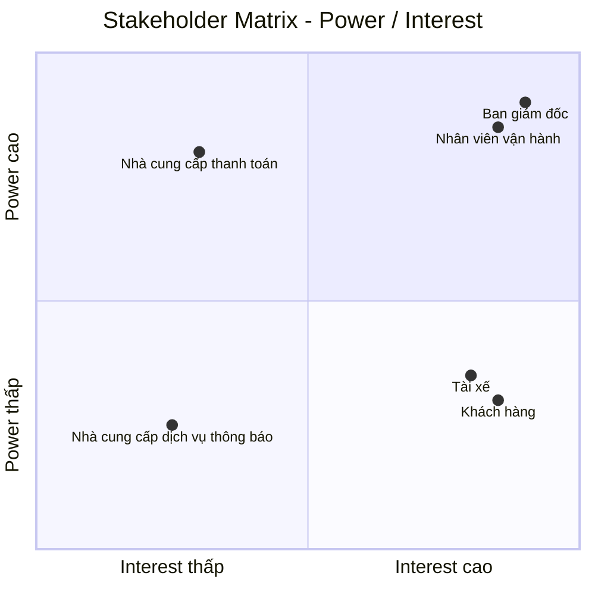

# CAB System – Phân tích yêu cầu
# Bước 1: Hiểu rõ hệ thống

## 1. Bối cảnh nghiệp vụ và lý do hệ thống cũ không đáp ứng được

Công ty ABC là một doanh nghiệp cung cấp dịch vụ đặt xe trực tuyến. Hiện tại khách hàng có thể liên hệ với tổng đài hoặc sử dụng một ứng dụng đơn giản để yêu cầu xe.

Hệ thống hiện tại còn một số hạn chế:

- Việc phân công tài xế chủ yếu được thực hiện thủ công.
- Khách hàng khó theo dõi trạng thái chuyến đi.
- Thông tin thanh toán chưa được quản lý tập trung.
- Bộ phận vận hành gặp khó khăn khi muốn mở rộng hệ thống.
- Hệ thống hiện tại khó đáp ứng khi số lượng khách hàng và tài xế tăng.

Những hạn chế này ảnh hưởng đến quá trình vận hành dịch vụ, trải nghiệm của khách hàng và khả năng mở rộng của doanh nghiệp.

## 2. Giải pháp mới và hệ thống mới

Công ty ABC mong muốn xây dựng **CAB System – Nền tảng đặt xe** nhằm hỗ trợ quy trình đặt xe từ khi khách hàng tạo yêu cầu cho đến khi chuyến đi hoàn thành.

Hệ thống mới hỗ trợ các hoạt động chính:

- Khách hàng đăng ký tài khoản, đăng nhập và cập nhật thông tin cá nhân.
- Khách hàng nhập điểm đón, điểm đến và lựa chọn loại xe.
- Khách hàng gửi yêu cầu đặt xe.
- Hệ thống xác định các tài xế phù hợp dựa trên vị trí, trạng thái sẵn sàng và một số tiêu chí vận hành khác.
- Hệ thống ưu tiên tài xế phù hợp và gần khách hàng.
- Tài xế nhận được thông báo và có thể chấp nhận hoặc từ chối chuyến.
- Nếu tài xế được đề xuất không phản hồi hoặc từ chối, hệ thống tiếp tục tìm tài xế khác mà không yêu cầu khách hàng tạo lại yêu cầu.
- Nếu không tìm được tài xế, khách hàng được thông báo rõ ràng.
- Khách hàng biết tài xế nào đã nhận chuyến và thời gian dự kiến tài xế đến.
- Tài xế cập nhật trạng thái chuyến gồm đã đến điểm đón, đã đón khách, đang di chuyển và hoàn thành chuyến.
- Khách hàng theo dõi được trạng thái hiện tại của chuyến đi.
- Sau khi chuyến đi hoàn thành, hệ thống xác định số tiền khách hàng phải trả dựa trên loại dịch vụ và thông tin chuyến đi.
- Khách hàng có thể thanh toán bằng tiền mặt hoặc phương thức thanh toán điện tử.
- Thanh toán điện tử được thực hiện thông qua nhà cung cấp thanh toán bên ngoài.
- Hệ thống CAB không lưu trực tiếp thông tin nhạy cảm của thẻ hoặc tài khoản thanh toán.
- Khách hàng nhận được thông báo khi yêu cầu đặt xe được tiếp nhận, khi có tài xế nhận chuyến, khi tài xế đến điểm đón, khi chuyến hoàn thành và khi thanh toán có kết quả.
- Tài xế nhận được thông báo về các chuyến mới hoặc những thay đổi liên quan đến chuyến đang thực hiện.
- Khách hàng có thể xem lịch sử chuyến đi, số tiền phải trả và đánh giá tài xế sau khi hoàn thành chuyến.
- Nhân viên vận hành có thể quản lý khách hàng, tài xế, phương tiện và chuyến đi.
- Nhân viên vận hành có thể xem các chuyến đang diễn ra, kiểm tra trạng thái tài xế, hỗ trợ xử lý các trường hợp chuyến bị lỗi và tra cứu lịch sử giao dịch.

Quy trình cốt lõi của hệ thống:

**Đặt xe → Tìm tài xế → Nhận chuyến → Thực hiện chuyến → Hoàn thành chuyến → Tính cước → Thanh toán → Đánh giá**

## 3. Các đối tượng tham gia hệ thống

| Đối tượng | Vai trò |
|---|---|
| Khách hàng | Đăng ký, đăng nhập, đặt xe, theo dõi chuyến đi, thanh toán và đánh giá tài xế |
| Tài xế | Quản lý hồ sơ, thông tin phương tiện, nhận hoặc từ chối chuyến và thực hiện chuyến |
| Nhân viên vận hành | Quản lý khách hàng, tài xế, phương tiện, chuyến đi và hỗ trợ xử lý các trường hợp chuyến bị lỗi |
| Nhà cung cấp thanh toán bên ngoài | Xử lý các giao dịch thanh toán điện tử |
| Nhà cung cấp dịch vụ thông báo | Hỗ trợ gửi thông báo đến khách hàng và tài xế |

## 4. Giá trị kinh doanh của hệ thống mới

| Đối tượng | Giá trị kinh doanh |
|---|---|
| Khách hàng | Đặt xe thuận tiện hơn, theo dõi được trạng thái chuyến đi, biết thông tin tài xế, thanh toán và đánh giá tài xế |
| Tài xế | Nhận yêu cầu chuyến, chủ động chấp nhận hoặc từ chối chuyến và cập nhật trạng thái chuyến |
| Nhân viên vận hành | Quản lý tập trung khách hàng, tài xế, phương tiện và chuyến đi; theo dõi và hỗ trợ xử lý các chuyến |
| Doanh nghiệp | Giảm sự phụ thuộc vào phân công tài xế thủ công, hỗ trợ tự động hóa việc tìm và phân công tài xế, cải thiện trải nghiệm khách hàng và hỗ trợ phục vụ số lượng lớn khách hàng và tài xế |

Giá trị cốt lõi của hệ thống là hỗ trợ Công ty ABC vận hành quy trình đặt xe từ khi khách hàng tạo yêu cầu, hệ thống tìm và phân công tài xế, tài xế thực hiện chuyến, chuyến hoàn thành, tính cước, thanh toán đến đánh giá tài xế.

# BƯỚC 2: XÁC ĐỊNH STAKEHOLDER, VAI TRÒ VÀ THIẾT LẬP STAKEHOLDER MATRIX

## 1. Xác định Stakeholder và vai trò

| Stakeholder | Vai trò trong hệ thống |
|---|---|
| Ban giám đốc | Chủ sở hữu sản phẩm, quyết định mục tiêu và định hướng của CAB System |
| Khách hàng | Người sử dụng dịch vụ đặt xe |
| Tài xế | Người cung cấp dịch vụ vận chuyển |
| Nhân viên vận hành | Người quản lý và giám sát hoạt động đặt xe |
| Nhà cung cấp thanh toán bên ngoài | Đối tác xử lý thanh toán điện tử |
| Nhà cung cấp dịch vụ thông báo | Đối tác hỗ trợ gửi thông báo |

## 2. Phân tích mức độ ảnh hưởng và quan tâm

| Stakeholder | Power | Interest | Lý do |
|---|---|---|---|
| Ban giám đốc | Cao | Cao | Có quyền quyết định và chịu trách nhiệm về sản phẩm |
| Nhân viên vận hành | Cao | Cao | Trực tiếp quản lý và giám sát hoạt động đặt xe |
| Khách hàng | Thấp | Cao | Sử dụng trực tiếp sản phẩm |
| Tài xế | Thấp | Cao | Sử dụng trực tiếp hệ thống để nhận và thực hiện chuyến |
| Nhà cung cấp thanh toán bên ngoài | Cao | Thấp | Có ảnh hưởng đến hoạt động thanh toán nhưng không tham gia trực tiếp vào quy trình đặt xe |
| Nhà cung cấp dịch vụ thông báo | Thấp | Thấp | Hỗ trợ một phần hoạt động của hệ thống |

## 3. Stakeholder Matrix

## 4. Chiến lược quản lý Stakeholder

| Nhóm | Stakeholder | Chiến lược |
|---|---|---|
| Power cao – Interest cao | Ban giám đốc, Nhân viên vận hành | Quản lý chặt chẽ, trao đổi thường xuyên và tham gia vào các quyết định quan trọng |
| Power thấp – Interest cao | Khách hàng, Tài xế | Duy trì sự tham gia, thường xuyên thu thập nhu cầu và phản hồi |
| Power cao – Interest thấp | Nhà cung cấp thanh toán bên ngoài | Duy trì sự hài lòng và phối hợp khi có vấn đề liên quan đến tích hợp |
| Power thấp – Interest thấp | Nhà cung cấp dịch vụ thông báo | Theo dõi và phối hợp khi phát sinh vấn đề |

## Bước 3. Mục đích nghiệp vụ

CAB System được xây dựng nhằm giải quyết các hạn chế của hệ thống đặt xe hiện tại và hỗ trợ Công ty ABC cải thiện hoạt động cung cấp dịch vụ đặt xe trực tuyến.

### Mục đích chính

- **Tự động hóa quá trình đặt xe và tìm tài xế**, giảm sự phụ thuộc vào việc phân công tài xế thủ công.
- **Cải thiện trải nghiệm khách hàng** bằng cách cho phép khách hàng chủ động đặt xe và theo dõi trạng thái chuyến đi.
- **Hỗ trợ tài xế tiếp nhận và thực hiện chuyến** thông qua hệ thống thay vì phụ thuộc vào quá trình điều phối thủ công.
- **Quản lý tập trung thông tin** về khách hàng, tài xế, phương tiện, chuyến đi và giao dịch.
- **Hỗ trợ thanh toán** bằng tiền mặt và phương thức thanh toán điện tử thông qua nhà cung cấp bên ngoài.
- **Cải thiện khả năng theo dõi và xử lý hoạt động vận hành** thông qua giao diện dành cho nhân viên vận hành.
- **Giảm thời gian xử lý khi tìm tài xế** bằng cách tự động tiếp tục tìm tài xế khác khi tài xế được đề xuất không phản hồi hoặc từ chối.
- **Cung cấp thông tin và dữ liệu cần thiết cho doanh nghiệp** để theo dõi hoạt động đặt xe và tình hình vận hành.

### Kết quả nghiệp vụ mong muốn

| Mục đích | Kết quả mong muốn |
|---|---|
| Tự động hóa đặt xe | Khách hàng có thể tạo yêu cầu và hệ thống tự động xử lý quá trình tìm tài xế |
| Cải thiện trải nghiệm khách hàng | Khách hàng có thể biết trạng thái yêu cầu, thông tin tài xế và trạng thái chuyến đi |
| Nâng cao hiệu quả tìm tài xế | Hệ thống có thể tiếp tục tìm tài xế khác khi tài xế được đề xuất không nhận chuyến |
| Quản lý tập trung | Thông tin khách hàng, tài xế, phương tiện, chuyến đi và giao dịch được quản lý trong hệ thống |
| Hỗ trợ thanh toán | Khách hàng có thể thanh toán bằng tiền mặt hoặc phương thức điện tử |
| Hỗ trợ vận hành | Nhân viên vận hành có thể theo dõi chuyến và hỗ trợ xử lý các trường hợp phát sinh |
| Hỗ trợ hoạt động kinh doanh | Doanh nghiệp có nền tảng để phục vụ số lượng lớn khách hàng và tài xế hơn hệ thống hiện tại |

### Mục tiêu tổng quát

**Xây dựng một nền tảng đặt xe giúp Công ty ABC tự động hóa quy trình từ khi khách hàng tạo yêu cầu, tìm và phân công tài xế, thực hiện chuyến, tính cước, thanh toán đến đánh giá sau chuyến, đồng thời hỗ trợ doanh nghiệp quản lý và theo dõi hoạt động đặt xe hiệu quả hơn.**

# BƯỚC 4: XÁC ĐỊNH PHẠM VI DỰ ÁN

## 1. Các module trong phạm vi

### Module 1: Quản lý tài khoản

- Đăng ký tài khoản khách hàng.
- Đăng nhập.
- Cập nhật thông tin cá nhân.
- Quản lý thông tin tài xế.
- Quản lý thông tin phương tiện.

### Module 2: Đặt xe

- Nhập điểm đón.
- Nhập điểm đến.
- Lựa chọn loại xe.
- Gửi yêu cầu đặt xe.
- Theo dõi trạng thái yêu cầu đặt xe.

### Module 3: Tìm và phân công tài xế

- Tìm tài xế phù hợp.
- Ưu tiên tài xế gần khách hàng.
- Gửi yêu cầu chuyến đến tài xế.
- Tài xế chấp nhận hoặc từ chối chuyến.
- Tiếp tục tìm tài xế khác khi tài xế từ chối hoặc không phản hồi.
- Thông báo khi không tìm được tài xế.

### Module 4: Quản lý chuyến đi

- Tài xế cập nhật trạng thái chuyến.
- Khách hàng theo dõi trạng thái chuyến.
- Lưu thông tin chuyến đi.
- Hoàn thành chuyến.

### Module 5: Tính cước và thanh toán

- Tính số tiền khách hàng phải trả.
- Thanh toán bằng tiền mặt.
- Thanh toán điện tử thông qua nhà cung cấp bên ngoài.
- Xử lý kết quả thanh toán.
- Thông báo kết quả thanh toán.

### Module 6: Thông báo

- Thông báo yêu cầu đặt xe được tiếp nhận.
- Thông báo khi tài xế nhận chuyến.
- Thông báo khi tài xế đến điểm đón.
- Thông báo khi chuyến hoàn thành.
- Thông báo kết quả thanh toán.
- Thông báo chuyến mới cho tài xế.

### Module 7: Lịch sử và đánh giá

- Xem lịch sử chuyến đi.
- Xem số tiền phải trả.
- Đánh giá tài xế sau chuyến.

### Module 8: Quản lý vận hành

- Quản lý khách hàng.
- Quản lý tài xế.
- Quản lý phương tiện.
- Theo dõi chuyến đang diễn ra.
- Kiểm tra trạng thái tài xế.
- Tra cứu lịch sử giao dịch.
- Hỗ trợ xử lý các trường hợp chuyến bị lỗi.
  
## Bước 5. Yêu cầu nghiệp vụ

| Yêu cầu nghiệp vụ | Yêu cầu hệ thống |
|---|---|
| Cung cấp dịch vụ đặt xe trực tuyến | Hệ thống phải cho phép khách hàng nhập điểm đón, điểm đến, lựa chọn loại xe và gửi yêu cầu đặt xe. |
| Tự động tìm và phân công tài xế | Hệ thống phải tự động xác định và lựa chọn tài xế phù hợp dựa trên vị trí, trạng thái sẵn sàng và các tiêu chí được xác định. |
| Xử lý trường hợp tài xế không nhận chuyến | Hệ thống phải tự động tìm tài xế khác khi tài xế được đề xuất từ chối hoặc không phản hồi. |
| Quản lý quá trình thực hiện chuyến | Hệ thống phải cho phép tài xế cập nhật trạng thái chuyến và cho phép khách hàng theo dõi trạng thái hiện tại của chuyến. |
| Quản lý khách hàng, tài xế và phương tiện | Hệ thống phải cho phép quản lý thông tin khách hàng, tài xế và phương tiện. |
| Tính cước chuyến đi | Hệ thống phải xác định số tiền khách hàng phải trả dựa trên thông tin chuyến đi và loại dịch vụ. |
| Hỗ trợ thanh toán | Hệ thống phải hỗ trợ thanh toán bằng tiền mặt và thanh toán điện tử thông qua nhà cung cấp thanh toán bên ngoài. |
| Quản lý kết quả thanh toán | Hệ thống phải tiếp nhận và lưu trạng thái giao dịch thanh toán, đồng thời thông báo kết quả cho khách hàng. |
| Cung cấp thông báo | Hệ thống phải gửi thông báo đến khách hàng và tài xế khi xảy ra các sự kiện quan trọng trong quá trình đặt và thực hiện chuyến. |
| Quản lý lịch sử chuyến đi | Hệ thống phải lưu trữ thông tin chuyến để khách hàng có thể tra cứu lịch sử và số tiền phải trả. |
| Đánh giá tài xế | Hệ thống phải cho phép khách hàng đánh giá tài xế sau khi chuyến đi hoàn thành. |
| Hỗ trợ nhân viên vận hành | Hệ thống phải cung cấp giao diện quản trị để nhân viên vận hành quản lý khách hàng, tài xế, phương tiện và chuyến đi. |
| Theo dõi và xử lý chuyến | Hệ thống phải cho phép nhân viên vận hành xem các chuyến đang diễn ra, kiểm tra trạng thái tài xế và hỗ trợ xử lý các trường hợp chuyến bị lỗi. |
| Phân quyền quản trị | Hệ thống phải kiểm soát quyền truy cập đối với các chức năng quản trị theo quyền của từng nhân viên. |
| Bảo vệ dữ liệu | Hệ thống phải bảo vệ thông tin cá nhân, thông tin phương tiện, dữ liệu vị trí và dữ liệu giao dịch khỏi truy cập trái phép. |
| Lưu vết hoạt động | Hệ thống phải ghi nhận các thao tác quan trọng để phục vụ kiểm tra khi có sự cố. |
| Đảm bảo tính ổn định | Hệ thống phải hạn chế việc lỗi tại một thành phần như thanh toán hoặc thông báo làm dừng toàn bộ quy trình đặt xe. |
| Hỗ trợ khả năng mở rộng | Hệ thống phải có khả năng mở rộng khi số lượng khách hàng và tài xế tăng và hỗ trợ bổ sung các chức năng mới trong tương lai. |

# Bước 6: Yêu cầu chức năng

## Khách hàng

- Quản lý tài khoản
- Đặt xe
- Theo dõi chuyến đi
- Thanh toán
- Xem lịch sử chuyến đi
- Đánh giá tài xế

## Tài xế

- Quản lý tài khoản
- Quản lý phương tiện
- Quản lý trạng thái hoạt động
- Quản lý chuyến được phân công
- Cập nhật trạng thái chuyến
- Xem lịch sử chuyến

## Nhân viên vận hành

- Quản lý khách hàng
- Quản lý tài xế
- Quản lý phương tiện
- Quản lý chuyến đi
- Theo dõi hoạt động tài xế
- Quản lý giao dịch
- Xử lý chuyến có vấn đề
- Quản lý quyền truy cập

## Ban giám đốc

- Theo dõi hoạt động kinh doanh
- Xem báo cáo hoạt động
- Theo dõi doanh thu
- Theo dõi số lượng chuyến
- Theo dõi tỷ lệ hoàn thành chuyến
- Theo dõi tỷ lệ hủy chuyến
- Theo dõi hiệu quả hoạt động của tài xế

## Nhà cung cấp thanh toán

- Xử lý thanh toán điện tử
- Trả kết quả giao dịch

## Nhà cung cấp dịch vụ thông báo

- Cung cấp dịch vụ gửi thông báo
- Trả trạng thái gửi thông báo

# Bước 7: Vẽ Use Case Diagram

# Bước 8: Đặc tả Use Case của tất cả chức năng

# Bước 8: Đặc tả Use Case

> **Lưu ý:** Actor trong đặc tả Use Case là các đối tượng trực tiếp sử dụng hoặc tương tác với CAB System. Trong phạm vi MLP gồm: **Khách hàng, Tài xế, Nhân viên vận hành, Ban giám đốc, Nhà cung cấp thanh toán và Nhà cung cấp dịch vụ thông báo**.  
> Các chức năng nội bộ như tìm tài xế, tính cước, quản lý dữ liệu không được xem là Actor.

---

# 1. Khách hàng

## UC01 – Quản lý tài khoản

| Thành phần | Nội dung |
|---|---|
| Actor | Khách hàng |
| Mục tiêu | Cho phép khách hàng đăng ký, đăng nhập và quản lý thông tin tài khoản |
| Tiền điều kiện | Khách hàng chưa đăng nhập khi đăng ký hoặc đăng nhập; đã có tài khoản khi cập nhật thông tin |
| Hậu điều kiện | Tài khoản được tạo, đăng nhập thành công hoặc thông tin cá nhân được cập nhật |
| Luồng chính | 1. Khách hàng truy cập chức năng quản lý tài khoản.   2. Khách hàng đăng ký hoặc đăng nhập.   3. Hệ thống xác thực thông tin.   4. Khách hàng xem thông tin tài khoản.   5. Khách hàng cập nhật thông tin nếu cần.   6. Hệ thống lưu thông tin thay đổi. |
| Luồng ngoại lệ | Thông tin đăng ký không hợp lệ; tài khoản đã tồn tại; thông tin đăng nhập không chính xác; thông tin cập nhật không hợp lệ. |

## UC02 – Đặt xe

| Thành phần | Nội dung |
|---|---|
| Actor | Khách hàng |
| Mục tiêu | Tạo yêu cầu đặt xe |
| Tiền điều kiện | Khách hàng đã đăng nhập |
| Hậu điều kiện | Yêu cầu đặt xe được tạo và chuyển sang trạng thái tìm tài xế |
| Luồng chính | 1. Khách hàng chọn chức năng đặt xe.   2. Nhập điểm đón.   3. Nhập điểm đến.   4. Chọn loại xe.   5. Xác nhận yêu cầu.   6. Hệ thống kiểm tra thông tin.   7. Hệ thống tạo yêu cầu đặt xe.   8. Hệ thống bắt đầu tìm tài xế phù hợp. |
| Luồng ngoại lệ | Thiếu điểm đón hoặc điểm đến; loại xe không khả dụng; thông tin không hợp lệ; hệ thống không thể tiếp nhận yêu cầu. |

## UC03 – Theo dõi chuyến đi

| Thành phần | Nội dung |
|---|---|
| Actor | Khách hàng |
| Mục tiêu | Theo dõi tình trạng chuyến đi từ khi tìm được tài xế đến khi hoàn thành |
| Tiền điều kiện | Khách hàng có yêu cầu đặt xe hoặc chuyến đang diễn ra |
| Hậu điều kiện | Khách hàng nhận được trạng thái mới nhất của chuyến |
| Luồng chính | 1. Khách hàng mở chuyến đang thực hiện.   2. Hệ thống hiển thị thông tin tài xế.   3. Hệ thống hiển thị trạng thái chuyến.   4. Hệ thống hiển thị thời gian dự kiến tài xế đến.   5. Khách hàng theo dõi các thay đổi của chuyến. |
| Luồng ngoại lệ | Không có chuyến đang thực hiện; dữ liệu trạng thái chưa được cập nhật; mất kết nối tạm thời. |

## UC04 – Thanh toán

| Thành phần | Nội dung |
|---|---|
| Actor | Khách hàng |
| Actor phụ | Nhà cung cấp thanh toán |
| Mục tiêu | Thanh toán chi phí chuyến đi |
| Tiền điều kiện | Chuyến đi đã hoàn thành và hệ thống đã xác định số tiền phải trả |
| Hậu điều kiện | Kết quả thanh toán được ghi nhận |
| Luồng chính | 1. Khách hàng xem số tiền phải trả.   2. Khách hàng lựa chọn phương thức thanh toán.   3. Nếu chọn tiền mặt, hệ thống ghi nhận phương thức thanh toán.   4. Nếu chọn thanh toán điện tử, hệ thống chuyển yêu cầu đến nhà cung cấp thanh toán.   5. Nhà cung cấp xử lý giao dịch.   6. Hệ thống nhận kết quả.   7. Hệ thống cập nhật trạng thái thanh toán.   8. Khách hàng nhận thông báo kết quả. |
| Luồng ngoại lệ | Giao dịch bị từ chối; giao dịch thất bại; nhà cung cấp thanh toán không phản hồi; khách hàng cần thực hiện lại giao dịch theo chính sách. |

## UC05 – Xem lịch sử chuyến đi

| Thành phần | Nội dung |
|---|---|
| Actor | Khách hàng |
| Mục tiêu | Tra cứu các chuyến đi đã thực hiện |
| Tiền điều kiện | Khách hàng đã đăng nhập |
| Hậu điều kiện | Thông tin lịch sử chuyến được hiển thị |
| Luồng chính | 1. Khách hàng mở lịch sử chuyến đi.   2. Hệ thống hiển thị danh sách chuyến.   3. Khách hàng chọn một chuyến.   4. Hệ thống hiển thị thông tin chi tiết và số tiền phải trả. |
| Luồng ngoại lệ | Không có chuyến đã hoàn thành. |

## UC06 – Đánh giá tài xế

| Thành phần | Nội dung |
|---|---|
| Actor | Khách hàng |
| Mục tiêu | Đánh giá tài xế sau khi hoàn thành chuyến |
| Tiền điều kiện | Chuyến đi đã hoàn thành và khách hàng chưa đánh giá chuyến đó |
| Hậu điều kiện | Đánh giá được lưu vào hệ thống |
| Luồng chính | 1. Khách hàng mở chuyến đã hoàn thành.   2. Chọn chức năng đánh giá.   3. Nhập mức đánh giá.   4. Gửi đánh giá.   5. Hệ thống kiểm tra và lưu đánh giá. |
| Luồng ngoại lệ | Chuyến chưa hoàn thành; khách hàng đã đánh giá; dữ liệu đánh giá không hợp lệ. |

---

# 2. Tài xế

## UC07 – Quản lý tài khoản

| Thành phần | Nội dung |
|---|---|
| Actor | Tài xế |
| Mục tiêu | Quản lý tài khoản và thông tin cá nhân |
| Tiền điều kiện | Tài xế đã được tạo tài khoản |
| Hậu điều kiện | Thông tin tài khoản được cập nhật |
| Luồng chính | 1. Tài xế đăng nhập.   2. Mở thông tin tài khoản.   3. Xem thông tin cá nhân.   4. Cập nhật thông tin.   5. Hệ thống kiểm tra và lưu thay đổi. |
| Luồng ngoại lệ | Thông tin đăng nhập không chính xác; thông tin cập nhật không hợp lệ. |

## UC08 – Quản lý phương tiện

| Thành phần | Nội dung |
|---|---|
| Actor | Tài xế, Nhân viên vận hành |
| Mục tiêu | Quản lý thông tin phương tiện được sử dụng để cung cấp dịch vụ |
| Tiền điều kiện | Người sử dụng đã đăng nhập và có quyền phù hợp |
| Hậu điều kiện | Thông tin phương tiện được tạo hoặc cập nhật |
| Luồng chính | 1. Actor mở thông tin phương tiện.   2. Xem thông tin hiện tại.   3. Nhập hoặc cập nhật thông tin.   4. Hệ thống kiểm tra dữ liệu.   5. Hệ thống lưu thông tin. |
| Luồng ngoại lệ | Thông tin phương tiện không hợp lệ; actor không có quyền thực hiện thao tác. |

## UC09 – Quản lý trạng thái hoạt động

| Thành phần | Nội dung |
|---|---|
| Actor | Tài xế |
| Mục tiêu | Cho phép tài xế xác định trạng thái có thể nhận chuyến |
| Tiền điều kiện | Tài xế đã đăng nhập và đủ điều kiện hoạt động |
| Hậu điều kiện | Trạng thái hoạt động của tài xế được cập nhật |
| Luồng chính | 1. Tài xế mở trạng thái hoạt động.   2. Chọn trạng thái phù hợp.   3. Hệ thống kiểm tra điều kiện.   4. Hệ thống cập nhật trạng thái. |
| Luồng ngoại lệ | Tài xế không đủ điều kiện hoạt động; trạng thái không thể cập nhật. |

## UC10 – Quản lý chuyến được phân công

| Thành phần | Nội dung |
|---|---|
| Actor | Tài xế |
| Mục tiêu | Tiếp nhận và quản lý các yêu cầu chuyến được gửi đến |
| Tiền điều kiện | Tài xế đang ở trạng thái sẵn sàng |
| Hậu điều kiện | Chuyến được tài xế nhận hoặc được chuyển sang tài xế khác |
| Luồng chính | 1. Tài xế nhận thông báo chuyến mới.   2. Xem thông tin chuyến.   3. Chọn chấp nhận hoặc từ chối.   4. Hệ thống ghi nhận phản hồi.   5. Nếu chấp nhận, chuyến được phân công cho tài xế. |
| Luồng ngoại lệ | Tài xế từ chối; tài xế không phản hồi; chuyến đã được tài xế khác nhận. |

## UC11 – Cập nhật trạng thái chuyến

| Thành phần | Nội dung |
|---|---|
| Actor | Tài xế |
| Mục tiêu | Cập nhật tình trạng thực tế của chuyến |
| Tiền điều kiện | Tài xế đã nhận chuyến |
| Hậu điều kiện | Trạng thái chuyến được cập nhật |
| Luồng chính | 1. Tài xế mở chuyến.   2. Chọn trạng thái mới.   3. Hệ thống kiểm tra trạng thái hợp lệ.   4. Hệ thống lưu trạng thái.   5. Hệ thống cập nhật thông tin cho khách hàng. |
| Luồng ngoại lệ | Trạng thái không hợp lệ; trạng thái mới không phù hợp với trạng thái hiện tại; mất kết nối. |

## UC12 – Xem lịch sử chuyến

| Thành phần | Nội dung |
|---|---|
| Actor | Tài xế |
| Mục tiêu | Xem các chuyến đã thực hiện |
| Tiền điều kiện | Tài xế đã đăng nhập |
| Hậu điều kiện | Danh sách lịch sử chuyến được hiển thị |
| Luồng chính | 1. Tài xế mở lịch sử chuyến.   2. Hệ thống hiển thị danh sách.   3. Tài xế chọn chuyến.   4. Hệ thống hiển thị chi tiết chuyến. |
| Luồng ngoại lệ | Không có lịch sử chuyến. |

---

# 3. Nhân viên vận hành

## UC13 – Quản lý khách hàng

| Thành phần | Nội dung |
|---|---|
| Actor | Nhân viên vận hành |
| Mục tiêu | Quản lý và tra cứu thông tin khách hàng |
| Tiền điều kiện | Nhân viên đã đăng nhập và có quyền phù hợp |
| Hậu điều kiện | Thông tin khách hàng được hiển thị hoặc cập nhật |
| Luồng chính | 1. Nhân viên truy cập quản lý khách hàng.   2. Tìm kiếm khách hàng.   3. Xem thông tin.   4. Thực hiện thao tác được cấp quyền.   5. Hệ thống lưu thay đổi nếu có. |
| Luồng ngoại lệ | Không tìm thấy khách hàng; không đủ quyền. |

## UC14 – Quản lý tài xế

| Thành phần | Nội dung |
|---|---|
| Actor | Nhân viên vận hành |
| Mục tiêu | Quản lý thông tin và tài khoản tài xế |
| Tiền điều kiện | Nhân viên đã đăng nhập và có quyền phù hợp |
| Hậu điều kiện | Thông tin tài xế được tạo hoặc cập nhật |
| Luồng chính | 1. Truy cập quản lý tài xế.   2. Tìm kiếm hoặc tạo tài khoản tài xế.   3. Nhập thông tin.   4. Hệ thống kiểm tra dữ liệu.   5. Hệ thống lưu thông tin. |
| Luồng ngoại lệ | Dữ liệu không hợp lệ; tài khoản đã tồn tại; không đủ quyền. |

## UC15 – Quản lý phương tiện

| Thành phần | Nội dung |
|---|---|
| Actor | Nhân viên vận hành |
| Mục tiêu | Quản lý thông tin phương tiện |
| Tiền điều kiện | Nhân viên đã đăng nhập và có quyền phù hợp |
| Hậu điều kiện | Thông tin phương tiện được lưu hoặc cập nhật |
| Luồng chính | 1. Truy cập quản lý phương tiện.   2. Tìm kiếm hoặc tạo thông tin phương tiện.   3. Nhập thông tin.   4. Kiểm tra dữ liệu.   5. Lưu thông tin. |
| Luồng ngoại lệ | Thông tin không hợp lệ; phương tiện đã tồn tại; không đủ quyền. |

## UC16 – Quản lý chuyến đi

| Thành phần | Nội dung |
|---|---|
| Actor | Nhân viên vận hành |
| Mục tiêu | Theo dõi và tra cứu các chuyến đi |
| Tiền điều kiện | Nhân viên đã đăng nhập |
| Hậu điều kiện | Thông tin chuyến được hiển thị |
| Luồng chính | 1. Nhân viên mở danh sách chuyến.   2. Tìm kiếm hoặc lọc chuyến.   3. Chọn chuyến.   4. Xem thông tin khách hàng, tài xế và trạng thái chuyến. |
| Luồng ngoại lệ | Không tìm thấy chuyến. |

## UC17 – Theo dõi hoạt động tài xế

| Thành phần | Nội dung |
|---|---|
| Actor | Nhân viên vận hành |
| Mục tiêu | Theo dõi trạng thái hoạt động và vị trí tài xế |
| Tiền điều kiện | Nhân viên đã đăng nhập |
| Hậu điều kiện | Thông tin hoạt động tài xế được hiển thị |
| Luồng chính | 1. Mở danh sách tài xế.   2. Xem trạng thái hoạt động.   3. Chọn tài xế.   4. Xem thông tin vị trí và chuyến liên quan nếu có. |
| Luồng ngoại lệ | Không có dữ liệu vị trí mới; tài xế mất kết nối. |

## UC18 – Quản lý giao dịch

| Thành phần | Nội dung |
|---|---|
| Actor | Nhân viên vận hành |
| Mục tiêu | Tra cứu và kiểm tra các giao dịch |
| Tiền điều kiện | Nhân viên đã đăng nhập và có quyền phù hợp |
| Hậu điều kiện | Thông tin giao dịch được hiển thị |
| Luồng chính | 1. Truy cập giao dịch.   2. Tìm kiếm giao dịch.   3. Xem thông tin giao dịch.   4. Kiểm tra trạng thái giao dịch. |
| Luồng ngoại lệ | Không tìm thấy giao dịch; không đủ quyền. |

## UC19 – Xử lý chuyến có vấn đề

| Thành phần | Nội dung |
|---|---|
| Actor | Nhân viên vận hành |
| Mục tiêu | Hỗ trợ xử lý các trường hợp chuyến bị lỗi |
| Tiền điều kiện | Có chuyến phát sinh vấn đề và nhân viên có quyền xử lý |
| Hậu điều kiện | Vấn đề được ghi nhận và xử lý theo chính sách |
| Luồng chính | 1. Nhân viên xác định chuyến có vấn đề.   2. Xem thông tin chuyến.   3. Xác định vấn đề.   4. Thực hiện thao tác hỗ trợ phù hợp.   5. Ghi nhận kết quả xử lý. |
| Luồng ngoại lệ | Không đủ quyền; không thể xử lý theo chính sách hiện tại. |

## UC20 – Quản lý quyền truy cập

| Thành phần | Nội dung |
|---|---|
| Actor | Nhân viên vận hành có quyền quản trị |
| Mục tiêu | Kiểm soát quyền truy cập của nhân viên |
| Tiền điều kiện | Người thực hiện có quyền quản trị |
| Hậu điều kiện | Quyền truy cập được cập nhật |
| Luồng chính | 1. Xem tài khoản nhân viên.   2. Chọn tài khoản.   3. Thiết lập quyền.   4. Xác nhận.   5. Hệ thống lưu quyền. |
| Luồng ngoại lệ | Không đủ quyền; quyền không hợp lệ. |

---

# 4. Ban giám đốc

## UC21 – Theo dõi hoạt động kinh doanh

| Thành phần | Nội dung |
|---|---|
| Actor | Ban giám đốc |
| Mục tiêu | Theo dõi tình hình hoạt động của dịch vụ |
| Tiền điều kiện | Ban giám đốc có quyền truy cập |
| Hậu điều kiện | Các chỉ số hoạt động được hiển thị |
| Luồng chính | 1. Đăng nhập hệ thống.   2. Truy cập khu vực theo dõi hoạt động.   3. Chọn khoảng thời gian.   4. Xem số lượng chuyến, doanh thu, tỷ lệ hoàn thành và tỷ lệ hủy. |
| Luồng ngoại lệ | Không có dữ liệu trong khoảng thời gian được chọn. |

## UC22 – Xem báo cáo hoạt động

| Thành phần | Nội dung |
|---|---|
| Actor | Ban giám đốc |
| Mục tiêu | Xem báo cáo phục vụ việc theo dõi và đánh giá hoạt động |
| Tiền điều kiện | Ban giám đốc có quyền truy cập |
| Hậu điều kiện | Báo cáo được hiển thị |
| Luồng chính | 1. Chọn loại báo cáo.   2. Chọn khoảng thời gian.   3. Hệ thống tổng hợp dữ liệu.   4. Hiển thị báo cáo. |
| Ngoại lệ | Không có dữ liệu; dữ liệu chưa được cập nhật. |

---

# 5. Nhà cung cấp thanh toán

## UC23 – Xử lý thanh toán điện tử

| Thành phần | Nội dung |
|---|---|
| Actor | Nhà cung cấp thanh toán |
| Mục tiêu | Xử lý giao dịch thanh toán điện tử từ CAB System |
| Tiền điều kiện | CAB System gửi yêu cầu thanh toán hợp lệ |
| Hậu điều kiện | Giao dịch có kết quả xử lý |
| Luồng chính | 1. Nhà cung cấp nhận yêu cầu thanh toán.   2. Xử lý giao dịch.   3. Xác định kết quả.   4. Trả kết quả về CAB System. |
| Luồng ngoại lệ | Giao dịch bị từ chối; giao dịch thất bại; dịch vụ thanh toán không khả dụng. |

## UC24 – Trả kết quả giao dịch

| Thành phần | Nội dung |
|---|---|
| Actor | Nhà cung cấp thanh toán |
| Mục tiêu | Cung cấp kết quả giao dịch cho CAB System |
| Tiền điều kiện | Giao dịch đã được xử lý |
| Hậu điều kiện | CAB System nhận được trạng thái giao dịch |
| Luồng chính | 1. Nhà cung cấp xác định kết quả.   2. Gửi trạng thái giao dịch.   3. CAB System tiếp nhận kết quả. |
| Luồng ngoại lệ | Không thể gửi kết quả; kết nối giữa hai hệ thống bị gián đoạn. |

---

# 6. Nhà cung cấp dịch vụ thông báo

## UC25 – Gửi thông báo

| Thành phần | Nội dung |
|---|---|
| Actor | Nhà cung cấp dịch vụ thông báo |
| Mục tiêu | Gửi thông báo do CAB System yêu cầu |
| Tiền điều kiện | CAB System gửi yêu cầu thông báo hợp lệ |
| Hậu điều kiện | Thông báo được gửi hoặc trạng thái thất bại được trả về |
| Luồng chính | 1. Nhà cung cấp nhận yêu cầu.   2. Kiểm tra yêu cầu.   3. Gửi thông báo đến người nhận.   4. Trả trạng thái gửi về CAB System. |
| Luồng ngoại lệ | Địa chỉ người nhận không hợp lệ; dịch vụ thông báo không khả dụng; gửi thất bại. |

## UC26 – Trả trạng thái gửi thông báo

| Thành phần | Nội dung |
|---|---|
| Actor | Nhà cung cấp dịch vụ thông báo |
| Mục tiêu | Cung cấp trạng thái gửi thông báo cho CAB System |
| Tiền điều kiện | Yêu cầu gửi thông báo đã được tiếp nhận |
| Hậu điều kiện | CAB System nhận được trạng thái gửi |
| Luồng chính | 1. Xác định trạng thái gửi.   2. Trả trạng thái về CAB System.   3. CAB System cập nhật trạng thái. |
| Luồng ngoại lệ | Không thể trả trạng thái; kết nối bị gián đoạn. |

---

# 7. Ghi chú về các chức năng hệ thống hỗ trợ

Các chức năng dưới đây **không tạo Actor riêng** vì chúng là khả năng xử lý bên trong CAB System và được thực hiện trong quá trình các Actor sử dụng chức năng chính:

- Tìm và phân công tài xế
- Tính cước
- Quản lý dữ liệu chuyến đi
- Quản lý trạng thái thanh toán
- Gửi thông báo

Các chức năng này được sử dụng như một phần của các Use Case chính, thay vì xem **CAB System** là một Actor.

Ví dụ:

- **Đặt xe** sử dụng chức năng **Tìm và phân công tài xế**.
- **Thanh toán** sử dụng chức năng **Tính cước** và **Quản lý trạng thái thanh toán**.
- **Theo dõi chuyến đi** sử dụng dữ liệu trạng thái chuyến.
- Các sự kiện quan trọng trong **Đặt xe**, **Theo dõi chuyến đi** và **Thanh toán** có thể sử dụng chức năng **Gửi thông báo**.
