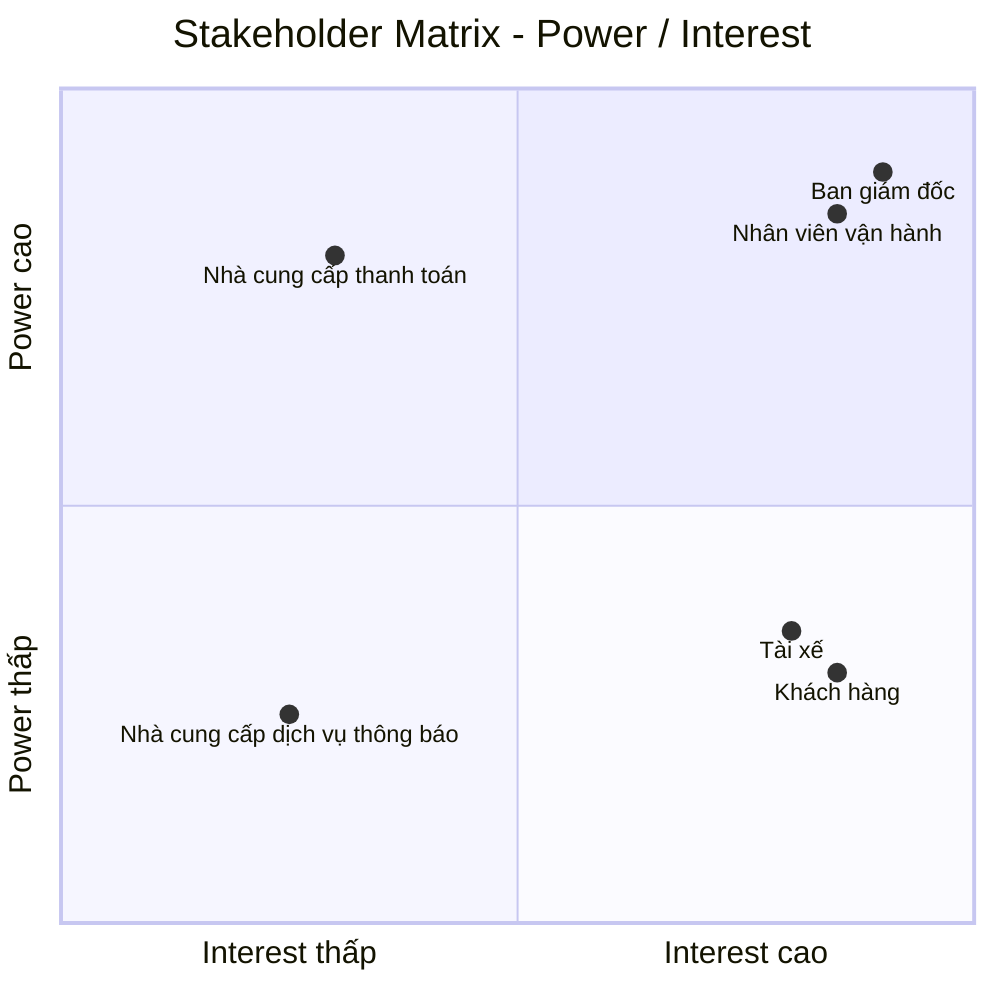
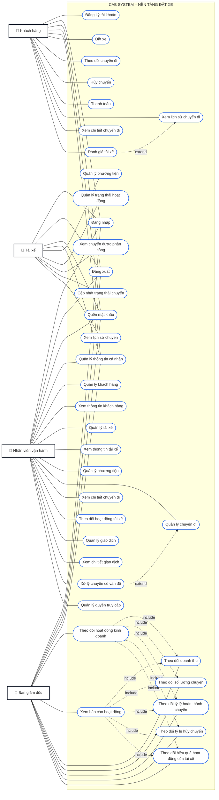

# CAB System – Phân tích yêu cầu
# Bước 1: Hiểu rõ hệ thống

## 1. Bối cảnh nghiệp vụ và lý do hệ thống cũ không đáp ứng được

Công ty ABC là một doanh nghiệp cung cấp dịch vụ đặt xe trực tuyến. Hiện tại khách hàng có thể liên hệ với tổng đài hoặc sử dụng một ứng dụng đơn giản để yêu cầu xe.

Hệ thống hiện tại còn một số hạn chế:

- Việc phân công tài xế chủ yếu được thực hiện thủ công.
- Khách hàng khó theo dõi trạng thái chuyến đi.
- Thông tin thanh toán chưa được quản lý tập trung.
- Bộ phận vận hành gặp khó khăn khi muốn mở rộng hệ thống.
- Hệ thống hiện tại khó đáp ứng khi số lượng khách hàng và tài xế tăng.

Những hạn chế này ảnh hưởng đến quá trình vận hành dịch vụ, trải nghiệm của khách hàng và khả năng mở rộng của doanh nghiệp.

## 2. Giải pháp mới và hệ thống mới

Công ty ABC mong muốn xây dựng **CAB System – Nền tảng đặt xe** nhằm hỗ trợ quy trình đặt xe từ khi khách hàng tạo yêu cầu cho đến khi chuyến đi hoàn thành.

Hệ thống mới hỗ trợ các hoạt động chính:

- Khách hàng đăng ký tài khoản, đăng nhập và cập nhật thông tin cá nhân.
- Khách hàng nhập điểm đón, điểm đến và lựa chọn loại xe.
- Khách hàng gửi yêu cầu đặt xe.
- Hệ thống xác định các tài xế phù hợp dựa trên vị trí, trạng thái sẵn sàng và một số tiêu chí vận hành khác.
- Hệ thống ưu tiên tài xế phù hợp và gần khách hàng.
- Tài xế nhận được thông báo và có thể chấp nhận hoặc từ chối chuyến.
- Nếu tài xế được đề xuất không phản hồi hoặc từ chối, hệ thống tiếp tục tìm tài xế khác mà không yêu cầu khách hàng tạo lại yêu cầu.
- Nếu không tìm được tài xế, khách hàng được thông báo rõ ràng.
- Khách hàng biết tài xế nào đã nhận chuyến và thời gian dự kiến tài xế đến.
- Tài xế cập nhật trạng thái chuyến gồm đã đến điểm đón, đã đón khách, đang di chuyển và hoàn thành chuyến.
- Khách hàng theo dõi được trạng thái hiện tại của chuyến đi.
- Sau khi chuyến đi hoàn thành, hệ thống xác định số tiền khách hàng phải trả dựa trên loại dịch vụ và thông tin chuyến đi.
- Khách hàng có thể thanh toán bằng tiền mặt hoặc phương thức thanh toán điện tử.
- Thanh toán điện tử được thực hiện thông qua nhà cung cấp thanh toán bên ngoài.
- Hệ thống CAB không lưu trực tiếp thông tin nhạy cảm của thẻ hoặc tài khoản thanh toán.
- Khách hàng nhận được thông báo khi yêu cầu đặt xe được tiếp nhận, khi có tài xế nhận chuyến, khi tài xế đến điểm đón, khi chuyến hoàn thành và khi thanh toán có kết quả.
- Tài xế nhận được thông báo về các chuyến mới hoặc những thay đổi liên quan đến chuyến đang thực hiện.
- Khách hàng có thể xem lịch sử chuyến đi, số tiền phải trả và đánh giá tài xế sau khi hoàn thành chuyến.
- Nhân viên vận hành có thể quản lý khách hàng, tài xế, phương tiện và chuyến đi.
- Nhân viên vận hành có thể xem các chuyến đang diễn ra, kiểm tra trạng thái tài xế, hỗ trợ xử lý các trường hợp chuyến bị lỗi và tra cứu lịch sử giao dịch.

Quy trình cốt lõi của hệ thống:

**Đặt xe → Tìm tài xế → Nhận chuyến → Thực hiện chuyến → Hoàn thành chuyến → Tính cước → Thanh toán → Đánh giá**

## 3. Các đối tượng tham gia hệ thống

| Đối tượng | Vai trò |
|---|---|
| Khách hàng | Đăng ký, đăng nhập, đặt xe, theo dõi chuyến đi, thanh toán và đánh giá tài xế |
| Tài xế | Quản lý hồ sơ, thông tin phương tiện, nhận hoặc từ chối chuyến và thực hiện chuyến |
| Nhân viên vận hành | Quản lý khách hàng, tài xế, phương tiện, chuyến đi và hỗ trợ xử lý các trường hợp chuyến bị lỗi |
| Nhà cung cấp thanh toán bên ngoài | Xử lý các giao dịch thanh toán điện tử |
| Nhà cung cấp dịch vụ thông báo | Hỗ trợ gửi thông báo đến khách hàng và tài xế |

## 4. Giá trị kinh doanh của hệ thống mới

| Đối tượng | Giá trị kinh doanh |
|---|---|
| Khách hàng | Đặt xe thuận tiện hơn, theo dõi được trạng thái chuyến đi, biết thông tin tài xế, thanh toán và đánh giá tài xế |
| Tài xế | Nhận yêu cầu chuyến, chủ động chấp nhận hoặc từ chối chuyến và cập nhật trạng thái chuyến |
| Nhân viên vận hành | Quản lý tập trung khách hàng, tài xế, phương tiện và chuyến đi; theo dõi và hỗ trợ xử lý các chuyến |
| Doanh nghiệp | Giảm sự phụ thuộc vào phân công tài xế thủ công, hỗ trợ tự động hóa việc tìm và phân công tài xế, cải thiện trải nghiệm khách hàng và hỗ trợ phục vụ số lượng lớn khách hàng và tài xế |

Giá trị cốt lõi của hệ thống là hỗ trợ Công ty ABC vận hành quy trình đặt xe từ khi khách hàng tạo yêu cầu, hệ thống tìm và phân công tài xế, tài xế thực hiện chuyến, chuyến hoàn thành, tính cước, thanh toán đến đánh giá tài xế.

# BƯỚC 2: XÁC ĐỊNH STAKEHOLDER, VAI TRÒ VÀ THIẾT LẬP STAKEHOLDER MATRIX

## 1. Xác định Stakeholder và vai trò

| Stakeholder | Vai trò trong hệ thống |
|---|---|
| Ban giám đốc | Chủ sở hữu sản phẩm, quyết định mục tiêu và định hướng của CAB System |
| Khách hàng | Người sử dụng dịch vụ đặt xe |
| Tài xế | Người cung cấp dịch vụ vận chuyển |
| Nhân viên vận hành | Người quản lý và giám sát hoạt động đặt xe |
| Nhà cung cấp thanh toán bên ngoài | Đối tác xử lý thanh toán điện tử |
| Nhà cung cấp dịch vụ thông báo | Đối tác hỗ trợ gửi thông báo |

## 2. Phân tích mức độ ảnh hưởng và quan tâm

| Stakeholder | Power | Interest | Lý do |
|---|---|---|---|
| Ban giám đốc | Cao | Cao | Có quyền quyết định và chịu trách nhiệm về sản phẩm |
| Nhân viên vận hành | Cao | Cao | Trực tiếp quản lý và giám sát hoạt động đặt xe |
| Khách hàng | Thấp | Cao | Sử dụng trực tiếp sản phẩm |
| Tài xế | Thấp | Cao | Sử dụng trực tiếp hệ thống để nhận và thực hiện chuyến |
| Nhà cung cấp thanh toán bên ngoài | Cao | Thấp | Có ảnh hưởng đến hoạt động thanh toán nhưng không tham gia trực tiếp vào quy trình đặt xe |
| Nhà cung cấp dịch vụ thông báo | Thấp | Thấp | Hỗ trợ một phần hoạt động của hệ thống |

## 3. Stakeholder Matrix

## 4. Chiến lược quản lý Stakeholder

| Nhóm | Stakeholder | Chiến lược |
|---|---|---|
| Power cao – Interest cao | Ban giám đốc, Nhân viên vận hành | Quản lý chặt chẽ, trao đổi thường xuyên và tham gia vào các quyết định quan trọng |
| Power thấp – Interest cao | Khách hàng, Tài xế | Duy trì sự tham gia, thường xuyên thu thập nhu cầu và phản hồi |
| Power cao – Interest thấp | Nhà cung cấp thanh toán bên ngoài | Duy trì sự hài lòng và phối hợp khi có vấn đề liên quan đến tích hợp |
| Power thấp – Interest thấp | Nhà cung cấp dịch vụ thông báo | Theo dõi và phối hợp khi phát sinh vấn đề |

## Bước 3. Mục đích nghiệp vụ

CAB System được xây dựng nhằm giải quyết các hạn chế của hệ thống đặt xe hiện tại và hỗ trợ Công ty ABC cải thiện hoạt động cung cấp dịch vụ đặt xe trực tuyến.

### Mục đích chính

- **Tự động hóa quá trình đặt xe và tìm tài xế**, giảm sự phụ thuộc vào việc phân công tài xế thủ công.
- **Cải thiện trải nghiệm khách hàng** bằng cách cho phép khách hàng chủ động đặt xe và theo dõi trạng thái chuyến đi.
- **Hỗ trợ tài xế tiếp nhận và thực hiện chuyến** thông qua hệ thống thay vì phụ thuộc vào quá trình điều phối thủ công.
- **Quản lý tập trung thông tin** về khách hàng, tài xế, phương tiện, chuyến đi và giao dịch.
- **Hỗ trợ thanh toán** bằng tiền mặt và phương thức thanh toán điện tử thông qua nhà cung cấp bên ngoài.
- **Cải thiện khả năng theo dõi và xử lý hoạt động vận hành** thông qua giao diện dành cho nhân viên vận hành.
- **Giảm thời gian xử lý khi tìm tài xế** bằng cách tự động tiếp tục tìm tài xế khác khi tài xế được đề xuất không phản hồi hoặc từ chối.
- **Cung cấp thông tin và dữ liệu cần thiết cho doanh nghiệp** để theo dõi hoạt động đặt xe và tình hình vận hành.

### Kết quả nghiệp vụ mong muốn

| Mục đích | Kết quả mong muốn |
|---|---|
| Tự động hóa đặt xe | Khách hàng có thể tạo yêu cầu và hệ thống tự động xử lý quá trình tìm tài xế |
| Cải thiện trải nghiệm khách hàng | Khách hàng có thể biết trạng thái yêu cầu, thông tin tài xế và trạng thái chuyến đi |
| Nâng cao hiệu quả tìm tài xế | Hệ thống có thể tiếp tục tìm tài xế khác khi tài xế được đề xuất không nhận chuyến |
| Quản lý tập trung | Thông tin khách hàng, tài xế, phương tiện, chuyến đi và giao dịch được quản lý trong hệ thống |
| Hỗ trợ thanh toán | Khách hàng có thể thanh toán bằng tiền mặt hoặc phương thức điện tử |
| Hỗ trợ vận hành | Nhân viên vận hành có thể theo dõi chuyến và hỗ trợ xử lý các trường hợp phát sinh |
| Hỗ trợ hoạt động kinh doanh | Doanh nghiệp có nền tảng để phục vụ số lượng lớn khách hàng và tài xế hơn hệ thống hiện tại |

### Mục tiêu tổng quát

**Xây dựng một nền tảng đặt xe giúp Công ty ABC tự động hóa quy trình từ khi khách hàng tạo yêu cầu, tìm và phân công tài xế, thực hiện chuyến, tính cước, thanh toán đến đánh giá sau chuyến, đồng thời hỗ trợ doanh nghiệp quản lý và theo dõi hoạt động đặt xe hiệu quả hơn.**

# BƯỚC 4: XÁC ĐỊNH PHẠM VI DỰ ÁN

## 1. Các module trong phạm vi

### Module 1: Quản lý tài khoản

- Đăng ký tài khoản khách hàng.
- Đăng nhập.
- Cập nhật thông tin cá nhân.
- Quản lý thông tin tài xế.
- Quản lý thông tin phương tiện.

### Module 2: Đặt xe

- Nhập điểm đón.
- Nhập điểm đến.
- Lựa chọn loại xe.
- Gửi yêu cầu đặt xe.
- Theo dõi trạng thái yêu cầu đặt xe.

### Module 3: Tìm và phân công tài xế

- Tìm tài xế phù hợp.
- Ưu tiên tài xế gần khách hàng.
- Gửi yêu cầu chuyến đến tài xế.
- Tài xế chấp nhận hoặc từ chối chuyến.
- Tiếp tục tìm tài xế khác khi tài xế từ chối hoặc không phản hồi.
- Thông báo khi không tìm được tài xế.

### Module 4: Quản lý chuyến đi

- Tài xế cập nhật trạng thái chuyến.
- Khách hàng theo dõi trạng thái chuyến.
- Lưu thông tin chuyến đi.
- Hoàn thành chuyến.

### Module 5: Tính cước và thanh toán

- Tính số tiền khách hàng phải trả.
- Thanh toán bằng tiền mặt.
- Thanh toán điện tử thông qua nhà cung cấp bên ngoài.
- Xử lý kết quả thanh toán.
- Thông báo kết quả thanh toán.

### Module 6: Thông báo

- Thông báo yêu cầu đặt xe được tiếp nhận.
- Thông báo khi tài xế nhận chuyến.
- Thông báo khi tài xế đến điểm đón.
- Thông báo khi chuyến hoàn thành.
- Thông báo kết quả thanh toán.
- Thông báo chuyến mới cho tài xế.

### Module 7: Lịch sử và đánh giá

- Xem lịch sử chuyến đi.
- Xem số tiền phải trả.
- Đánh giá tài xế sau chuyến.

### Module 8: Quản lý vận hành

- Quản lý khách hàng.
- Quản lý tài xế.
- Quản lý phương tiện.
- Theo dõi chuyến đang diễn ra.
- Kiểm tra trạng thái tài xế.
- Tra cứu lịch sử giao dịch.
- Hỗ trợ xử lý các trường hợp chuyến bị lỗi.
  
## Bước 5. Yêu cầu nghiệp vụ

| Yêu cầu nghiệp vụ | Yêu cầu hệ thống |
|---|---|
| Cung cấp dịch vụ đặt xe trực tuyến | Hệ thống phải cho phép khách hàng nhập điểm đón, điểm đến, lựa chọn loại xe và gửi yêu cầu đặt xe. |
| Tự động tìm và phân công tài xế | Hệ thống phải tự động xác định và lựa chọn tài xế phù hợp dựa trên vị trí, trạng thái sẵn sàng và các tiêu chí được xác định. |
| Xử lý trường hợp tài xế không nhận chuyến | Hệ thống phải tự động tìm tài xế khác khi tài xế được đề xuất từ chối hoặc không phản hồi. |
| Quản lý quá trình thực hiện chuyến | Hệ thống phải cho phép tài xế cập nhật trạng thái chuyến và cho phép khách hàng theo dõi trạng thái hiện tại của chuyến. |
| Quản lý khách hàng, tài xế và phương tiện | Hệ thống phải cho phép quản lý thông tin khách hàng, tài xế và phương tiện. |
| Tính cước chuyến đi | Hệ thống phải xác định số tiền khách hàng phải trả dựa trên thông tin chuyến đi và loại dịch vụ. |
| Hỗ trợ thanh toán | Hệ thống phải hỗ trợ thanh toán bằng tiền mặt và thanh toán điện tử thông qua nhà cung cấp thanh toán bên ngoài. |
| Quản lý kết quả thanh toán | Hệ thống phải tiếp nhận và lưu trạng thái giao dịch thanh toán, đồng thời thông báo kết quả cho khách hàng. |
| Cung cấp thông báo | Hệ thống phải gửi thông báo đến khách hàng và tài xế khi xảy ra các sự kiện quan trọng trong quá trình đặt và thực hiện chuyến. |
| Quản lý lịch sử chuyến đi | Hệ thống phải lưu trữ thông tin chuyến để khách hàng có thể tra cứu lịch sử và số tiền phải trả. |
| Đánh giá tài xế | Hệ thống phải cho phép khách hàng đánh giá tài xế sau khi chuyến đi hoàn thành. |
| Hỗ trợ nhân viên vận hành | Hệ thống phải cung cấp giao diện quản trị để nhân viên vận hành quản lý khách hàng, tài xế, phương tiện và chuyến đi. |
| Theo dõi và xử lý chuyến | Hệ thống phải cho phép nhân viên vận hành xem các chuyến đang diễn ra, kiểm tra trạng thái tài xế và hỗ trợ xử lý các trường hợp chuyến bị lỗi. |
| Phân quyền quản trị | Hệ thống phải kiểm soát quyền truy cập đối với các chức năng quản trị theo quyền của từng nhân viên. |
| Bảo vệ dữ liệu | Hệ thống phải bảo vệ thông tin cá nhân, thông tin phương tiện, dữ liệu vị trí và dữ liệu giao dịch khỏi truy cập trái phép. |
| Lưu vết hoạt động | Hệ thống phải ghi nhận các thao tác quan trọng để phục vụ kiểm tra khi có sự cố. |
| Đảm bảo tính ổn định | Hệ thống phải hạn chế việc lỗi tại một thành phần như thanh toán hoặc thông báo làm dừng toàn bộ quy trình đặt xe. |
| Hỗ trợ khả năng mở rộng | Hệ thống phải có khả năng mở rộng khi số lượng khách hàng và tài xế tăng và hỗ trợ bổ sung các chức năng mới trong tương lai. |

# Bước 6: Yêu cầu chức năng

# Bước 6. Yêu cầu chức năng

## 1. Khách hàng

- Đăng ký tài khoản
- Đăng nhập
- Đăng xuất
- Quên mật khẩu
- Quản lý thông tin cá nhân
- Đặt xe
- Theo dõi chuyến đi
- Hủy chuyến
- Thanh toán
- Xem lịch sử chuyến đi
- Xem chi tiết chuyến đi
- Đánh giá tài xế

## 2. Tài xế

- Đăng nhập
- Đăng xuất
- Quên mật khẩu
- Quản lý thông tin cá nhân
- Quản lý phương tiện
- Quản lý trạng thái hoạt động
- Xem chuyến được phân công
- Cập nhật trạng thái chuyến
- Xem lịch sử chuyến
- Xem chi tiết chuyến đi

## 3. Nhân viên vận hành

- Đăng nhập
- Đăng xuất
- Quên mật khẩu
- Quản lý thông tin cá nhân
- Quản lý khách hàng
- Xem thông tin khách hàng
- Quản lý tài xế
- Xem thông tin tài xế
- Quản lý phương tiện
- Quản lý chuyến đi
- Xem chi tiết chuyến đi
- Theo dõi hoạt động tài xế
- Quản lý giao dịch
- Xem chi tiết giao dịch
- Xử lý chuyến có vấn đề
- Quản lý quyền truy cập

## 4. Ban giám đốc

- Đăng nhập
- Đăng xuất
- Quên mật khẩu
- Quản lý thông tin cá nhân
- Theo dõi hoạt động kinh doanh
- Xem báo cáo hoạt động
- Theo dõi doanh thu
- Theo dõi số lượng chuyến
- Theo dõi tỷ lệ hoàn thành chuyến
- Theo dõi tỷ lệ hủy chuyến
- Theo dõi hiệu quả hoạt động của tài xế

## Bước 7. Use Case Diagram

# Bước 8: Đặc tả Use Case

