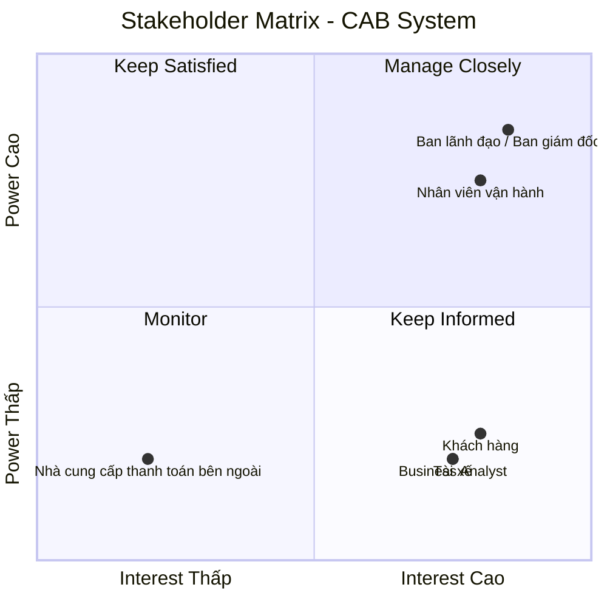

# CAB System – Phân tích yêu cầu
## Bước 1: Hiểu rõ hệ thống
## 1. Tại sao cần hệ thống?

Công ty ABC cần xây dựng hệ thống CAB mới để khắc phục những hạn chế của hệ thống hiện tại, đặc biệt là việc phân công tài xế còn thủ công, khách hàng khó theo dõi trạng thái chuyến đi, thông tin thanh toán chưa được quản lý tập trung và bộ phận vận hành gặp khó khăn khi mở rộng hệ thống. Hệ thống mới sẽ giúp tự động hóa quy trình đặt xe và tìm kiếm tài xế, quản lý tập trung dữ liệu, nâng cao trải nghiệm khách hàng và hiệu quả vận hành. Đồng thời, hệ thống được định hướng xây dựng như một nền tảng có khả năng phục vụ số lượng lớn khách hàng và tài xế, cũng như hỗ trợ mở rộng thêm các dịch vụ và tính năng trong tương lai.

## 2. Các vấn đề hiện hữu

- Việc phân công tài xế chủ yếu được thực hiện thủ công.
- Khách hàng khó theo dõi trạng thái chuyến đi.
- Thông tin thanh toán chưa được quản lý tập trung.
- Bộ phận vận hành gặp khó khăn khi muốn mở rộng hệ thống.
- Hệ thống cần có khả năng phục vụ số lượng lớn khách hàng và tài xế.
- Hệ thống hiện tại còn hạn chế trong việc phát triển thêm các tính năng trong tương lai.

## 3. Ai sẽ tham gia vào hệ thống?

- **Khách hàng**
  - Đặt xe và theo dõi chuyến đi.
  - Xem lịch sử chuyến đi.
  - Thanh toán và đánh giá tài xế.

- **Tài xế**
  - Nhận và thực hiện chuyến đi.
  - Cập nhật trạng thái chuyến đi.
  - Cập nhật vị trí.

- **Nhân viên vận hành**
  - Quản lý khách hàng, tài xế, phương tiện và chuyến đi.
  - Theo dõi chuyến đi và trạng thái tài xế.
  - Hỗ trợ xử lý các trường hợp chuyến bị lỗi.

- **Ban lãnh đạo**
  - Theo dõi các báo cáo về hoạt động kinh doanh.

- **Nhà cung cấp thanh toán bên ngoài**
  - Xử lý các giao dịch thanh toán điện tử.

## 4. Giá trị kinh doanh của hệ thống mới

- Tự động hóa việc tìm kiếm và phân công tài xế.
- Nâng cao trải nghiệm khách hàng thông qua khả năng theo dõi chuyến đi.
- Quản lý tập trung thông tin khách hàng, tài xế, phương tiện, chuyến đi và giao dịch.
- Nâng cao hiệu quả hoạt động của bộ phận vận hành.
- Hỗ trợ quản lý hoạt động kinh doanh thông qua các báo cáo.
- Đáp ứng số lượng lớn khách hàng và tài xế khi nhu cầu tăng cao.
- Tạo nền tảng có khả năng mở rộng và phát triển thêm các tính năng trong tương lai.

## Bước 2. Stakeholder

## 1. Các stakeholder của hệ thống
| Stakeholder | Vai trò | Tương tác với hệ thống |
|---|---|---|
| **Khách hàng** | Sử dụng dịch vụ đặt xe | Đăng ký, đăng nhập, quản lý thông tin cá nhân, đặt xe, theo dõi chuyến đi, xem lịch sử, thanh toán, nhận thông báo và đánh giá tài xế |
| **Tài xế** | Thực hiện chuyến đi | Quản lý hồ sơ và phương tiện, cập nhật trạng thái, nhận thông báo, chấp nhận/từ chối chuyến, cập nhật trạng thái chuyến và vị trí |
| **Nhân viên vận hành** | Quản lý hoạt động vận hành | Quản lý khách hàng, tài xế, phương tiện, chuyến đi; theo dõi chuyến, kiểm tra trạng thái tài xế, xử lý chuyến bị lỗi và tra cứu giao dịch |
| **Ban lãnh đạo** | Quản lý hoạt động kinh doanh | Theo dõi số lượng chuyến, doanh thu, tỷ lệ hoàn thành, tỷ lệ hủy và hiệu quả hoạt động của tài xế |
| **Nhà cung cấp thanh toán bên ngoài** | Cung cấp dịch vụ thanh toán điện tử | Tích hợp với CAB để xử lý giao dịch thanh toán điện tử và trả kết quả giao dịch về hệ thống |

## 2. Stakeholder metrics
## Stakeholder Matrix

Stakeholder Matrix được sử dụng để phân loại các bên liên quan dựa trên hai tiêu chí: **mức độ quan tâm (Interest)** và **mức độ quyền lực/ảnh hưởng (Power)** đối với hệ thống CAB.

### Phân loại Stakeholder
| Stakeholder | Power | Interest | Nhóm |
|---|---|---|---|
| Ban lãnh đạo / Ban giám đốc | Cao | Cao | Manage Closely |
| Nhân viên vận hành | Cao | Cao | Manage Closely |
| Khách hàng | Thấp | Cao | Keep Informed |
| Tài xế | Thấp | Cao | Keep Informed |
| Business Analyst | Thấp | Cao | Keep Informed |
| Nhà cung cấp thanh toán bên ngoài | Thấp | Thấp | Monitor |

## Bước 3. Mục đích nghiệp vụ
- Xây dựng nền tảng CAB mới để khắc phục những hạn chế của hệ thống hiện tại.
- Tự động hóa việc tìm kiếm và phân công tài xế.
- Giúp khách hàng đặt xe và theo dõi trạng thái chuyến đi.
- Quản lý tập trung thông tin thanh toán và hỗ trợ thanh toán điện tử.
- Hỗ trợ nhân viên vận hành quản lý khách hàng, tài xế, phương tiện và chuyến đi.
- Cung cấp báo cáo về số lượng chuyến, doanh thu, tỷ lệ chuyến hoàn thành, tỷ lệ hủy và hiệu quả hoạt động của tài xế.
- Đảm bảo hệ thống có khả năng phục vụ số lượng lớn khách hàng và tài xế khi nhu cầu tăng cao.
- Tạo nền tảng có khả năng mở rộng để bổ sung dịch vụ, phương thức thanh toán và kênh thông báo mới.
- Bảo vệ thông tin cá nhân, dữ liệu vị trí và dữ liệu giao dịch, đồng thời lưu vết các thao tác quan trọng.
- Cho phép triển khai các chức năng mới từng phần với hạn chế ảnh hưởng đến các chức năng đang hoạt động.
