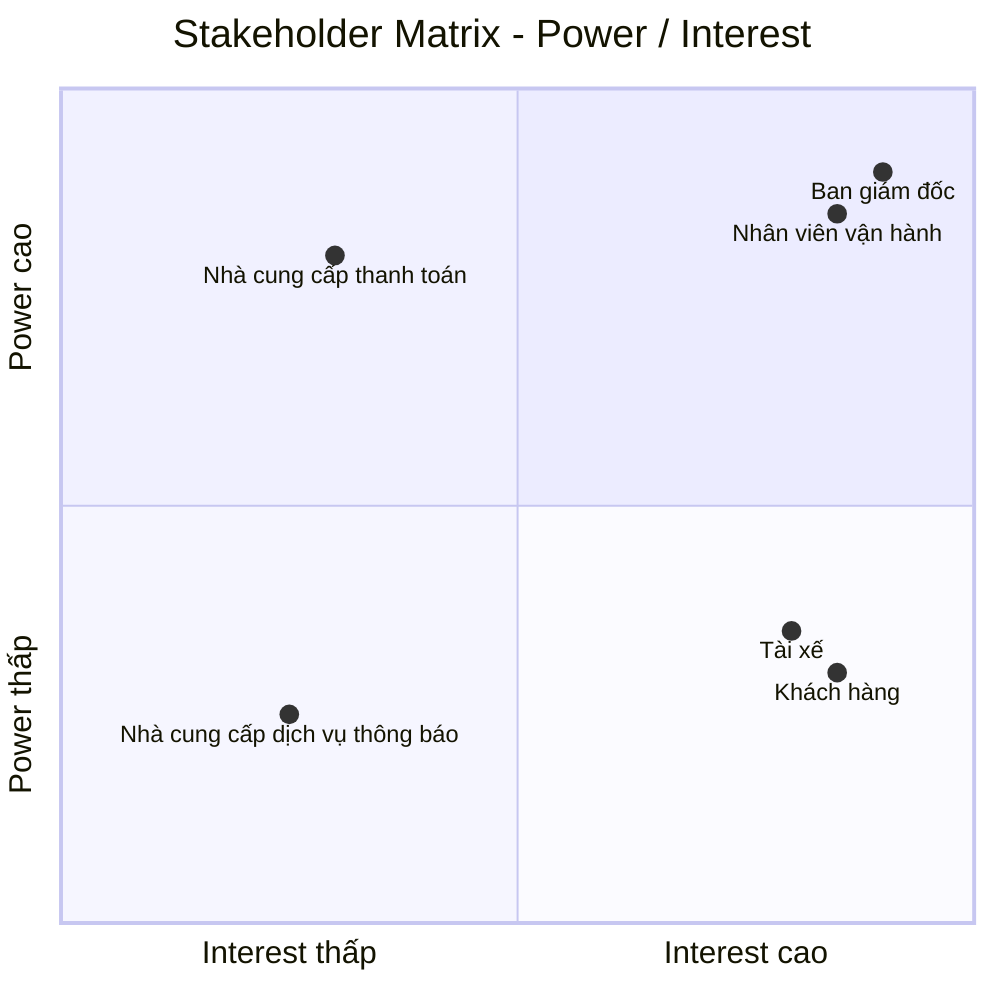
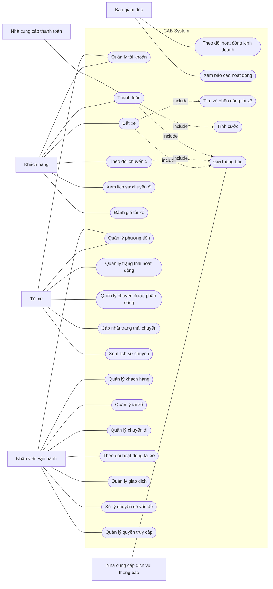

# CAB System – Phân tích yêu cầu
# Bước 1: Hiểu rõ hệ thống

## 1. Bối cảnh nghiệp vụ và lý do hệ thống cũ không đáp ứng được

Công ty ABC là một doanh nghiệp cung cấp dịch vụ đặt xe trực tuyến. Hiện tại khách hàng có thể liên hệ với tổng đài hoặc sử dụng một ứng dụng đơn giản để yêu cầu xe.

Hệ thống hiện tại còn một số hạn chế:

- Việc phân công tài xế chủ yếu được thực hiện thủ công.
- Khách hàng khó theo dõi trạng thái chuyến đi.
- Thông tin thanh toán chưa được quản lý tập trung.
- Bộ phận vận hành gặp khó khăn khi muốn mở rộng hệ thống.
- Hệ thống hiện tại khó đáp ứng khi số lượng khách hàng và tài xế tăng.

Những hạn chế này ảnh hưởng đến quá trình vận hành dịch vụ, trải nghiệm của khách hàng và khả năng mở rộng của doanh nghiệp.

## 2. Giải pháp mới và hệ thống mới

Công ty ABC mong muốn xây dựng **CAB System – Nền tảng đặt xe** nhằm hỗ trợ quy trình đặt xe từ khi khách hàng tạo yêu cầu cho đến khi chuyến đi hoàn thành.

Hệ thống mới hỗ trợ các hoạt động chính:

- Khách hàng đăng ký tài khoản, đăng nhập và cập nhật thông tin cá nhân.
- Khách hàng nhập điểm đón, điểm đến và lựa chọn loại xe.
- Khách hàng gửi yêu cầu đặt xe.
- Hệ thống xác định các tài xế phù hợp dựa trên vị trí, trạng thái sẵn sàng và một số tiêu chí vận hành khác.
- Hệ thống ưu tiên tài xế phù hợp và gần khách hàng.
- Tài xế nhận được thông báo và có thể chấp nhận hoặc từ chối chuyến.
- Nếu tài xế được đề xuất không phản hồi hoặc từ chối, hệ thống tiếp tục tìm tài xế khác mà không yêu cầu khách hàng tạo lại yêu cầu.
- Nếu không tìm được tài xế, khách hàng được thông báo rõ ràng.
- Khách hàng biết tài xế nào đã nhận chuyến và thời gian dự kiến tài xế đến.
- Tài xế cập nhật trạng thái chuyến gồm đã đến điểm đón, đã đón khách, đang di chuyển và hoàn thành chuyến.
- Khách hàng theo dõi được trạng thái hiện tại của chuyến đi.
- Sau khi chuyến đi hoàn thành, hệ thống xác định số tiền khách hàng phải trả dựa trên loại dịch vụ và thông tin chuyến đi.
- Khách hàng có thể thanh toán bằng tiền mặt hoặc phương thức thanh toán điện tử.
- Thanh toán điện tử được thực hiện thông qua nhà cung cấp thanh toán bên ngoài.
- Hệ thống CAB không lưu trực tiếp thông tin nhạy cảm của thẻ hoặc tài khoản thanh toán.
- Khách hàng nhận được thông báo khi yêu cầu đặt xe được tiếp nhận, khi có tài xế nhận chuyến, khi tài xế đến điểm đón, khi chuyến hoàn thành và khi thanh toán có kết quả.
- Tài xế nhận được thông báo về các chuyến mới hoặc những thay đổi liên quan đến chuyến đang thực hiện.
- Khách hàng có thể xem lịch sử chuyến đi, số tiền phải trả và đánh giá tài xế sau khi hoàn thành chuyến.
- Nhân viên vận hành có thể quản lý khách hàng, tài xế, phương tiện và chuyến đi.
- Nhân viên vận hành có thể xem các chuyến đang diễn ra, kiểm tra trạng thái tài xế, hỗ trợ xử lý các trường hợp chuyến bị lỗi và tra cứu lịch sử giao dịch.

Quy trình cốt lõi của hệ thống:

**Đặt xe → Tìm tài xế → Nhận chuyến → Thực hiện chuyến → Hoàn thành chuyến → Tính cước → Thanh toán → Đánh giá**

## 3. Các đối tượng tham gia hệ thống

| Đối tượng | Vai trò |
|---|---|
| Khách hàng | Đăng ký, đăng nhập, đặt xe, theo dõi chuyến đi, thanh toán và đánh giá tài xế |
| Tài xế | Quản lý hồ sơ, thông tin phương tiện, nhận hoặc từ chối chuyến và thực hiện chuyến |
| Nhân viên vận hành | Quản lý khách hàng, tài xế, phương tiện, chuyến đi và hỗ trợ xử lý các trường hợp chuyến bị lỗi |
| Nhà cung cấp thanh toán bên ngoài | Xử lý các giao dịch thanh toán điện tử |
| Nhà cung cấp dịch vụ thông báo | Hỗ trợ gửi thông báo đến khách hàng và tài xế |

## 4. Giá trị kinh doanh của hệ thống mới

| Đối tượng | Giá trị kinh doanh |
|---|---|
| Khách hàng | Đặt xe thuận tiện hơn, theo dõi được trạng thái chuyến đi, biết thông tin tài xế, thanh toán và đánh giá tài xế |
| Tài xế | Nhận yêu cầu chuyến, chủ động chấp nhận hoặc từ chối chuyến và cập nhật trạng thái chuyến |
| Nhân viên vận hành | Quản lý tập trung khách hàng, tài xế, phương tiện và chuyến đi; theo dõi và hỗ trợ xử lý các chuyến |
| Doanh nghiệp | Giảm sự phụ thuộc vào phân công tài xế thủ công, hỗ trợ tự động hóa việc tìm và phân công tài xế, cải thiện trải nghiệm khách hàng và hỗ trợ phục vụ số lượng lớn khách hàng và tài xế |

Giá trị cốt lõi của hệ thống là hỗ trợ Công ty ABC vận hành quy trình đặt xe từ khi khách hàng tạo yêu cầu, hệ thống tìm và phân công tài xế, tài xế thực hiện chuyến, chuyến hoàn thành, tính cước, thanh toán đến đánh giá tài xế.

# BƯỚC 2: XÁC ĐỊNH STAKEHOLDER, VAI TRÒ VÀ THIẾT LẬP STAKEHOLDER MATRIX

## 1. Xác định Stakeholder và vai trò

| Stakeholder | Vai trò trong hệ thống |
|---|---|
| Ban giám đốc | Chủ sở hữu sản phẩm, quyết định mục tiêu và định hướng của CAB System |
| Khách hàng | Người sử dụng dịch vụ đặt xe |
| Tài xế | Người cung cấp dịch vụ vận chuyển |
| Nhân viên vận hành | Người quản lý và giám sát hoạt động đặt xe |
| Nhà cung cấp thanh toán bên ngoài | Đối tác xử lý thanh toán điện tử |
| Nhà cung cấp dịch vụ thông báo | Đối tác hỗ trợ gửi thông báo |

## 2. Phân tích mức độ ảnh hưởng và quan tâm

| Stakeholder | Power | Interest | Lý do |
|---|---|---|---|
| Ban giám đốc | Cao | Cao | Có quyền quyết định và chịu trách nhiệm về sản phẩm |
| Nhân viên vận hành | Cao | Cao | Trực tiếp quản lý và giám sát hoạt động đặt xe |
| Khách hàng | Thấp | Cao | Sử dụng trực tiếp sản phẩm |
| Tài xế | Thấp | Cao | Sử dụng trực tiếp hệ thống để nhận và thực hiện chuyến |
| Nhà cung cấp thanh toán bên ngoài | Cao | Thấp | Có ảnh hưởng đến hoạt động thanh toán nhưng không tham gia trực tiếp vào quy trình đặt xe |
| Nhà cung cấp dịch vụ thông báo | Thấp | Thấp | Hỗ trợ một phần hoạt động của hệ thống |

## 3. Stakeholder Matrix

## 4. Chiến lược quản lý Stakeholder

| Nhóm | Stakeholder | Chiến lược |
|---|---|---|
| Power cao – Interest cao | Ban giám đốc, Nhân viên vận hành | Quản lý chặt chẽ, trao đổi thường xuyên và tham gia vào các quyết định quan trọng |
| Power thấp – Interest cao | Khách hàng, Tài xế | Duy trì sự tham gia, thường xuyên thu thập nhu cầu và phản hồi |
| Power cao – Interest thấp | Nhà cung cấp thanh toán bên ngoài | Duy trì sự hài lòng và phối hợp khi có vấn đề liên quan đến tích hợp |
| Power thấp – Interest thấp | Nhà cung cấp dịch vụ thông báo | Theo dõi và phối hợp khi phát sinh vấn đề |

## Bước 3. Mục đích nghiệp vụ

CAB System được xây dựng nhằm giải quyết các hạn chế của hệ thống đặt xe hiện tại và hỗ trợ Công ty ABC cải thiện hoạt động cung cấp dịch vụ đặt xe trực tuyến.

### Mục đích chính

- **Tự động hóa quá trình đặt xe và tìm tài xế**, giảm sự phụ thuộc vào việc phân công tài xế thủ công.
- **Cải thiện trải nghiệm khách hàng** bằng cách cho phép khách hàng chủ động đặt xe và theo dõi trạng thái chuyến đi.
- **Hỗ trợ tài xế tiếp nhận và thực hiện chuyến** thông qua hệ thống thay vì phụ thuộc vào quá trình điều phối thủ công.
- **Quản lý tập trung thông tin** về khách hàng, tài xế, phương tiện, chuyến đi và giao dịch.
- **Hỗ trợ thanh toán** bằng tiền mặt và phương thức thanh toán điện tử thông qua nhà cung cấp bên ngoài.
- **Cải thiện khả năng theo dõi và xử lý hoạt động vận hành** thông qua giao diện dành cho nhân viên vận hành.
- **Giảm thời gian xử lý khi tìm tài xế** bằng cách tự động tiếp tục tìm tài xế khác khi tài xế được đề xuất không phản hồi hoặc từ chối.
- **Cung cấp thông tin và dữ liệu cần thiết cho doanh nghiệp** để theo dõi hoạt động đặt xe và tình hình vận hành.

### Kết quả nghiệp vụ mong muốn

| Mục đích | Kết quả mong muốn |
|---|---|
| Tự động hóa đặt xe | Khách hàng có thể tạo yêu cầu và hệ thống tự động xử lý quá trình tìm tài xế |
| Cải thiện trải nghiệm khách hàng | Khách hàng có thể biết trạng thái yêu cầu, thông tin tài xế và trạng thái chuyến đi |
| Nâng cao hiệu quả tìm tài xế | Hệ thống có thể tiếp tục tìm tài xế khác khi tài xế được đề xuất không nhận chuyến |
| Quản lý tập trung | Thông tin khách hàng, tài xế, phương tiện, chuyến đi và giao dịch được quản lý trong hệ thống |
| Hỗ trợ thanh toán | Khách hàng có thể thanh toán bằng tiền mặt hoặc phương thức điện tử |
| Hỗ trợ vận hành | Nhân viên vận hành có thể theo dõi chuyến và hỗ trợ xử lý các trường hợp phát sinh |
| Hỗ trợ hoạt động kinh doanh | Doanh nghiệp có nền tảng để phục vụ số lượng lớn khách hàng và tài xế hơn hệ thống hiện tại |

### Mục tiêu tổng quát

**Xây dựng một nền tảng đặt xe giúp Công ty ABC tự động hóa quy trình từ khi khách hàng tạo yêu cầu, tìm và phân công tài xế, thực hiện chuyến, tính cước, thanh toán đến đánh giá sau chuyến, đồng thời hỗ trợ doanh nghiệp quản lý và theo dõi hoạt động đặt xe hiệu quả hơn.**

# BƯỚC 4: XÁC ĐỊNH PHẠM VI DỰ ÁN

## 1. Các module trong phạm vi

### Module 1: Quản lý tài khoản

- Đăng ký tài khoản khách hàng.
- Đăng nhập.
- Cập nhật thông tin cá nhân.
- Quản lý thông tin tài xế.
- Quản lý thông tin phương tiện.

### Module 2: Đặt xe

- Nhập điểm đón.
- Nhập điểm đến.
- Lựa chọn loại xe.
- Gửi yêu cầu đặt xe.
- Theo dõi trạng thái yêu cầu đặt xe.

### Module 3: Tìm và phân công tài xế

- Tìm tài xế phù hợp.
- Ưu tiên tài xế gần khách hàng.
- Gửi yêu cầu chuyến đến tài xế.
- Tài xế chấp nhận hoặc từ chối chuyến.
- Tiếp tục tìm tài xế khác khi tài xế từ chối hoặc không phản hồi.
- Thông báo khi không tìm được tài xế.

### Module 4: Quản lý chuyến đi

- Tài xế cập nhật trạng thái chuyến.
- Khách hàng theo dõi trạng thái chuyến.
- Lưu thông tin chuyến đi.
- Hoàn thành chuyến.

### Module 5: Tính cước và thanh toán

- Tính số tiền khách hàng phải trả.
- Thanh toán bằng tiền mặt.
- Thanh toán điện tử thông qua nhà cung cấp bên ngoài.
- Xử lý kết quả thanh toán.
- Thông báo kết quả thanh toán.

### Module 6: Thông báo

- Thông báo yêu cầu đặt xe được tiếp nhận.
- Thông báo khi tài xế nhận chuyến.
- Thông báo khi tài xế đến điểm đón.
- Thông báo khi chuyến hoàn thành.
- Thông báo kết quả thanh toán.
- Thông báo chuyến mới cho tài xế.

### Module 7: Lịch sử và đánh giá

- Xem lịch sử chuyến đi.
- Xem số tiền phải trả.
- Đánh giá tài xế sau chuyến.

### Module 8: Quản lý vận hành

- Quản lý khách hàng.
- Quản lý tài xế.
- Quản lý phương tiện.
- Theo dõi chuyến đang diễn ra.
- Kiểm tra trạng thái tài xế.
- Tra cứu lịch sử giao dịch.
- Hỗ trợ xử lý các trường hợp chuyến bị lỗi.
  
## Bước 5. Yêu cầu nghiệp vụ

| Yêu cầu nghiệp vụ | Yêu cầu hệ thống |
|---|---|
| Cung cấp dịch vụ đặt xe trực tuyến | Hệ thống phải cho phép khách hàng nhập điểm đón, điểm đến, lựa chọn loại xe và gửi yêu cầu đặt xe. |
| Tự động tìm và phân công tài xế | Hệ thống phải tự động xác định và lựa chọn tài xế phù hợp dựa trên vị trí, trạng thái sẵn sàng và các tiêu chí được xác định. |
| Xử lý trường hợp tài xế không nhận chuyến | Hệ thống phải tự động tìm tài xế khác khi tài xế được đề xuất từ chối hoặc không phản hồi. |
| Quản lý quá trình thực hiện chuyến | Hệ thống phải cho phép tài xế cập nhật trạng thái chuyến và cho phép khách hàng theo dõi trạng thái hiện tại của chuyến. |
| Quản lý khách hàng, tài xế và phương tiện | Hệ thống phải cho phép quản lý thông tin khách hàng, tài xế và phương tiện. |
| Tính cước chuyến đi | Hệ thống phải xác định số tiền khách hàng phải trả dựa trên thông tin chuyến đi và loại dịch vụ. |
| Hỗ trợ thanh toán | Hệ thống phải hỗ trợ thanh toán bằng tiền mặt và thanh toán điện tử thông qua nhà cung cấp thanh toán bên ngoài. |
| Quản lý kết quả thanh toán | Hệ thống phải tiếp nhận và lưu trạng thái giao dịch thanh toán, đồng thời thông báo kết quả cho khách hàng. |
| Cung cấp thông báo | Hệ thống phải gửi thông báo đến khách hàng và tài xế khi xảy ra các sự kiện quan trọng trong quá trình đặt và thực hiện chuyến. |
| Quản lý lịch sử chuyến đi | Hệ thống phải lưu trữ thông tin chuyến để khách hàng có thể tra cứu lịch sử và số tiền phải trả. |
| Đánh giá tài xế | Hệ thống phải cho phép khách hàng đánh giá tài xế sau khi chuyến đi hoàn thành. |
| Hỗ trợ nhân viên vận hành | Hệ thống phải cung cấp giao diện quản trị để nhân viên vận hành quản lý khách hàng, tài xế, phương tiện và chuyến đi. |
| Theo dõi và xử lý chuyến | Hệ thống phải cho phép nhân viên vận hành xem các chuyến đang diễn ra, kiểm tra trạng thái tài xế và hỗ trợ xử lý các trường hợp chuyến bị lỗi. |
| Phân quyền quản trị | Hệ thống phải kiểm soát quyền truy cập đối với các chức năng quản trị theo quyền của từng nhân viên. |
| Bảo vệ dữ liệu | Hệ thống phải bảo vệ thông tin cá nhân, thông tin phương tiện, dữ liệu vị trí và dữ liệu giao dịch khỏi truy cập trái phép. |
| Lưu vết hoạt động | Hệ thống phải ghi nhận các thao tác quan trọng để phục vụ kiểm tra khi có sự cố. |
| Đảm bảo tính ổn định | Hệ thống phải hạn chế việc lỗi tại một thành phần như thanh toán hoặc thông báo làm dừng toàn bộ quy trình đặt xe. |
| Hỗ trợ khả năng mở rộng | Hệ thống phải có khả năng mở rộng khi số lượng khách hàng và tài xế tăng và hỗ trợ bổ sung các chức năng mới trong tương lai. |

# Bước 6: Yêu cầu chức năng

## Khách hàng

- Quản lý tài khoản
- Đặt xe
- Theo dõi chuyến đi
- Thanh toán
- Xem lịch sử chuyến đi
- Đánh giá tài xế

## Tài xế

- Quản lý tài khoản
- Quản lý phương tiện
- Quản lý trạng thái hoạt động
- Quản lý chuyến được phân công
- Cập nhật trạng thái chuyến
- Xem lịch sử chuyến

## Nhân viên vận hành

- Quản lý khách hàng
- Quản lý tài xế
- Quản lý phương tiện
- Quản lý chuyến đi
- Theo dõi hoạt động tài xế
- Quản lý giao dịch
- Xử lý chuyến có vấn đề
- Quản lý quyền truy cập

## Ban giám đốc

- Theo dõi hoạt động kinh doanh
- Xem báo cáo hoạt động
- Theo dõi doanh thu
- Theo dõi số lượng chuyến
- Theo dõi tỷ lệ hoàn thành chuyến
- Theo dõi tỷ lệ hủy chuyến
- Theo dõi hiệu quả hoạt động của tài xế

## Nhà cung cấp thanh toán

- Xử lý thanh toán điện tử
- Trả kết quả giao dịch

## Nhà cung cấp dịch vụ thông báo

- Cung cấp dịch vụ gửi thông báo
- Trả trạng thái gửi thông báo

# Bước 7: Vẽ Use Case Diagram

# Bước 8: Đặc tả Use Case của tất cả chức năng

## 1. Khách hàng

### UC01 – Quản lý tài khoản

| Thành phần | Nội dung |
|---|---|
| Actor | Khách hàng |
| Mục tiêu | Quản lý thông tin và quyền truy cập tài khoản |
| Tiền điều kiện | Khách hàng đã có hoặc đang thực hiện đăng ký tài khoản |
| Luồng chính | Đăng ký tài khoản → Đăng nhập → Xem thông tin → Cập nhật thông tin |
| Ngoại lệ | Thông tin đăng ký không hợp lệ; thông tin đăng nhập không chính xác |
| Kết quả | Thông tin tài khoản được tạo hoặc cập nhật |

### UC02 – Đặt xe

| Thành phần | Nội dung |
|---|---|
| Actor | Khách hàng |
| Mục tiêu | Tạo yêu cầu đặt xe |
| Tiền điều kiện | Khách hàng đã đăng nhập |
| Luồng chính | Nhập điểm đón, điểm đến → Chọn loại xe → Gửi yêu cầu → Hệ thống tiếp nhận yêu cầu |
| Ngoại lệ | Thông tin đặt xe không hợp lệ; không tìm được tài xế |
| Kết quả | Yêu cầu đặt xe được tạo |

### UC03 – Theo dõi chuyến đi

| Thành phần | Nội dung |
|---|---|
| Actor | Khách hàng |
| Mục tiêu | Theo dõi tình trạng chuyến đi |
| Tiền điều kiện | Khách hàng có chuyến đang được xử lý hoặc đang thực hiện |
| Luồng chính | Xem thông tin tài xế → Xem trạng thái chuyến → Xem thời gian dự kiến tài xế đến |
| Ngoại lệ | Không thể lấy thông tin trạng thái mới nhất |
| Kết quả | Khách hàng xem được trạng thái chuyến |

### UC04 – Thanh toán

| Thành phần | Nội dung |
|---|---|
| Actor | Khách hàng, Nhà cung cấp thanh toán |
| Mục tiêu | Thanh toán chi phí chuyến đi |
| Tiền điều kiện | Chuyến đi đã hoàn thành và hệ thống đã xác định số tiền phải trả |
| Luồng chính | Xem số tiền → Chọn phương thức thanh toán → Thực hiện thanh toán → Nhận kết quả → Cập nhật trạng thái |
| Ngoại lệ | Thanh toán điện tử thất bại |
| Kết quả | Giao dịch được ghi nhận với trạng thái tương ứng |

### UC05 – Xem lịch sử chuyến đi

| Thành phần | Nội dung |
|---|---|
| Actor | Khách hàng |
| Mục tiêu | Tra cứu các chuyến đã thực hiện |
| Tiền điều kiện | Khách hàng đã đăng nhập |
| Luồng chính | Mở lịch sử → Xem danh sách chuyến → Chọn chuyến → Xem chi tiết và số tiền phải trả |
| Ngoại lệ | Không có lịch sử chuyến |
| Kết quả | Thông tin lịch sử được hiển thị |

### UC06 – Đánh giá tài xế

| Thành phần | Nội dung |
|---|---|
| Actor | Khách hàng |
| Mục tiêu | Đánh giá tài xế sau chuyến đi |
| Tiền điều kiện | Chuyến đi đã hoàn thành |
| Luồng chính | Chọn chuyến → Thực hiện đánh giá → Gửi đánh giá → Hệ thống lưu đánh giá |
| Ngoại lệ | Chuyến chưa hoàn thành; đánh giá không hợp lệ |
| Kết quả | Đánh giá được lưu |

---

## 2. Tài xế

### UC07 – Quản lý tài khoản

| Thành phần | Nội dung |
|---|---|
| Actor | Tài xế |
| Mục tiêu | Quản lý thông tin tài khoản |
| Tiền điều kiện | Tài xế có tài khoản |
| Luồng chính | Đăng nhập → Xem thông tin → Cập nhật thông tin |
| Ngoại lệ | Thông tin đăng nhập hoặc thông tin cập nhật không hợp lệ |
| Kết quả | Thông tin tài khoản được cập nhật |

### UC08 – Quản lý phương tiện

| Thành phần | Nội dung |
|---|---|
| Actor | Tài xế, Nhân viên vận hành |
| Mục tiêu | Quản lý thông tin phương tiện của tài xế |
| Tiền điều kiện | Tài xế đã có tài khoản |
| Luồng chính | Xem thông tin phương tiện → Cập nhật thông tin |
| Ngoại lệ | Thông tin phương tiện không hợp lệ |
| Kết quả | Thông tin phương tiện được lưu |

### UC09 – Quản lý trạng thái hoạt động

| Thành phần | Nội dung |
|---|---|
| Actor | Tài xế |
| Mục tiêu | Cập nhật khả năng nhận chuyến |
| Tiền điều kiện | Tài xế đã đăng nhập |
| Luồng chính | Chọn trạng thái hoạt động → Hệ thống cập nhật trạng thái |
| Ngoại lệ | Tài xế không đủ điều kiện chuyển sang trạng thái sẵn sàng |
| Kết quả | Trạng thái hoạt động được cập nhật |

### UC10 – Quản lý chuyến được phân công

| Thành phần | Nội dung |
|---|---|
| Actor | Tài xế |
| Mục tiêu | Xem và xử lý các chuyến được phân công |
| Tiền điều kiện | Tài xế đang sẵn sàng nhận chuyến |
| Luồng chính | Nhận thông báo chuyến → Xem thông tin → Chấp nhận hoặc từ chối |
| Ngoại lệ | Chuyến đã được tài xế khác nhận hoặc đã hết thời gian phản hồi |
| Kết quả | Chuyến được tài xế chấp nhận hoặc chuyển sang tài xế khác |

### UC11 – Cập nhật trạng thái chuyến

| Thành phần | Nội dung |
|---|---|
| Actor | Tài xế |
| Mục tiêu | Cập nhật trạng thái hiện tại của chuyến |
| Tiền điều kiện | Tài xế đã nhận chuyến |
| Luồng chính | Chọn trạng thái → Hệ thống kiểm tra → Lưu trạng thái → Cập nhật cho các bên liên quan |
| Ngoại lệ | Trạng thái không hợp lệ hoặc không đúng điều kiện |
| Kết quả | Trạng thái chuyến được cập nhật |

### UC12 – Xem lịch sử chuyến

| Thành phần | Nội dung |
|---|---|
| Actor | Tài xế |
| Mục tiêu | Xem các chuyến đã thực hiện |
| Tiền điều kiện | Tài xế đã đăng nhập |
| Luồng chính | Mở lịch sử → Xem danh sách → Xem chi tiết |
| Ngoại lệ | Không có lịch sử chuyến |
| Kết quả | Lịch sử chuyến được hiển thị |

---

## 3. Nhân viên vận hành

### UC13 – Quản lý khách hàng

| Thành phần | Nội dung |
|---|---|
| Actor | Nhân viên vận hành |
| Mục tiêu | Quản lý thông tin khách hàng |
| Tiền điều kiện | Nhân viên đã đăng nhập và có quyền phù hợp |
| Luồng chính | Tìm kiếm → Xem thông tin → Thực hiện thao tác được cấp quyền |
| Ngoại lệ | Không tìm thấy khách hàng; không đủ quyền |
| Kết quả | Thông tin khách hàng được quản lý |

### UC14 – Quản lý tài xế

| Thành phần | Nội dung |
|---|---|
| Actor | Nhân viên vận hành |
| Mục tiêu | Quản lý thông tin tài xế |
| Tiền điều kiện | Nhân viên đã đăng nhập và có quyền phù hợp |
| Luồng chính | Tìm kiếm → Xem thông tin → Tạo hoặc cập nhật thông tin tài xế |
| Ngoại lệ | Thông tin không hợp lệ; không đủ quyền |
| Kết quả | Thông tin tài xế được quản lý |

### UC15 – Quản lý phương tiện

| Thành phần | Nội dung |
|---|---|
| Actor | Nhân viên vận hành |
| Mục tiêu | Quản lý thông tin phương tiện |
| Tiền điều kiện | Nhân viên đã đăng nhập và có quyền phù hợp |
| Luồng chính | Tìm kiếm → Xem thông tin → Tạo hoặc cập nhật thông tin phương tiện |
| Ngoại lệ | Thông tin không hợp lệ; không đủ quyền |
| Kết quả | Thông tin phương tiện được quản lý |

### UC16 – Quản lý chuyến đi

| Thành phần | Nội dung |
|---|---|
| Actor | Nhân viên vận hành |
| Mục tiêu | Theo dõi và quản lý thông tin chuyến đi |
| Tiền điều kiện | Nhân viên đã đăng nhập |
| Luồng chính | Tìm kiếm chuyến → Xem thông tin → Theo dõi trạng thái |
| Ngoại lệ | Không tìm thấy chuyến |
| Kết quả | Thông tin chuyến được hiển thị |

### UC17 – Theo dõi hoạt động tài xế

| Thành phần | Nội dung |
|---|---|
| Actor | Nhân viên vận hành |
| Mục tiêu | Theo dõi trạng thái hoạt động của tài xế |
| Tiền điều kiện | Nhân viên đã đăng nhập |
| Luồng chính | Xem danh sách tài xế → Kiểm tra trạng thái → Xem thông tin liên quan |
| Ngoại lệ | Không có dữ liệu trạng thái mới nhất |
| Kết quả | Trạng thái tài xế được hiển thị |

### UC18 – Quản lý giao dịch

| Thành phần | Nội dung |
|---|---|
| Actor | Nhân viên vận hành |
| Mục tiêu | Tra cứu và theo dõi giao dịch |
| Tiền điều kiện | Nhân viên đã đăng nhập và có quyền phù hợp |
| Luồng chính | Tìm kiếm giao dịch → Xem thông tin → Kiểm tra trạng thái |
| Ngoại lệ | Không tìm thấy giao dịch; không đủ quyền |
| Kết quả | Thông tin giao dịch được hiển thị |

### UC19 – Xử lý chuyến có vấn đề

| Thành phần | Nội dung |
|---|---|
| Actor | Nhân viên vận hành |
| Mục tiêu | Hỗ trợ xử lý các chuyến phát sinh vấn đề |
| Tiền điều kiện | Nhân viên có quyền xử lý |
| Luồng chính | Xác định chuyến có vấn đề → Xem thông tin → Thực hiện thao tác hỗ trợ phù hợp → Ghi nhận kết quả |
| Ngoại lệ | Không đủ quyền hoặc không thể xử lý |
| Kết quả | Vấn đề của chuyến được ghi nhận và xử lý theo chính sách |

### UC20 – Quản lý quyền truy cập

| Thành phần | Nội dung |
|---|---|
| Actor | Nhân viên vận hành có quyền quản trị |
| Mục tiêu | Kiểm soát quyền truy cập của nhân viên |
| Tiền điều kiện | Người thực hiện có quyền quản trị |
| Luồng chính | Xem tài khoản → Thiết lập quyền → Lưu thay đổi |
| Ngoại lệ | Không đủ quyền; quyền thiết lập không hợp lệ |
| Kết quả | Quyền truy cập được cập nhật |

---

## 4. Ban giám đốc

### UC21 – Theo dõi hoạt động kinh doanh

| Thành phần | Nội dung |
|---|---|
| Actor | Ban giám đốc |
| Mục tiêu | Theo dõi tình hình hoạt động của hệ thống |
| Tiền điều kiện | Có dữ liệu hoạt động |
| Luồng chính | Truy cập thông tin → Xem các chỉ số hoạt động → Theo dõi tình hình kinh doanh |
| Ngoại lệ | Không có dữ liệu |
| Kết quả | Thông tin hoạt động được hiển thị |

### UC22 – Xem báo cáo hoạt động

| Thành phần | Nội dung |
|---|---|
| Actor | Ban giám đốc |
| Mục tiêu | Xem các báo cáo phục vụ quản lý |
| Tiền điều kiện | Có dữ liệu báo cáo |
| Luồng chính | Chọn báo cáo → Chọn khoảng thời gian → Xem kết quả |
| Ngoại lệ | Không có dữ liệu trong khoảng thời gian được chọn |
| Kết quả | Báo cáo được hiển thị |

---

## 5. Nhà cung cấp thanh toán

### UC23 – Xử lý thanh toán điện tử

| Thành phần | Nội dung |
|---|---|
| Actor | Nhà cung cấp thanh toán |
| Mục tiêu | Xử lý giao dịch thanh toán điện tử |
| Tiền điều kiện | CAB System gửi yêu cầu thanh toán hợp lệ |
| Luồng chính | Nhận yêu cầu → Xử lý giao dịch → Trả kết quả giao dịch |
| Ngoại lệ | Giao dịch thất bại hoặc bị từ chối |
| Kết quả | CAB System nhận được trạng thái giao dịch |

### UC24 – Trả kết quả giao dịch

| Thành phần | Nội dung |
|---|---|
| Actor | Nhà cung cấp thanh toán |
| Mục tiêu | Cung cấp kết quả xử lý giao dịch cho CAB System |
| Tiền điều kiện | Giao dịch đã được xử lý |
| Luồng chính | Hoàn tất xử lý → Gửi trạng thái giao dịch → CAB System tiếp nhận |
| Ngoại lệ | Không thể trả kết quả |
| Kết quả | Trạng thái giao dịch được cập nhật trong CAB System |

---

## 6. Nhà cung cấp dịch vụ thông báo

### UC25 – Gửi thông báo

| Thành phần | Nội dung |
|---|---|
| Actor | Nhà cung cấp dịch vụ thông báo |
| Mục tiêu | Gửi thông báo đến người nhận |
| Tiền điều kiện | CAB System gửi yêu cầu thông báo |
| Luồng chính | Nhận yêu cầu → Gửi thông báo → Trả trạng thái gửi |
| Ngoại lệ | Gửi thông báo thất bại |
| Kết quả | Trạng thái gửi thông báo được trả về CAB System |

### UC26 – Trả trạng thái gửi thông báo

| Thành phần | Nội dung |
|---|---|
| Actor | Nhà cung cấp dịch vụ thông báo |
| Mục tiêu | Cung cấp trạng thái của thông báo |
| Tiền điều kiện | Yêu cầu gửi thông báo đã được tiếp nhận |
| Luồng chính | Xử lý yêu cầu → Xác định trạng thái → Trả kết quả |
| Ngoại lệ | Không xác định được trạng thái |
| Kết quả | CAB System nhận được trạng thái gửi thông báo |

---

## 7. Chức năng hệ thống hỗ trợ

### UC27 – Tìm và phân công tài xế

| Thành phần | Nội dung |
|---|---|
| Actor | CAB System |
| Mục tiêu | Tìm và phân công tài xế phù hợp cho yêu cầu đặt xe |
| Tiền điều kiện | Có yêu cầu đặt xe hợp lệ |
| Luồng chính | Xác định tài xế phù hợp → Gửi yêu cầu → Tiếp nhận phản hồi → Phân công tài xế |
| Ngoại lệ | Tài xế từ chối hoặc không phản hồi → Tiếp tục tìm tài xế khác; không có tài xế phù hợp → Thông báo cho khách hàng |
| Kết quả | Chuyến được phân công hoặc yêu cầu được thông báo không tìm được tài xế |

### UC28 – Tính cước

| Thành phần | Nội dung |
|---|---|
| Actor | CAB System |
| Mục tiêu | Xác định số tiền khách hàng phải trả |
| Tiền điều kiện | Chuyến đi đã hoàn thành và có đủ thông tin cần thiết |
| Luồng chính | Tiếp nhận thông tin chuyến → Áp dụng quy tắc tính cước → Xác định số tiền |
| Ngoại lệ | Thiếu thông tin cần thiết để tính cước |
| Kết quả | Số tiền phải trả được xác định |

### UC29 – Gửi thông báo

| Thành phần | Nội dung |
|---|---|
| Actor | CAB System, Nhà cung cấp dịch vụ thông báo |
| Mục tiêu | Gửi thông báo đến khách hàng hoặc tài xế |
| Tiền điều kiện | Phát sinh sự kiện cần thông báo |
| Luồng chính | Xác định người nhận → Tạo yêu cầu thông báo → Gửi đến nhà cung cấp → Nhận trạng thái |
| Ngoại lệ | Nhà cung cấp không thể gửi thông báo |
| Kết quả | Thông báo được gửi hoặc trạng thái thất bại được ghi nhận |

### UC30 – Quản lý thanh toán

| Thành phần | Nội dung |
|---|---|
| Actor | CAB System, Nhà cung cấp thanh toán |
| Mục tiêu | Quản lý trạng thái và thông tin thanh toán của chuyến |
| Tiền điều kiện | Chuyến đi đã hoàn thành và có số tiền phải trả |
| Luồng chính | Xác định số tiền → Ghi nhận phương thức → Thực hiện thanh toán → Nhận kết quả → Cập nhật trạng thái |
| Ngoại lệ | Thanh toán thất bại |
| Kết quả | Giao dịch được ghi nhận với trạng thái tương ứng |

### UC31 – Quản lý dữ liệu chuyến đi

| Thành phần | Nội dung |
|---|---|
| Actor | CAB System |
| Mục tiêu | Lưu trữ và cung cấp thông tin chuyến đi |
| Tiền điều kiện | Có yêu cầu hoặc chuyến đi được tạo |
| Luồng chính | Tạo thông tin chuyến → Cập nhật thông tin → Lưu dữ liệu → Cung cấp dữ liệu cho các chức năng liên quan |
| Ngoại lệ | Dữ liệu không hợp lệ hoặc không thể lưu |
| Kết quả | Thông tin chuyến được lưu trữ và có thể tra cứu |
