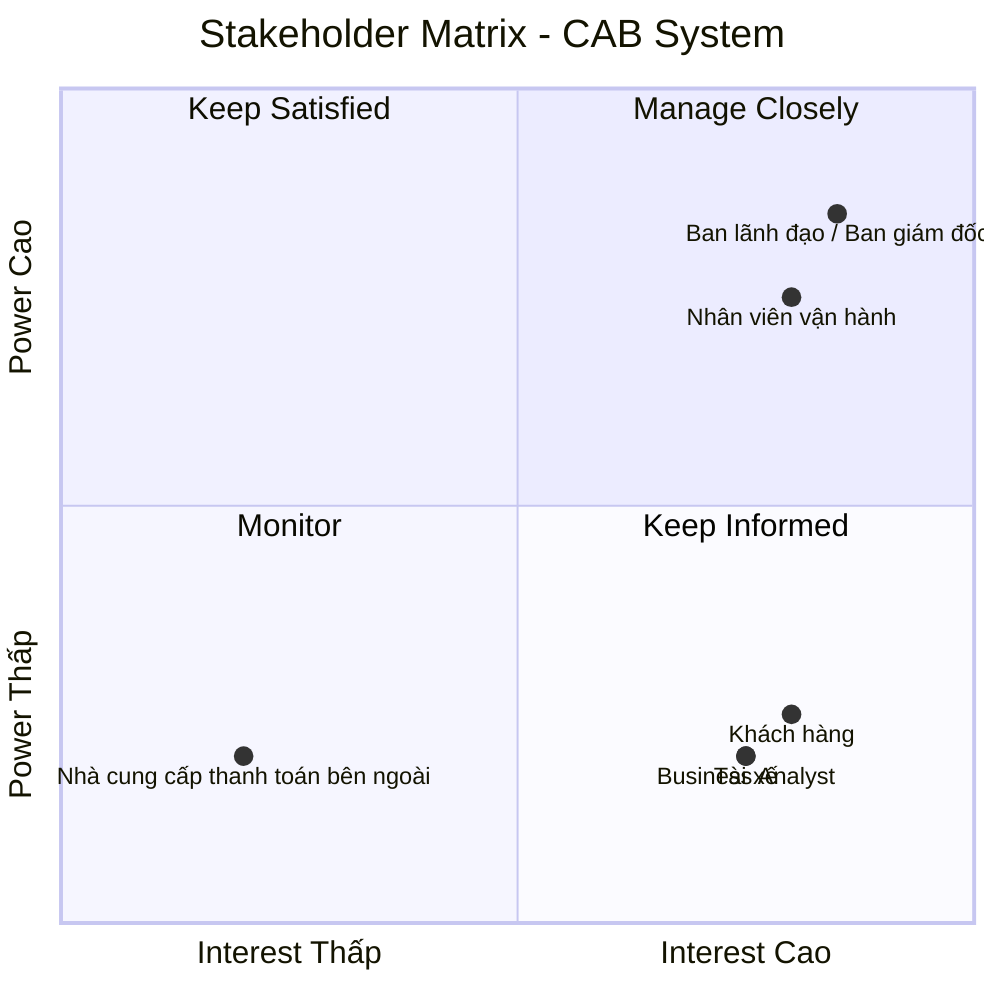

# CAB System – Phân tích yêu cầu
## Bước 1: Hiểu rõ hệ thống
## 1. Tại sao cần hệ thống?

Công ty ABC cần xây dựng hệ thống CAB mới để khắc phục những hạn chế của hệ thống hiện tại, đặc biệt là việc phân công tài xế còn thủ công, khách hàng khó theo dõi trạng thái chuyến đi, thông tin thanh toán chưa được quản lý tập trung và bộ phận vận hành gặp khó khăn khi mở rộng hệ thống. Hệ thống mới sẽ giúp tự động hóa quy trình đặt xe và tìm kiếm tài xế, quản lý tập trung dữ liệu, nâng cao trải nghiệm khách hàng và hiệu quả vận hành. Đồng thời, hệ thống được định hướng xây dựng như một nền tảng có khả năng phục vụ số lượng lớn khách hàng và tài xế, cũng như hỗ trợ mở rộng thêm các dịch vụ và tính năng trong tương lai.

## 2. Các vấn đề hiện hữu

- Việc phân công tài xế chủ yếu được thực hiện thủ công.
- Khách hàng khó theo dõi trạng thái chuyến đi.
- Thông tin thanh toán chưa được quản lý tập trung.
- Bộ phận vận hành gặp khó khăn khi muốn mở rộng hệ thống.
- Hệ thống cần có khả năng phục vụ số lượng lớn khách hàng và tài xế.
- Hệ thống hiện tại còn hạn chế trong việc phát triển thêm các tính năng trong tương lai.

## 3. Ai sẽ tham gia vào hệ thống?

- **Khách hàng**
  - Đặt xe và theo dõi chuyến đi.
  - Xem lịch sử chuyến đi.
  - Thanh toán và đánh giá tài xế.

- **Tài xế**
  - Nhận và thực hiện chuyến đi.
  - Cập nhật trạng thái chuyến đi.
  - Cập nhật vị trí.

- **Nhân viên vận hành**
  - Quản lý khách hàng, tài xế, phương tiện và chuyến đi.
  - Theo dõi chuyến đi và trạng thái tài xế.
  - Hỗ trợ xử lý các trường hợp chuyến bị lỗi.

- **Ban lãnh đạo**
  - Theo dõi các báo cáo về hoạt động kinh doanh.

- **Nhà cung cấp thanh toán bên ngoài**
  - Xử lý các giao dịch thanh toán điện tử.

## 4. Giá trị kinh doanh của hệ thống mới

- Tự động hóa việc tìm kiếm và phân công tài xế.
- Nâng cao trải nghiệm khách hàng thông qua khả năng theo dõi chuyến đi.
- Quản lý tập trung thông tin khách hàng, tài xế, phương tiện, chuyến đi và giao dịch.
- Nâng cao hiệu quả hoạt động của bộ phận vận hành.
- Hỗ trợ quản lý hoạt động kinh doanh thông qua các báo cáo.
- Đáp ứng số lượng lớn khách hàng và tài xế khi nhu cầu tăng cao.
- Tạo nền tảng có khả năng mở rộng và phát triển thêm các tính năng trong tương lai.

## Bước 2. Stakeholder

## 1. Các stakeholder của hệ thống
| Stakeholder | Vai trò | Tương tác với hệ thống |
|---|---|---|
| **Khách hàng** | Sử dụng dịch vụ đặt xe | Đăng ký, đăng nhập, quản lý thông tin cá nhân, đặt xe, theo dõi chuyến đi, xem lịch sử, thanh toán, nhận thông báo và đánh giá tài xế |
| **Tài xế** | Thực hiện chuyến đi | Quản lý hồ sơ và phương tiện, cập nhật trạng thái, nhận thông báo, chấp nhận/từ chối chuyến, cập nhật trạng thái chuyến và vị trí |
| **Nhân viên vận hành** | Quản lý hoạt động vận hành | Quản lý khách hàng, tài xế, phương tiện, chuyến đi; theo dõi chuyến, kiểm tra trạng thái tài xế, xử lý chuyến bị lỗi và tra cứu giao dịch |
| **Ban lãnh đạo** | Quản lý hoạt động kinh doanh | Theo dõi số lượng chuyến, doanh thu, tỷ lệ hoàn thành, tỷ lệ hủy và hiệu quả hoạt động của tài xế |
| **Nhà cung cấp thanh toán bên ngoài** | Cung cấp dịch vụ thanh toán điện tử | Tích hợp với CAB để xử lý giao dịch thanh toán điện tử và trả kết quả giao dịch về hệ thống |

## 2. Stakeholder metrics
## Stakeholder Matrix

Stakeholder Matrix được sử dụng để phân loại các bên liên quan dựa trên hai tiêu chí: **mức độ quan tâm (Interest)** và **mức độ quyền lực/ảnh hưởng (Power)** đối với hệ thống CAB.

### Phân loại Stakeholder
| Stakeholder | Power | Interest | Nhóm |
|---|---|---|---|
| Ban lãnh đạo / Ban giám đốc | Cao | Cao | Manage Closely |
| Nhân viên vận hành | Cao | Cao | Manage Closely |
| Khách hàng | Thấp | Cao | Keep Informed |
| Tài xế | Thấp | Cao | Keep Informed |
| Business Analyst | Thấp | Cao | Keep Informed |
| Nhà cung cấp thanh toán bên ngoài | Thấp | Thấp | Monitor |

## Bước 3. Mục đích nghiệp vụ

### 3.1. Cải thiện hoạt động đặt xe

- Xây dựng nền tảng CAB mới để thay thế những hạn chế của hệ thống đặt xe hiện tại.
- Cho phép khách hàng chủ động đăng ký, đăng nhập và sử dụng dịch vụ đặt xe trên hệ thống.
- Cho phép khách hàng nhập điểm đón, điểm đến và lựa chọn loại xe trước khi gửi yêu cầu.
- Giúp khách hàng theo dõi quá trình xử lý yêu cầu đặt xe từ lúc gửi yêu cầu đến khi chuyến đi hoàn thành.
- Cung cấp thông tin về trạng thái tìm tài xế, tài xế nhận chuyến, thời gian dự kiến tài xế đến và trạng thái hiện tại của chuyến đi.

### 3.2. Tự động hóa việc tìm kiếm và phân công tài xế

- Giảm sự phụ thuộc vào việc phân công tài xế thủ công.
- Xác định tài xế phù hợp dựa trên vị trí, trạng thái sẵn sàng và các tiêu chí vận hành.
- Ưu tiên tài xế phù hợp và gần khách hàng.
- Tự động tiếp tục tìm tài xế khác khi tài xế được đề xuất không phản hồi hoặc từ chối chuyến.
- Không yêu cầu khách hàng tạo lại yêu cầu khi việc tìm tài xế trước đó không thành công.
- Thông báo rõ ràng cho khách hàng khi hệ thống không tìm được tài xế.

### 3.3. Hỗ trợ tài xế trong quá trình thực hiện chuyến

- Cho phép tài xế đăng ký hoặc được nhân viên vận hành tạo tài khoản.
- Hỗ trợ tài xế cập nhật hồ sơ và thông tin phương tiện.
- Cho phép tài xế cập nhật trạng thái hoạt động và chuyển sang trạng thái sẵn sàng nhận chuyến.
- Gửi thông báo cho tài xế khi có yêu cầu chuyến phù hợp.
- Cho phép tài xế chấp nhận hoặc từ chối yêu cầu chuyến.
- Cho phép tài xế cập nhật trạng thái chuyến đi trong quá trình thực hiện.
- Lưu thông tin vị trí của tài xế để hỗ trợ tìm kiếm tài xế gần khách hàng.
- Sử dụng thông tin vị trí để hỗ trợ cải thiện khả năng dự kiến thời gian tài xế đến.

### 3.4. Nâng cao khả năng quản lý chuyến đi

- Quản lý thông tin và trạng thái chuyến đi tập trung trên hệ thống.
- Theo dõi các chuyến đang diễn ra.
- Hỗ trợ xử lý các trường hợp chuyến bị lỗi.
- Lưu lịch sử chuyến đi để phục vụ tra cứu.
- Cho phép khách hàng xem lịch sử chuyến đi và số tiền phải trả.
- Cho phép khách hàng đánh giá tài xế sau khi chuyến đi hoàn thành.

### 3.5. Quản lý và tính cước

- Xác định số tiền khách hàng phải trả sau khi chuyến đi hoàn thành.
- Tính cước dựa trên loại dịch vụ và thông tin chuyến đi.
- Hỗ trợ thanh toán bằng tiền mặt.
- Hỗ trợ thanh toán bằng phương thức thanh toán điện tử.
- Quản lý thông tin thanh toán tập trung.
- Cho phép tích hợp với nhà cung cấp thanh toán bên ngoài.
- Không lưu trực tiếp thông tin nhạy cảm của thẻ hoặc tài khoản thanh toán trong hệ thống CAB.
- Thông báo cho khách hàng về kết quả giao dịch thanh toán điện tử.
- Hỗ trợ xử lý lại giao dịch thanh toán điện tử khi giao dịch thất bại theo chính sách của doanh nghiệp.
- Hỗ trợ nhân viên vận hành tra cứu lịch sử giao dịch.

### 3.6. Cải thiện hệ thống thông báo

- Thông báo cho khách hàng khi yêu cầu đặt xe được tiếp nhận.
- Thông báo cho khách hàng khi có tài xế nhận chuyến.
- Thông báo cho khách hàng khi tài xế đến điểm đón.
- Thông báo cho khách hàng khi chuyến đi hoàn thành.
- Thông báo cho khách hàng về kết quả thanh toán.
- Thông báo cho tài xế khi có chuyến mới.
- Thông báo cho tài xế về những thay đổi liên quan đến chuyến đang thực hiện.
- Xây dựng khả năng mở rộng để có thể bổ sung thêm các kênh thông báo trong tương lai mà không phải thay đổi toàn bộ hệ thống.

### 3.7. Hỗ trợ hoạt động vận hành

- Cung cấp giao diện quản trị cho nhân viên vận hành.
- Quản lý tập trung thông tin khách hàng.
- Quản lý tập trung thông tin tài xế.
- Quản lý tập trung thông tin phương tiện.
- Quản lý tập trung thông tin chuyến đi.
- Cho phép nhân viên vận hành xem các chuyến đang diễn ra.
- Cho phép nhân viên kiểm tra trạng thái tài xế.
- Hỗ trợ nhân viên xử lý các trường hợp chuyến bị lỗi.
- Cho phép nhân viên tra cứu lịch sử giao dịch.
- Phân quyền các chức năng quản trị để hạn chế nhân viên thông thường thực hiện các thao tác nhạy cảm.

### 3.8. Hỗ trợ quản lý và ra quyết định

- Cung cấp dữ liệu để các bộ phận trong doanh nghiệp phối hợp thông qua hệ thống.
- Cung cấp báo cáo phục vụ theo dõi hoạt động kinh doanh.
- Theo dõi số lượng chuyến.
- Theo dõi doanh thu.
- Theo dõi tỷ lệ chuyến hoàn thành.
- Theo dõi tỷ lệ chuyến hủy.
- Theo dõi hiệu quả hoạt động của tài xế.
- Cung cấp đủ dữ liệu để ban lãnh đạo theo dõi tình hình hoạt động của hệ thống.

### 3.9. Đảm bảo khả năng mở rộng

- Xây dựng nền tảng có khả năng phục vụ số lượng lớn khách hàng và tài xế.
- Đảm bảo hệ thống hoạt động ổn định trong thời điểm nhu cầu tăng cao.
- Cho phép các thành phần của hệ thống mở rộng độc lập khi tải tăng.
- Hạn chế việc một lỗi tại chức năng thanh toán làm toàn bộ hệ thống đặt xe ngừng hoạt động.
- Hạn chế việc một lỗi tại chức năng thông báo làm toàn bộ hệ thống đặt xe ngừng hoạt động.
- Cho phép triển khai các chức năng mới từng phần.
- Hạn chế ảnh hưởng của việc triển khai chức năng mới đến các chức năng đang hoạt động.

### 3.10. Đảm bảo bảo mật và kiểm soát truy cập

- Yêu cầu khách hàng và tài xế được xác thực trước khi sử dụng các chức năng yêu cầu tài khoản.
- Kiểm soát quyền truy cập đối với các thao tác quản trị.
- Bảo vệ thông tin cá nhân của khách hàng và tài xế.
- Bảo vệ thông tin phương tiện.
- Bảo vệ dữ liệu vị trí của tài xế.
- Bảo vệ dữ liệu giao dịch.
- Không lưu trực tiếp thông tin nhạy cảm của thẻ hoặc tài khoản thanh toán trong hệ thống CAB.
- Lưu vết các thao tác quan trọng để phục vụ kiểm tra khi xảy ra sự cố.

### 3.11. Tạo nền tảng cho việc phát triển lâu dài

- Xây dựng CAB không chỉ như một ứng dụng đặt xe mà là một nền tảng có khả năng phát triển lâu dài.
- Cho phép bổ sung các loại dịch vụ mới trong tương lai.
- Cho phép bổ sung thêm các phương thức thanh toán.
- Cho phép bổ sung thêm các nhà cung cấp thông báo.
- Cho phép thay đổi một số thành phần kỹ thuật mà không phải xây dựng lại toàn bộ ứng dụng.
- Hạn chế sự phụ thuộc giữa các thành phần để thuận lợi cho việc mở rộng và thay đổi hệ thống.

### 3.12. Làm rõ các vấn đề nghiệp vụ trước khi phát triển

- Xác định rõ cách tính cước trước khi xây dựng giải pháp.
- Xác định rõ tiêu chí ưu tiên tài xế.
- Xác định rõ thời gian tài xế phải phản hồi yêu cầu chuyến.
- Xác định rõ chính sách hủy chuyến.
- Xác định cách xử lý khi mất kết nối mạng.
- Xác định thời gian lưu trữ dữ liệu.
- Làm rõ các vấn đề chưa được doanh nghiệp chốt với các bên liên quan.
- Xác định rõ phạm vi, tác nhân, quy trình nghiệp vụ, yêu cầu chức năng, yêu cầu phi chức năng, quy tắc nghiệp vụ và các trường hợp ngoại lệ trước khi nhóm phát triển xây dựng giải pháp.
