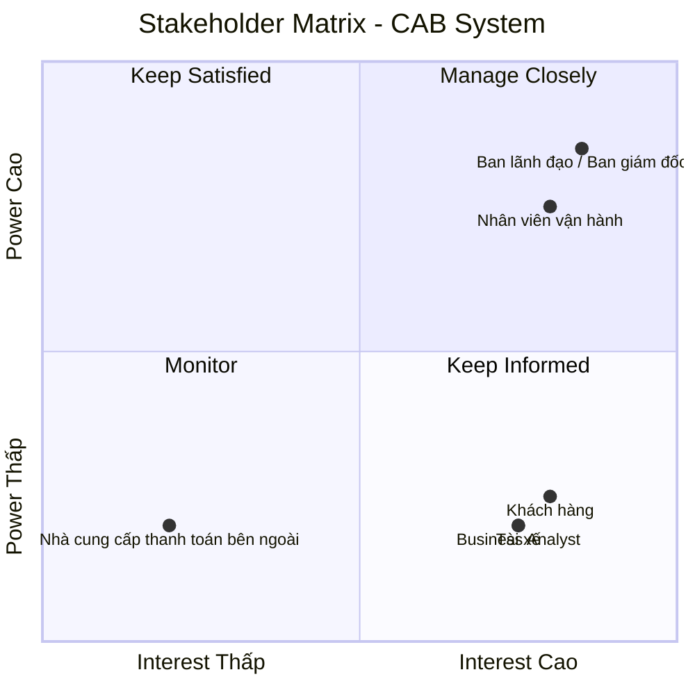

# CAB System – Phân tích yêu cầu
## Bước 1: Hiểu rõ hệ thống
## 1. Tại sao cần hệ thống?

Công ty ABC cần xây dựng hệ thống CAB mới để khắc phục những hạn chế của hệ thống hiện tại, đặc biệt là việc phân công tài xế còn thủ công, khách hàng khó theo dõi trạng thái chuyến đi, thông tin thanh toán chưa được quản lý tập trung và bộ phận vận hành gặp khó khăn khi mở rộng hệ thống. Hệ thống mới sẽ giúp tự động hóa quy trình đặt xe và tìm kiếm tài xế, quản lý tập trung dữ liệu, nâng cao trải nghiệm khách hàng và hiệu quả vận hành. Đồng thời, hệ thống được định hướng xây dựng như một nền tảng có khả năng phục vụ số lượng lớn khách hàng và tài xế, cũng như hỗ trợ mở rộng thêm các dịch vụ và tính năng trong tương lai.

## 2. Các vấn đề hiện hữu

- Việc phân công tài xế chủ yếu được thực hiện thủ công.
- Khách hàng khó theo dõi trạng thái chuyến đi.
- Thông tin thanh toán chưa được quản lý tập trung.
- Bộ phận vận hành gặp khó khăn khi muốn mở rộng hệ thống.
- Hệ thống cần có khả năng phục vụ số lượng lớn khách hàng và tài xế.
- Hệ thống hiện tại còn hạn chế trong việc phát triển thêm các tính năng trong tương lai.

## 3. Ai sẽ tham gia vào hệ thống?

- **Khách hàng**
  - Đặt xe và theo dõi chuyến đi.
  - Xem lịch sử chuyến đi.
  - Thanh toán và đánh giá tài xế.

- **Tài xế**
  - Nhận và thực hiện chuyến đi.
  - Cập nhật trạng thái chuyến đi.
  - Cập nhật vị trí.

- **Nhân viên vận hành**
  - Quản lý khách hàng, tài xế, phương tiện và chuyến đi.
  - Theo dõi chuyến đi và trạng thái tài xế.
  - Hỗ trợ xử lý các trường hợp chuyến bị lỗi.

- **Ban lãnh đạo**
  - Theo dõi các báo cáo về hoạt động kinh doanh.

- **Nhà cung cấp thanh toán bên ngoài**
  - Xử lý các giao dịch thanh toán điện tử.

## 4. Giá trị kinh doanh của hệ thống mới

- Tự động hóa việc tìm kiếm và phân công tài xế.
- Nâng cao trải nghiệm khách hàng thông qua khả năng theo dõi chuyến đi.
- Quản lý tập trung thông tin khách hàng, tài xế, phương tiện, chuyến đi và giao dịch.
- Nâng cao hiệu quả hoạt động của bộ phận vận hành.
- Hỗ trợ quản lý hoạt động kinh doanh thông qua các báo cáo.
- Đáp ứng số lượng lớn khách hàng và tài xế khi nhu cầu tăng cao.
- Tạo nền tảng có khả năng mở rộng và phát triển thêm các tính năng trong tương lai.

## Bước 2. Stakeholder

## 1. Các stakeholder của hệ thống
| Stakeholder | Vai trò | Tương tác với hệ thống |
|---|---|---|
| **Khách hàng** | Sử dụng dịch vụ đặt xe | Đăng ký, đăng nhập, quản lý thông tin cá nhân, đặt xe, theo dõi chuyến đi, xem lịch sử, thanh toán, nhận thông báo và đánh giá tài xế |
| **Tài xế** | Thực hiện chuyến đi | Quản lý hồ sơ và phương tiện, cập nhật trạng thái, nhận thông báo, chấp nhận/từ chối chuyến, cập nhật trạng thái chuyến và vị trí |
| **Nhân viên vận hành** | Quản lý hoạt động vận hành | Quản lý khách hàng, tài xế, phương tiện, chuyến đi; theo dõi chuyến, kiểm tra trạng thái tài xế, xử lý chuyến bị lỗi và tra cứu giao dịch |
| **Ban lãnh đạo** | Quản lý hoạt động kinh doanh | Theo dõi số lượng chuyến, doanh thu, tỷ lệ hoàn thành, tỷ lệ hủy và hiệu quả hoạt động của tài xế |
| **Nhà cung cấp thanh toán bên ngoài** | Cung cấp dịch vụ thanh toán điện tử | Tích hợp với CAB để xử lý giao dịch thanh toán điện tử và trả kết quả giao dịch về hệ thống |

## 2. Stakeholder metrics
## Stakeholder Matrix

Stakeholder Matrix được sử dụng để phân loại các bên liên quan dựa trên hai tiêu chí: **mức độ quan tâm (Interest)** và **mức độ quyền lực/ảnh hưởng (Power)** đối với hệ thống CAB.

### Phân loại Stakeholder
| Stakeholder | Power | Interest | Nhóm |
|---|---|---|---|
| Ban lãnh đạo / Ban giám đốc | Cao | Cao | Manage Closely |
| Nhân viên vận hành | Cao | Cao | Manage Closely |
| Khách hàng | Thấp | Cao | Keep Informed |
| Tài xế | Thấp | Cao | Keep Informed |
| Business Analyst | Thấp | Cao | Keep Informed |
| Nhà cung cấp thanh toán bên ngoài | Thấp | Thấp | Monitor |

## Bước 3. Mục đích nghiệp vụ
- Xây dựng nền tảng CAB mới để khắc phục những hạn chế của hệ thống hiện tại.
- Tự động hóa việc tìm kiếm và phân công tài xế.
- Giúp khách hàng đặt xe và theo dõi trạng thái chuyến đi.
- Quản lý tập trung thông tin thanh toán và hỗ trợ thanh toán điện tử.
- Hỗ trợ nhân viên vận hành quản lý khách hàng, tài xế, phương tiện và chuyến đi.
- Cung cấp báo cáo về số lượng chuyến, doanh thu, tỷ lệ chuyến hoàn thành, tỷ lệ hủy và hiệu quả hoạt động của tài xế.
- Đảm bảo hệ thống có khả năng phục vụ số lượng lớn khách hàng và tài xế khi nhu cầu tăng cao.
- Tạo nền tảng có khả năng mở rộng để bổ sung dịch vụ, phương thức thanh toán và kênh thông báo mới.
- Bảo vệ thông tin cá nhân, dữ liệu vị trí và dữ liệu giao dịch, đồng thời lưu vết các thao tác quan trọng.
- Cho phép triển khai các chức năng mới từng phần với hạn chế ảnh hưởng đến các chức năng đang hoạt động.

## Bước 4. Phạm vi dự án

### 4.1. Quản lý tài khoản

- Khách hàng đăng ký, đăng nhập và cập nhật thông tin cá nhân.
- Tài xế đăng ký hoặc được nhân viên vận hành tạo tài khoản.
- Tài xế cập nhật hồ sơ và thông tin phương tiện.
- Xác thực khách hàng và tài xế trước khi sử dụng các chức năng yêu cầu tài khoản.

### 4.2. Đặt xe

- Khách hàng nhập điểm đón và điểm đến.
- Khách hàng lựa chọn loại xe.
- Khách hàng gửi yêu cầu đặt xe.
- Hệ thống tiếp nhận và xử lý yêu cầu đặt xe.
- Khách hàng nhận thông báo về trạng thái yêu cầu.

### 4.3. Tìm kiếm và phân công tài xế

- Hệ thống xác định tài xế phù hợp dựa trên vị trí và trạng thái sẵn sàng.
- Ưu tiên tài xế phù hợp và gần khách hàng.
- Gửi yêu cầu chuyến đến tài xế phù hợp.
- Tài xế có thể chấp nhận hoặc từ chối chuyến.
- Hệ thống tiếp tục tìm tài xế khác khi tài xế không phản hồi hoặc từ chối.
- Thông báo cho khách hàng khi không tìm được tài xế.
- Lưu thông tin vị trí của tài xế để hỗ trợ tìm kiếm.

### 4.4. Thực hiện và theo dõi chuyến đi

- Tài xế cập nhật trạng thái:
  - Đã đến điểm đón.
  - Đã đón khách.
  - Đang di chuyển.
  - Hoàn thành chuyến.
- Khách hàng theo dõi trạng thái chuyến đi.
- Khách hàng xem tài xế đã nhận chuyến.
- Khách hàng xem thời gian dự kiến tài xế đến.
- Nhân viên vận hành xem các chuyến đang diễn ra.
- Nhân viên vận hành kiểm tra trạng thái tài xế.
- Nhân viên vận hành hỗ trợ xử lý các trường hợp chuyến bị lỗi.
- Lưu lịch sử chuyến đi.

### 4.5. Tính cước và thanh toán

- Tính số tiền phải trả sau khi chuyến hoàn thành.
- Tính cước dựa trên loại dịch vụ và thông tin chuyến đi.
- Hỗ trợ thanh toán tiền mặt.
- Hỗ trợ một phương thức thanh toán điện tử được lựa chọn cho phiên bản đầu.
- Tích hợp với một nhà cung cấp thanh toán bên ngoài.
- Không lưu trực tiếp thông tin nhạy cảm của thẻ hoặc tài khoản thanh toán.
- Thông báo kết quả thanh toán cho khách hàng.
- Xử lý trường hợp thanh toán điện tử thất bại theo chính sách được thống nhất.
- Nhân viên vận hành có thể tra cứu lịch sử giao dịch.

### 4.6. Thông báo

- Thông báo cho khách hàng khi yêu cầu đặt xe được tiếp nhận.
- Thông báo khi tài xế nhận chuyến.
- Thông báo khi tài xế đến điểm đón.
- Thông báo khi chuyến hoàn thành.
- Thông báo kết quả thanh toán.
- Thông báo cho tài xế khi có chuyến mới.
- Thông báo cho tài xế về các thay đổi liên quan đến chuyến đang thực hiện.
- Triển khai một kênh thông báo chính cho phiên bản đầu nhưng thiết kế để có thể mở rộng thêm kênh sau này.

### 4.7. Quản trị và vận hành

- Nhân viên vận hành quản lý khách hàng.
- Nhân viên vận hành quản lý tài xế.
- Nhân viên vận hành quản lý phương tiện.
- Nhân viên vận hành quản lý chuyến đi.
- Nhân viên vận hành tra cứu lịch sử giao dịch.
- Phân quyền các chức năng quản trị.
- Hạn chế nhân viên thông thường thực hiện các thao tác nhạy cảm.

### 4.8. Báo cáo cơ bản

- Báo cáo số lượng chuyến.
- Báo cáo doanh thu.
- Báo cáo tỷ lệ chuyến hoàn thành.
- Báo cáo tỷ lệ hủy.
- Báo cáo hiệu quả hoạt động của tài xế.

## Bước 5. Yêu cầu nghiệp vụ

### 5.1. Quản lý tài khoản

- Hệ thống phải hỗ trợ khách hàng đăng ký tài khoản.
- Hệ thống phải hỗ trợ khách hàng đăng nhập.
- Hệ thống phải cho phép khách hàng cập nhật thông tin cá nhân.
- Hệ thống phải hỗ trợ tài xế đăng ký tài khoản hoặc cho phép nhân viên vận hành tạo tài khoản cho tài xế.
- Hệ thống phải cho phép tài xế cập nhật hồ sơ cá nhân.
- Hệ thống phải cho phép tài xế cập nhật thông tin phương tiện.
- Khách hàng và tài xế phải được xác thực trước khi sử dụng các chức năng yêu cầu tài khoản.

### 5.2. Đặt xe

- Hệ thống phải cho phép khách hàng nhập điểm đón.
- Hệ thống phải cho phép khách hàng nhập điểm đến.
- Hệ thống phải cho phép khách hàng lựa chọn loại xe.
- Hệ thống phải cho phép khách hàng gửi yêu cầu đặt xe.
- Hệ thống phải thông báo cho khách hàng khi yêu cầu đặt xe được tiếp nhận.
- Hệ thống phải hiển thị trạng thái xử lý yêu cầu đặt xe.
- Hệ thống phải thông báo rõ ràng cho khách hàng khi không tìm được tài xế.

### 5.3. Tìm kiếm và phân công tài xế

- Hệ thống phải tự động xác định các tài xế phù hợp với yêu cầu chuyến đi.
- Việc lựa chọn tài xế phải dựa trên vị trí, trạng thái sẵn sàng và các tiêu chí vận hành được doanh nghiệp xác định.
- Hệ thống phải ưu tiên tài xế phù hợp và gần khách hàng.
- Hệ thống phải gửi yêu cầu chuyến đến tài xế phù hợp.
- Tài xế phải có khả năng chấp nhận hoặc từ chối chuyến.
- Hệ thống phải tiếp tục tìm tài xế khác nếu tài xế được đề xuất không phản hồi.
- Hệ thống phải tiếp tục tìm tài xế khác nếu tài xế được đề xuất từ chối chuyến.
- Khách hàng không phải tạo lại yêu cầu khi việc phân công tài xế trước đó không thành công.
- Hệ thống phải lưu thông tin vị trí của tài xế để hỗ trợ quá trình tìm kiếm.

### 5.4. Thực hiện chuyến đi

- Tài xế phải có khả năng chuyển sang trạng thái sẵn sàng nhận chuyến.
- Tài xế phải nhận được thông báo khi có yêu cầu chuyến phù hợp.
- Tài xế phải có khả năng cập nhật trạng thái chuyến đi.
- Các trạng thái chuyến đi bao gồm:
  - Đã đến điểm đón.
  - Đã đón khách.
  - Đang di chuyển.
  - Hoàn thành chuyến.
- Hệ thống phải lưu thông tin vị trí của tài xế trong quá trình hoạt động.
- Khách hàng phải có thể xem tài xế đã nhận chuyến.
- Khách hàng phải có thể xem thời gian dự kiến tài xế đến.
- Khách hàng phải có thể theo dõi trạng thái hiện tại của chuyến đi.

### 5.5. Tính cước

- Hệ thống phải xác định số tiền khách hàng phải trả sau khi chuyến đi hoàn thành.
- Số tiền phải trả phải được xác định dựa trên loại dịch vụ và thông tin chuyến đi.
- Số tiền phải trả phải được cung cấp cho khách hàng.
- Các quy tắc tính cước cụ thể phải được xác định với các bên liên quan trước khi triển khai.

### 5.6. Thanh toán

- Hệ thống phải hỗ trợ thanh toán bằng tiền mặt.
- Hệ thống phải hỗ trợ thanh toán điện tử.
- Hệ thống phải tích hợp với nhà cung cấp thanh toán bên ngoài.
- Hệ thống không được lưu trực tiếp thông tin nhạy cảm của thẻ hoặc tài khoản thanh toán.
- Hệ thống phải thông báo cho khách hàng về kết quả thanh toán.
- Hệ thống phải xử lý trường hợp thanh toán điện tử thất bại.
- Hệ thống phải cho phép xử lý lại giao dịch thanh toán thất bại theo chính sách của doanh nghiệp.
- Hệ thống phải lưu thông tin giao dịch để phục vụ tra cứu lịch sử.

### 5.7. Thông báo

- Hệ thống phải thông báo cho khách hàng khi yêu cầu đặt xe được tiếp nhận.
- Hệ thống phải thông báo cho khách hàng khi tài xế nhận chuyến.
- Hệ thống phải thông báo cho khách hàng khi tài xế đến điểm đón.
- Hệ thống phải thông báo cho khách hàng khi chuyến đi hoàn thành.
- Hệ thống phải thông báo cho khách hàng về kết quả thanh toán.
- Hệ thống phải thông báo cho tài xế khi có chuyến mới.
- Hệ thống phải thông báo cho tài xế về những thay đổi liên quan đến chuyến đang thực hiện.
- Hệ thống phải có khả năng mở rộng để bổ sung các kênh thông báo trong tương lai.

### 5.8. Quản lý vận hành

- Nhân viên vận hành phải có giao diện quản trị để quản lý hoạt động của hệ thống.
- Nhân viên vận hành phải có khả năng quản lý khách hàng.
- Nhân viên vận hành phải có khả năng quản lý tài xế.
- Nhân viên vận hành phải có khả năng quản lý phương tiện.
- Nhân viên vận hành phải có khả năng quản lý chuyến đi.
- Nhân viên vận hành phải có khả năng xem các chuyến đang diễn ra.
- Nhân viên vận hành phải có khả năng kiểm tra trạng thái tài xế.
- Nhân viên vận hành phải có khả năng hỗ trợ xử lý các trường hợp chuyến bị lỗi.
- Nhân viên vận hành phải có khả năng tra cứu lịch sử giao dịch.
- Các chức năng quản trị phải được phân quyền.
- Nhân viên thông thường không được thực hiện các thao tác quản trị nhạy cảm.

### 5.9. Lịch sử và đánh giá

- Hệ thống phải lưu lịch sử chuyến đi.
- Khách hàng phải có thể xem lịch sử chuyến đi.
- Khách hàng phải có thể xem số tiền phải trả của các chuyến đi.
- Khách hàng phải có thể đánh giá tài xế sau khi chuyến đi hoàn thành.

### 5.10. Báo cáo hoạt động

- Hệ thống phải cung cấp báo cáo về số lượng chuyến.
- Hệ thống phải cung cấp báo cáo về doanh thu.
- Hệ thống phải cung cấp báo cáo về tỷ lệ chuyến hoàn thành.
- Hệ thống phải cung cấp báo cáo về tỷ lệ hủy.
- Hệ thống phải cung cấp báo cáo về hiệu quả hoạt động của tài xế.

### 5.11. Bảo mật và kiểm soát dữ liệu

- Hệ thống phải kiểm soát quyền truy cập đối với các chức năng quản trị.
- Hệ thống phải bảo vệ thông tin cá nhân của khách hàng và tài xế.
- Hệ thống phải bảo vệ thông tin phương tiện.
- Hệ thống phải bảo vệ dữ liệu vị trí của tài xế.
- Hệ thống phải bảo vệ dữ liệu giao dịch.
- Hệ thống phải lưu vết các thao tác quan trọng để phục vụ kiểm tra khi có sự cố.

### 5.12. Khả năng mở rộng và phát triển

- Hệ thống phải có khả năng phục vụ số lượng lớn khách hàng và tài xế.
- Hệ thống phải hoạt động ổn định trong thời điểm nhu cầu tăng cao.
- Các thành phần của hệ thống phải có khả năng mở rộng độc lập khi tải tăng.
- Lỗi tại chức năng thanh toán không được làm toàn bộ hệ thống đặt xe ngừng hoạt động.
- Lỗi tại chức năng thông báo không được làm toàn bộ hệ thống đặt xe ngừng hoạt động.
- Các chức năng mới phải có khả năng được triển khai từng phần với hạn chế ảnh hưởng đến các chức năng đang hoạt động.
- Hệ thống phải có khả năng bổ sung các loại dịch vụ mới trong tương lai.
- Hệ thống phải có khả năng bổ sung các phương thức thanh toán mới.
- Hệ thống phải có khả năng bổ sung các nhà cung cấp thông báo mới.
- Hệ thống phải cho phép thay đổi một số thành phần kỹ thuật mà không phải xây dựng lại toàn bộ ứng dụng.
## Bước 6. Yêu cầu chức năng 

### 6.1. Khách hàng

- Đăng ký tài khoản.
- Đăng nhập.
- Cập nhật thông tin cá nhân.
- Nhập điểm đón và điểm đến.
- Lựa chọn loại xe.
- Đặt xe.
- Theo dõi trạng thái tìm tài xế.
- Xem thông tin tài xế đã nhận chuyến.
- Xem thời gian dự kiến tài xế đến.
- Theo dõi trạng thái chuyến đi.
- Xem số tiền phải trả.
- Thanh toán bằng tiền mặt.
- Thanh toán điện tử.
- Xem kết quả thanh toán.
- Xem lịch sử chuyến đi.
- Đánh giá tài xế.

### 6.2. Tài xế

- Đăng ký tài khoản.
- Đăng nhập.
- Cập nhật hồ sơ.
- Cập nhật thông tin phương tiện.
- Cập nhật trạng thái hoạt động.
- Chuyển sang trạng thái sẵn sàng nhận chuyến.
- Xem yêu cầu chuyến.
- Chấp nhận chuyến.
- Từ chối chuyến.
- Cập nhật trạng thái chuyến đi.
- Cập nhật vị trí.
- Xem các thông báo liên quan đến chuyến đi.

### 6.3. Nhân viên vận hành

- Đăng nhập hệ thống quản trị.
- Quản lý khách hàng.
- Quản lý tài xế.
- Quản lý phương tiện.
- Quản lý chuyến đi.
- Xem các chuyến đang diễn ra.
- Kiểm tra trạng thái tài xế.
- Xử lý các trường hợp chuyến bị lỗi.
- Tra cứu lịch sử giao dịch.
- Quản lý phân quyền.

### 6.4. Ban lãnh đạo / Ban giám đốc

- Xem báo cáo số lượng chuyến.
- Xem báo cáo doanh thu.
- Xem báo cáo tỷ lệ chuyến hoàn thành.
- Xem báo cáo tỷ lệ hủy.
- Xem báo cáo hiệu quả hoạt động của tài xế.

### 6.5. Nhà cung cấp thanh toán bên ngoài

- Tiếp nhận yêu cầu thanh toán từ hệ thống CAB.
- Xử lý giao dịch thanh toán.
- Trả kết quả giao dịch về hệ thống CAB.
